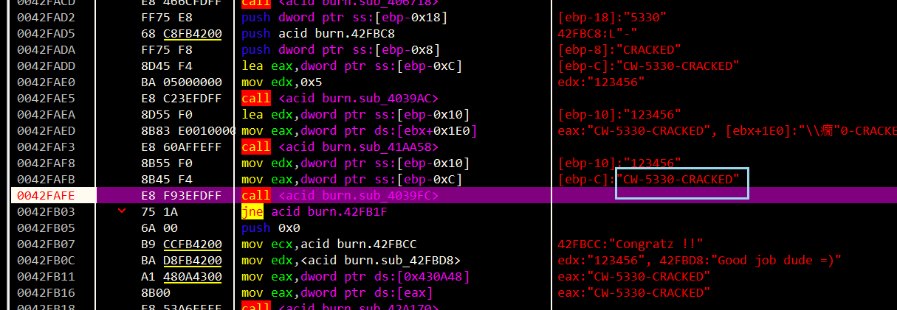

跟平时CTF的逆向很不一样的点
大多数函数都是通过类似虚函数表来调用执行的
所以交叉引用不好使

这应该也是基本的保护策略
ida不好看值 x32dbg动调
定位到找到的strcmp的点

所以`serial`分支输入`Hello Dude!`即可

`serial/name`分支定位到这里

这是对应我们name为AAAA时候的
所以`AAAA CW-5330-CRACKED`即可满足
其实看IDA也很容易逆出注册机
注意生成的注册码只跟`dword_431750`相关 其他为混淆

中间项 = `name[0]*82` 只要满足len(name)>=4即可
比如`12345 CW-4018-CRACKED`

整体难度很低 找时间学学怎么用这种类似虚函数表的形式调用的