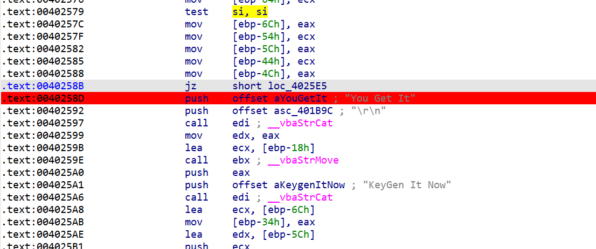
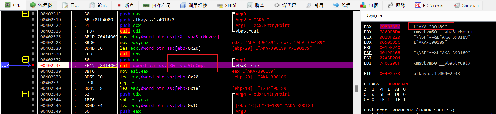
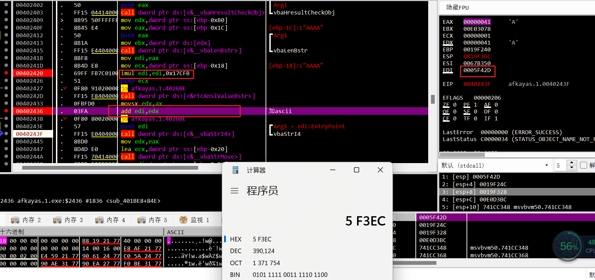

是一个VB写的exe
没见过...
IDA字符串交叉引用不了 函数也F5不了...
但能找到对应check段


x32dbg动调
输入AAAA 很容易得到对应的序列号

接下来就是逆出keygen

换一组`ABCDE`得到edi代表len
这就清楚了
`serial = 0x17CFB*len(name) + ord(name[0])`
测试一组:
```
iAWERQ
AKA-585291
```

🆗desu