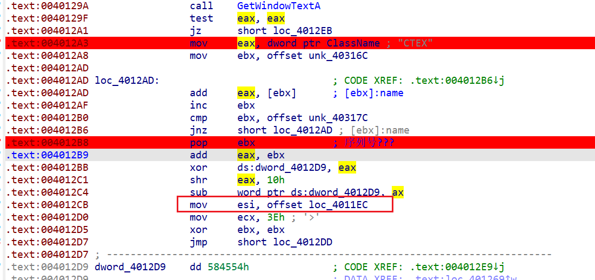
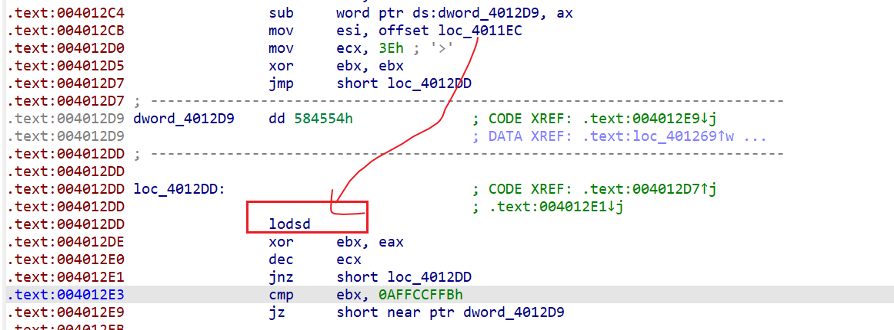

有花指令干扰

看汇编大致也能看出算法
???
但是怎么check serial的呢??? woc...
它是一个个的读的serial???

好奇怪啊... 而且感觉dword_4012D9这里是一个SMC?
如果serial对了就会修改为跳转到正确地方???

注意这里的
`mov     esi, offset loc_4011EC`
看意思是把内存定到`0x4011EC` 然后取0x3E个dword xor

soga... 这里lodsd本来是Load 字符串的指令 应该是是从esi寄存器的值的内存处读取...
这里不了解的话根本分析不到... 动调看不大出来(不会注意到...)
所以从`0x4011EC`取了0x3E个DWORD xor (发现取得正好是我们看的这段 即关键加密代码段... 如果在这上面打断点会把字节改为CC... 就gg了)

emmmm.....................