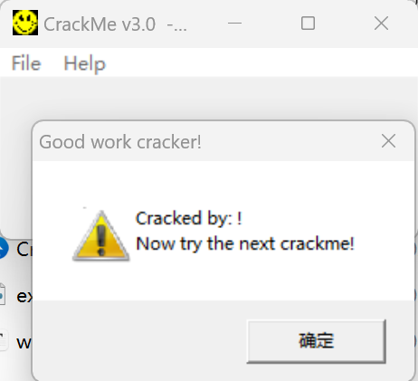

简单分析下，这里取巧，用了v2==0的break来使得dword_402149 = 0，简化构造。

```py
dword_4020F9 = 0
def sub_401311(a1):
    global dword_402149
    v1 = 0
    v2 = 0
    v4 = 65
    i = 0
    while(True):
        v2 = v4 ^ a1[i]
        a1[i] = v2
        i += 1
        dword_4020F9 += v2
        if(v2 == 0):
            break
        v1 = v1 + 1
        if(v4 == 79):
            break
    dword_402149 = v1

def check(a1):
    global dword_4020F9
    sub_401311(a1)
    dword_4020F9 ^= 0x12345678
    n = ord(a1[-1])<<24 + ord(a1[-2])<<16 + ord(a1[-3])<<8 + ord(a1[-4])
    return dword_4020F9 == n

key = b'\x41' + b'\x00' * (18-1-4) + b'\x78\x56\x34\x12'
with open("./CRACKME3.KEY","wb") as f:
    f.write(key)

"""
分析一下怎么crack
这个 xor 0x12345678
测试可以知道，最多dword_402149 = 0x1200，也就是最多影响末四位
所以
ord[-1] = 0x12
ord[-2] = 0x34
前面的可以灵活应用这个break点:
        if(v2 == 0):
            break
那么控制a1[0] = 65，一上来就break了

"""
```


