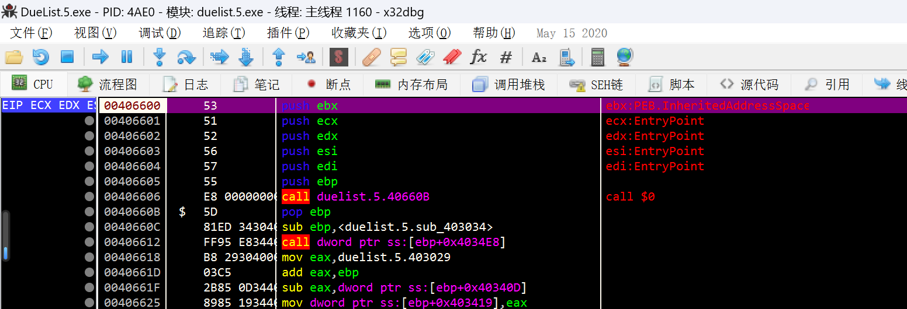
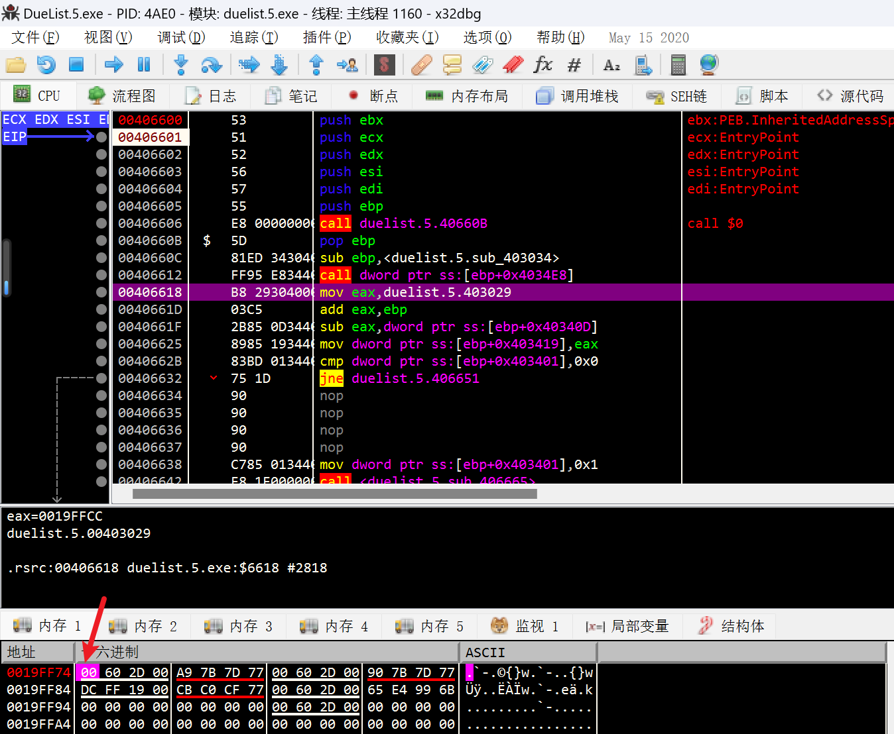
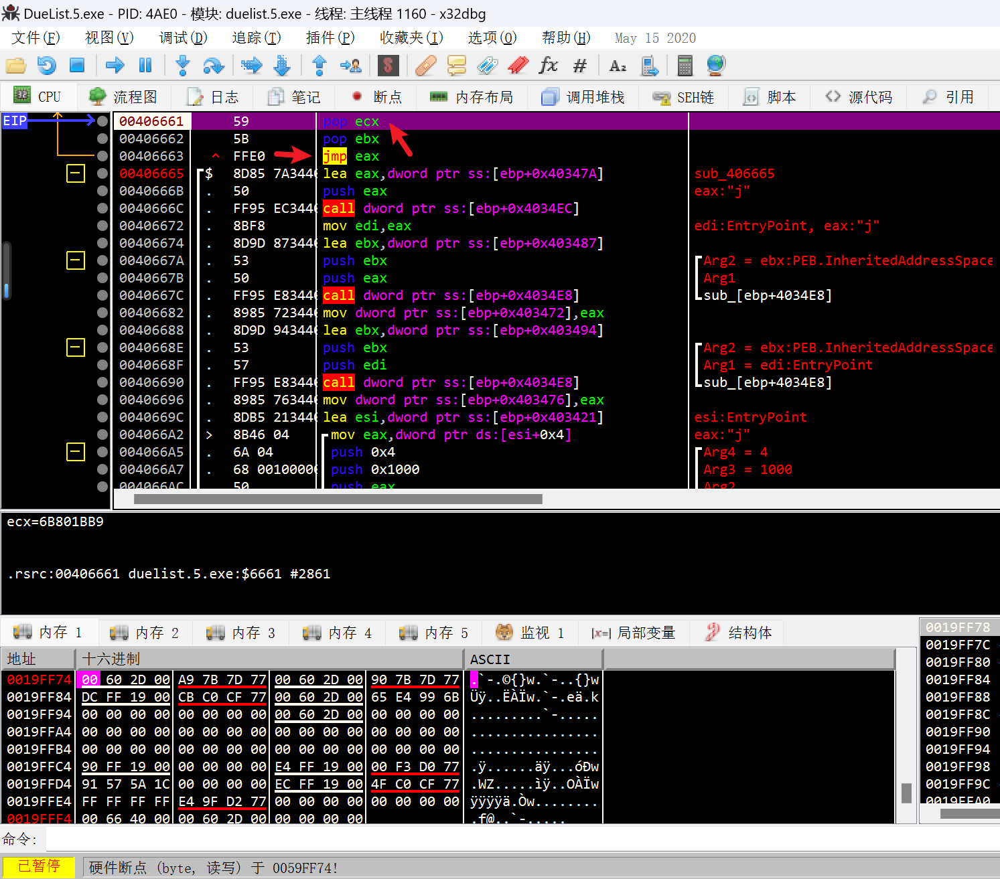
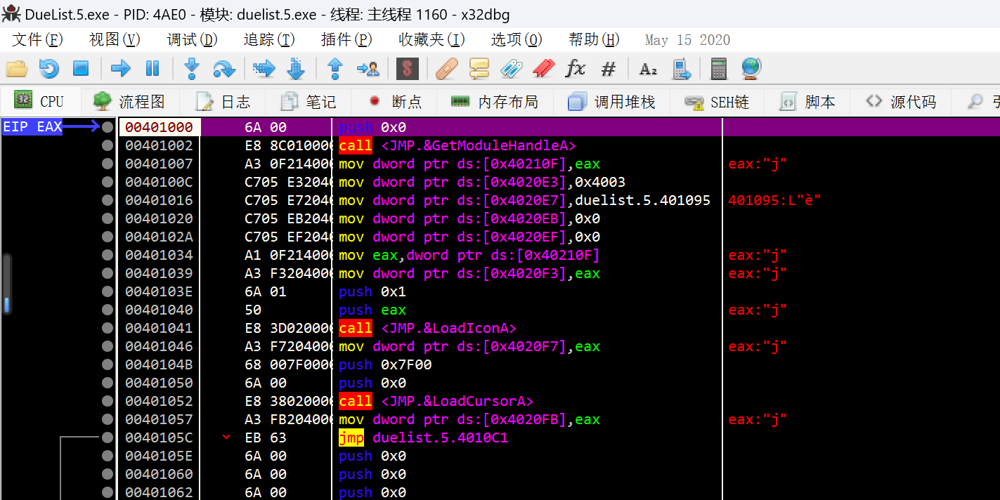
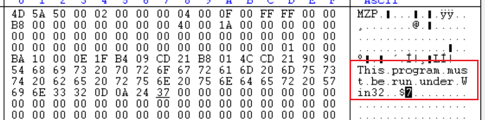
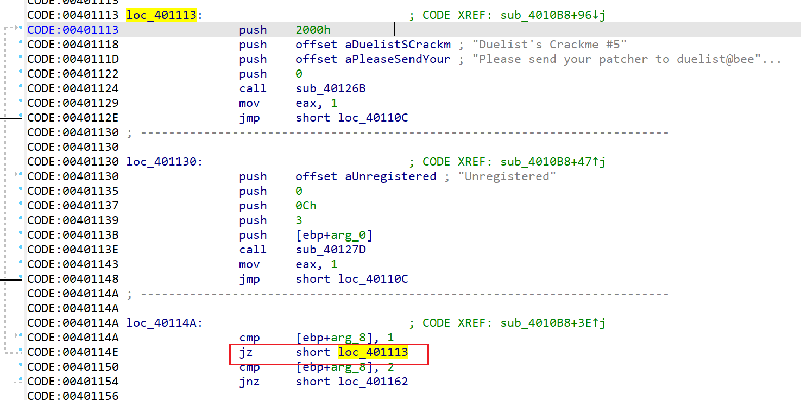
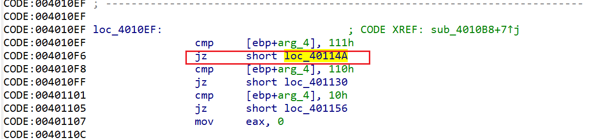

加了壳的，

手动脱壳，练练手。

直接ESP定律脱壳。

开始就看到一堆push，在ESP的地址下硬件访问断点，F9，在POP处停下，看到jmp，跟过去就是OEP了。

但好像Scylla DUMP的IAT有问题。

可以拖到IDA看看F5，具体调试还是用x32。

到了OEP后，记得把硬件断点禁用。。。

发现一个有趣的点，DOS头这里改了：

这个cm的目的是用patch，那就简单了，把这两处jz改为jmp即可，虽然会一直弹弹窗（）

