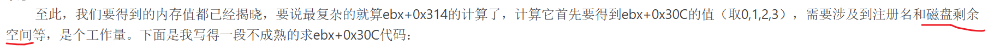
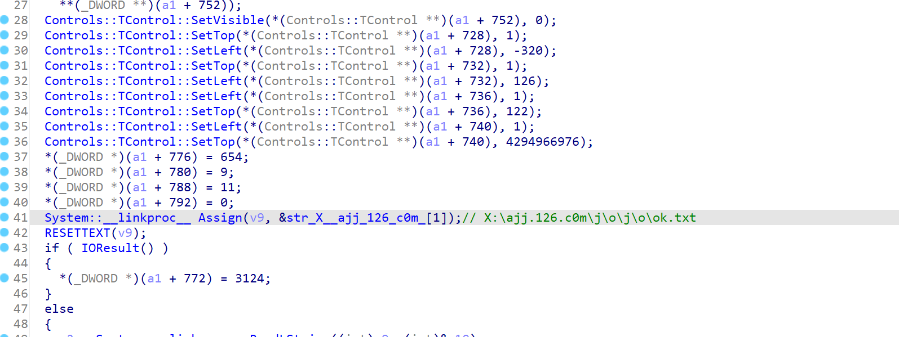
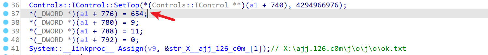
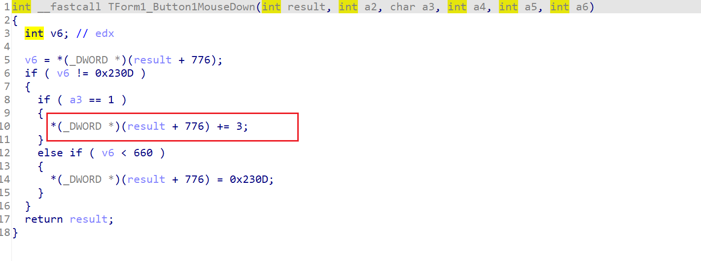
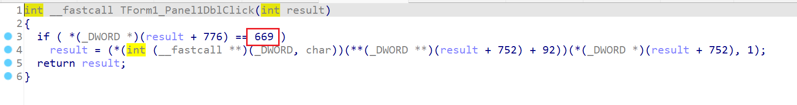

...

这就是三※的恶心程度吗，，，

如果按程序本身的流程，需要在各个阶段，分别点击图片不同次数，可能还需要对应输入string，重复几次后才能通过最后的check。


所以，多半不能按照正常流程做。。。



：？


可以跟着这篇看看：

```
https://www.cnblogs.com/nxyz/p/10298385.html
```

自己做太tm恶心了。。。


FormCreate这里有一个ok.txt的检测：


真要注册的话，得改盘符X->C/D（）


为什么点5次？

在这里：








( 669 - 654 ) / 3 = 5，而且要**右键**点。。 点5次后，就会出现Panel1


...