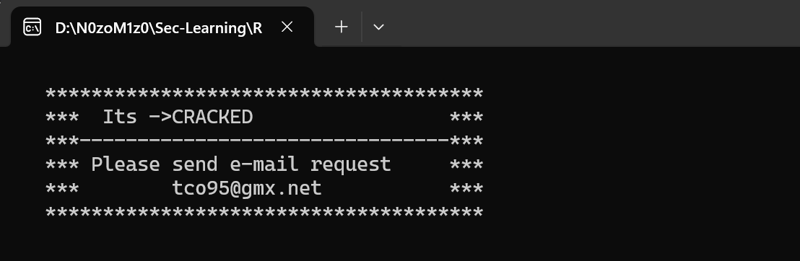
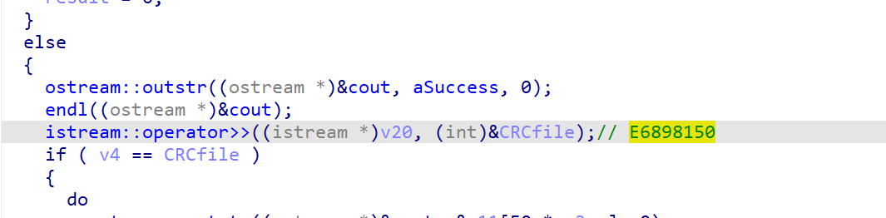

看样子应该是一个算法逆向，嘛，也好。


本身serial的算法很简单

```py
def calculate(name,orga,usernum):
    serial = 0
    for i in range(len(orga)):
        serial += ord(orga[i]) * ord(name[i])
    return serial
    

print(calculate("N0zoM1z0123","Kitauji",114514))
```




有个麻烦的点是最开始，有个CRC，crack.dat的校验。





v4的值是PE头和1,2,3...的xor和，可以直接动调得到，但这个CRCfile是怎么获得的呢？

：？

呃，貌似crack.dat里面写入E6898150的十进制就行。。。

呃呃呃。。。嘛。。。


难度给1※吧。