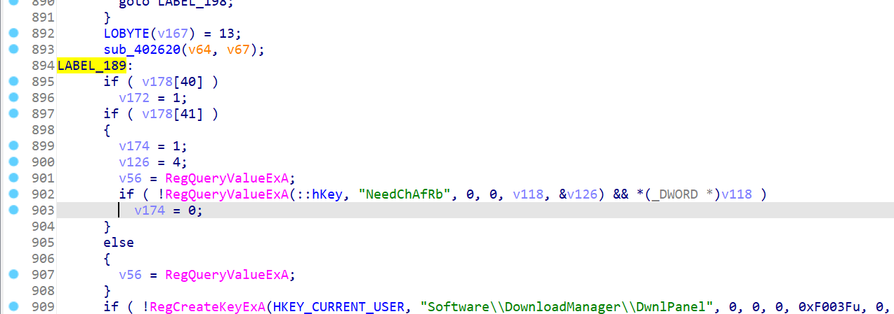

记得老早以前看过52一篇文章，说是破解IDM啥的。自己也来试试。


这里先以`114514@123.com`为例，注册机后面再看。。（但感觉貌似跟email无关？）)


慢慢缩小范围，跟到这里：

`520650`


对应逻辑也蛮简单，写出脚本：

```py
byte_75E6D8 = "2YOPB3AQCVUXMNRS97WE0IZD4KLFGHJ8165T@"
print(len(byte_75E6D8))

# 114514@123.com
table = "2YOPB3AQCVUXMNRS97WE0IZD4KLFGHJ8165T" 
table = [x for x in table]

# 222YA-2222D-22227-222Y9
for i1 in range(36):
    for i2 in range(36):
        for i3 in range(36):
            for i4 in range(36):
                for i5 in range(36):
                    t = i1*37**4 + i2*37**3 + i3*37**2 + i4*37**1 + i5
                    # t &= 0xff
                    if t%53 == 0 and t>0:
                        s = table[i1] + table[i2] + table[i3] + table[i4] + table[i5]
                        print(s)
                        exit()

```


呃呃，但被识别出假冒？？？

好吧，这步过后它还开了联网检查。。。

我把网断了发现的：


那也就只能crack到这一步了。。。

毕竟感觉联网的话都没办法crack过吧。。。 除非考虑把联网的patch掉。。。


但我保持断网重新打开：


牛逼，“假的”已注册，6。

但我寻思你IDM不联网你用它干啥。。。 嘛，逆逆向还是有意思的~

（没想到IDM写的这种勾巴register。。。 真绷不住了。。。）


但是，断网注册后，貌似再次恢复网络不会弹假冒？？？

牛逼。。。


它应该是在本地注册表来看的。

emmm，好吧，联网还是得寄。


但我可以试着ban一下它的IP？


用process monitor看它的网络连接情况。


这个ip：

```
https://85.1b.3da9.ip4.static.sl-reverse.com/
```


现在两种方案：

1. ban ip。。
2. patch。。


对于ban Ip，这个域名不一定能解析到真实IP，不是个好方法。


还是patch吧。

把"假冒的序列号"这里patch下跳转的label


emm，貌似不行。


如果改这里的话跳转关系好tm复杂啊。。。


尝试改switch处的跳转？

感觉default像是没事时候的跳转。


。。。 还是不行啊。。 这么改了就直接退了。。。c。。。


可能是还有一些变量的关系不对。


ooo！！！

可以patch这里：


对应跳到这里：




但怎么还有检测啊。。。


啊啊啊啊啊。。。。

服了。。不弄了。。

。。。


总结：

register很简单，但联网的检查太难patch干净了。。。
