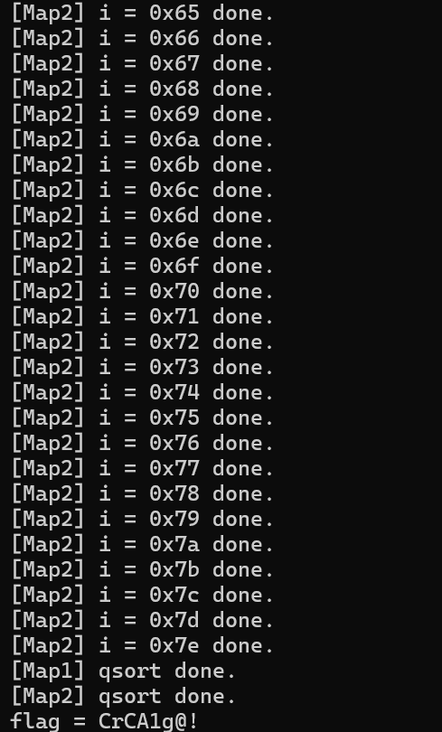

md...
[wp](https://github.com/DoubleLabyrinth/reversing.kr/tree/master/CRC1)

就逆向角度没有任何理解难度 难点在于怎么逆算法...

首先 题目那奇奇怪怪的算法其实是标准的CRC64
所以可以抽象出来(函数模块化)

然后用`Meet-In-Middle`的思想
针对8个字符分为0~3 4~7 分别计算CRC

其实当时在车上也想到这个思路了 但对CRC完全不熟悉 写不出来...
这里直接搬exp了罢
```c
#include <stddef.h>
#include <stdint.h>
#include <stdlib.h>
#include <stdio.h>

char welcome_str[] =
"_[Hello___Welcom"
"e To Reversing.K"
"r]__The idea of "
"the algorithm ca"
"me out of the co"
"deengn challenge"
"__This algorithm"
" very FXCK__But "
"you can solve it"
"!!__Impossible i"
"s Impossible_()_"
"[]_()_[]_()_[]_("
")_[]_()_[]_()_[]"
"_()_[]_()_[]_()_"
"[]_()_[]_()_[]_("
")_[]_()_[]_()_[";

uint64_t CRC64Table[256];
uint8_t CRC64InvTable[256];

void crc64_init() {
    for (int i = 0; i < 256; ++i) {
        uint64_t tmp = i;
        for (int j = 0; j < 8; ++j) {
            if (tmp & 1) {
                tmp >>= 1;
                tmp ^= 0xC96C5795D7870F42;
            } else {
                tmp >>= 1;
            }
        }
        CRC64Table[i] = tmp;
        CRC64InvTable[tmp >> (8 * 7)] = (uint8_t)i;
    }
}

uint64_t crc64(const void* lpBuffer, size_t len) {
    uint64_t CRC = 0;
    for (size_t i = 0; i < len; ++i) {
        uint8_t index = (uint8_t)(CRC ^ ((const uint8_t*)lpBuffer)[i]);
        CRC >>= 8;
        CRC ^= CRC64Table[index];
    }
    return CRC;
}

int find_index(uint64_t crc) {
    return CRC64InvTable[crc >> (8 * 7)];
}

uint64_t uncrc64(const void* lpBuffer, size_t len, uint64_t crc) {
    for (size_t i = len - 1; i != (size_t)-1; --i) {
        uint8_t index = (uint8_t)find_index(crc);
        crc ^= CRC64Table[index];
        crc <<= 8;
        crc |= index ^ ((const uint8_t*)lpBuffer)[i];
    }
    return crc;
}

typedef struct _Pair {
    uint64_t crc;
    uint32_t value;
} Pair;

int cmp(const void* a, const void* b) {
    if (((const Pair*)a)->crc > ((const Pair*)b)->crc)
        return 1;
    else if (((const Pair*)a)->crc < ((const Pair*)b)->crc)
        return -1;
    else
        return 0;
}

int main(int argc, char* argv[]) {
    crc64_init();

    *(uint64_t*)&welcome_str[208] = 0x2E9013A335DE51E7;

    uint64_t target_crc = 0x676F5F675F695F6C;
    target_crc = uncrc64(welcome_str + 128, 128, target_crc);
    Pair* Map1 = (Pair*)malloc(95 * 95 * 95 * 95 * sizeof(Pair));
    Pair* Map2 = (Pair*)malloc(95 * 95 * 95 * 95 * sizeof(Pair));

    printf("ready\n");

    Pair* cur1 = Map1;
    for (char i = 0x20; i < 0x7f; ++i) {
        for (char j = 0x20; j < 0x7f; j++) {
            for (char k = 0x20; k < 0x7f; k++) {
                for (char l = 0x20; l < 0x7f; l++) {
                    welcome_str[0x00] = i;
                    welcome_str[0x10] = j;
                    welcome_str[0x20] = k;
                    welcome_str[0x30] = l;
                    cur1->crc = crc64(welcome_str, 64);
                    cur1->value = i + 256 * j + 256 * 256 * k + 256 * 256 * 256 * l;
                    cur1++;
                }
            }
        }
        printf("[Map1] i = 0x%02x done.\n", i);
    }

    Pair* cur2 = Map2;
    for (char i = 0x20; i < 0x7f; ++i) {
        for (char j = 0x20; j < 0x7f; j++) {
            for (char k = 0x20; k < 0x7f; k++) {
                for (char l = 0x20; l < 0x7f; l++) {
                    welcome_str[0x40] = i;
                    welcome_str[0x50] = j;
                    welcome_str[0x60] = k;
                    welcome_str[0x70] = l;
                    cur2->crc = uncrc64(welcome_str + 64, 64, target_crc);
                    cur2->value = i + 256 * j + 256 * 256 * k + 256 * 256 * 256 * l;
                    cur2++;
                }
            }
        }
        printf("[Map2] i = 0x%02x done.\n", i);
    }

    qsort(Map1, 95 * 95 * 95 * 95, sizeof(Pair), cmp);
    printf("[Map1] qsort done.\n");
    qsort(Map2, 95 * 95 * 95 * 95, sizeof(Pair), cmp);
    printf("[Map2] qsort done.\n");

    cur1 = Map1;
    cur2 = Map2;
    while (1) {
        if (cur1 - Map1 > 95 * 95 * 95 * 95)
            break;
        if (cur2 - Map2 > 95 * 95 * 95 * 95)
            break;
        if (cur1->crc > cur2->crc) {
            cur2++;
        } else if (cur1->crc < cur2->crc) {
            cur1++;
        } else {
            char flag[9] = { 0 };
            *(uint32_t*)&flag[0] = cur1->value;
            *(uint32_t*)&flag[4] = cur2->value;
            printf("flag = %s\n", flag);
            break;
        }
    }

    free(Map2);
    free(Map1);
    return 0;
}
```

然后直接开O3优化
`gcc -O3 .\find_flag.c -o find_flag.exe`



**`CrCA1g@!`**
