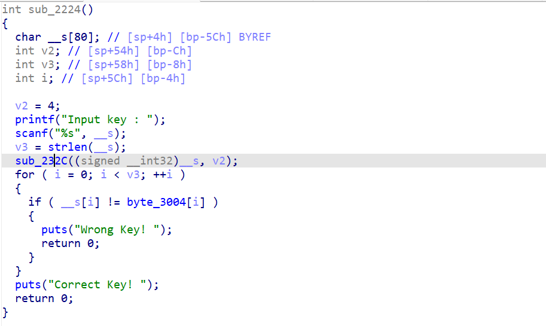
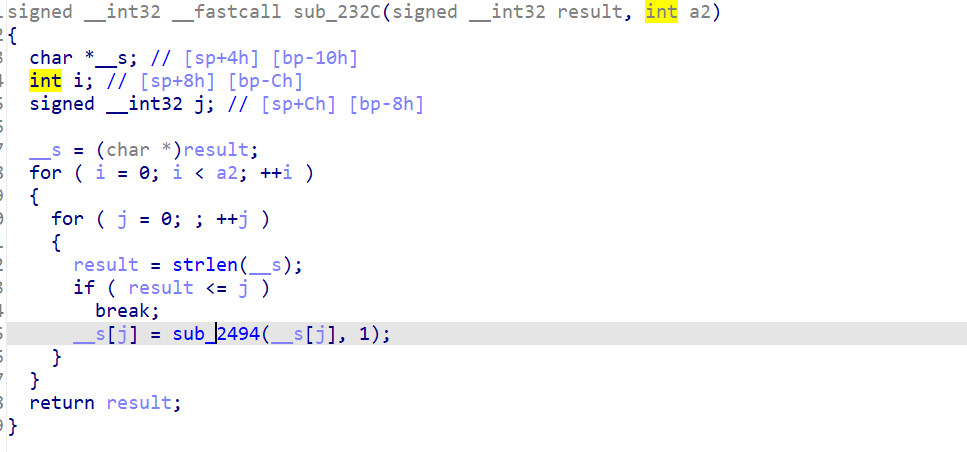
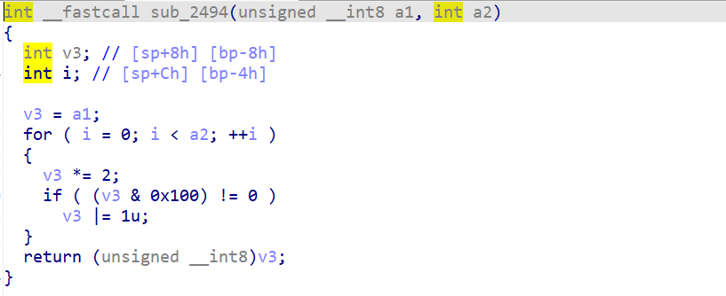

有这个版本的IDA7.5，带各种插件，再看就简单到爆。。。


die看架构：


傻逼苹果。


相比Ghidra，IDA反编译就太牛逼了。（虽然有部分没反编译出来。。。）



传的v2是4。。






```py
_enc = [0x44, 0xF6, 0xF5, 0x57, 0xF5, 0xC6, 0x96, 0xB6, 0x56, 0xF5, 0x14, 0x25, 0xD4, 0xF5, 0x96, 0xE6, 0x37, 0x47, 0x27, 0x57, 0x36, 0x47, 0x96, 0x03, 0xE6, 0xF3, 0xA3, 0x92, 0x00, 0x00, 0x00, 0x00]
l = len(_enc)

def enc(x):
    for i in range(4):
        x *= 2
        if((x&0x100)):
            x |= 1
    return x&0xFF
flag = ''
for c in _enc:
    for x in range(32,128):
        y = enc(x)
        if(y==c):
            flag += chr(x)
        print(flag)
```


**Do_u_like_ARM_instructi0n?:)**