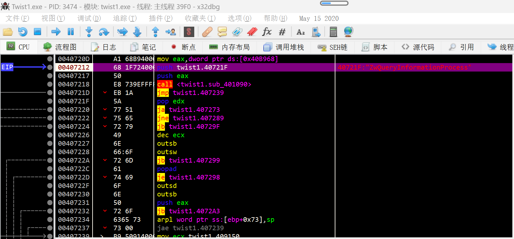
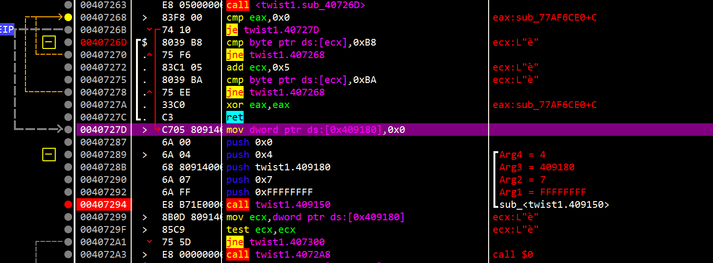
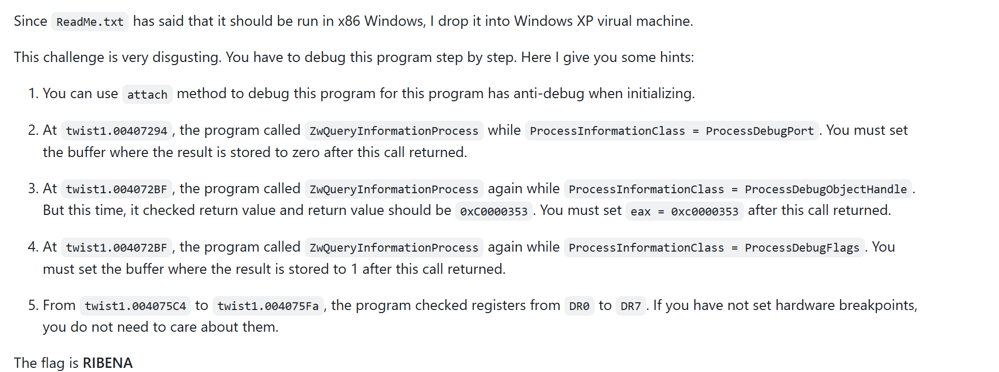

混杂了一堆SMC。。。

最开始的反调试（PEB）sharpod直接过

自解密完了过后，dump出来IDA分析。但还是有很多地方反编译不全。


看到调用ZwQueryProcessInfo就感觉不对劲了。。。



妥妥的内核反调试，，，。。。


真tm disgusting啊。。。


```
https://github.com/DoubleLabyrinth/reversing.kr/tree/master/Twist1
```


刚好前几天学了ZwQueryProcessInfo的反调试，跟着debug一下。

貌似后面的得在32位环境调试。。。


但32位。。。emmm，disgusting。。。


主要是64位的话这个循环好像会死循环：




。。。 不调了

