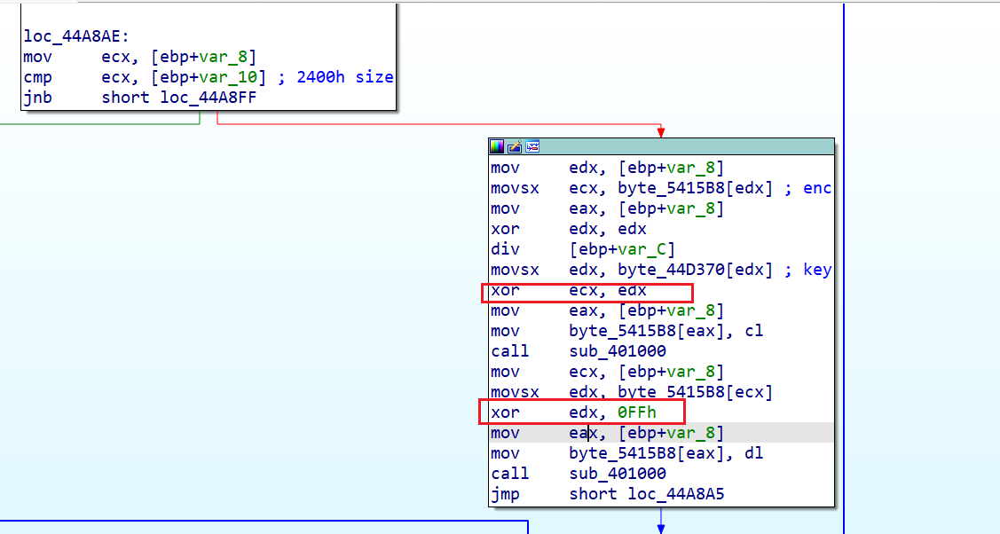
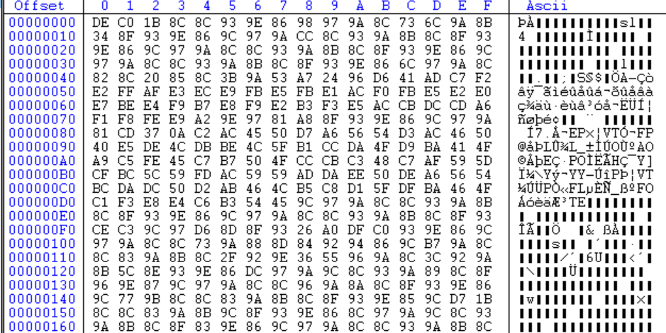
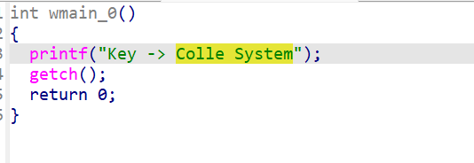

脱掉UPX壳。

简单逆向一下：




循环xor key xor 0xFF

观察file结构：




猜测是PE。

```
enc = [
	0xDE, 0xC0, 0x1B, 0x8C, 0x8C, 0x93, 0x9E, 0x86, 0x98, 0x97, 0x9A, 0x8C, 0x73, 0x6C, 0x9A, 0x8B,
	0x34, 0x8F, 0x93, 0x9E, 0x86, 0x9C, 0x97, 0x9A, 0xCC, 0x8C, 0x93, 0x9A, 0x8B, 0x8C, 0x8F, 0x93,
	0x9E, 0x86, 0x9C, 0x97, 0x9A, 0x8C, 0x8C, 0x93, 0x9A, 0x8B, 0x8C, 0x8F, 0x93, 0x9E, 0x86, 0x9C,
	0x97, 0x9A, 0x8C, 0x8C, 0x93, 0x9A, 0x8B, 0x8C, 0x8F, 0x93, 0x9E, 0x86, 0x6C, 0x97, 0x9A, 0x8C,
	0x82, 0x8C, 0x20, 0x85, 0x8C, 0x3B, 0x9A, 0x53, 0xA7, 0x24, 0x96, 0xD6, 0x41, 0xAD, 0xC7, 0xF2
]

known =[
	0x4D, 0x5A, 0x90, 0x00, 0x03, 0x00, 0x00, 0x00, 0x04, 0x00, 0x00, 0x00, 0xFF, 0xFF, 0x00, 0x00,
	0xB8, 0x00, 0x00, 0x00, 0x00, 0x00, 0x00, 0x00, 0x40, 0x00, 0x00, 0x00, 0x00, 0x00, 0x00, 0x00,
	0x00, 0x00, 0x00, 0x00, 0x00, 0x00, 0x00, 0x00, 0x00, 0x00, 0x00, 0x00, 0x00, 0x00, 0x00, 0x00,
	0x00, 0x00, 0x00, 0x00, 0x00, 0x00, 0x00, 0x00, 0x00, 0x00, 0x00, 0x00, 0xF0, 0x00, 0x00, 0x00
]

for i in range(len(known)):
    print(chr(enc[i]^known[i]^0xff),end='')
```

```
letsplaychessletsplaychessletsplaychessletsplaychessletsplayches
```

所以key是`letsplaychess`

解密后发现是一个UPX壳的PE，脱壳后，


**`Colle System`**