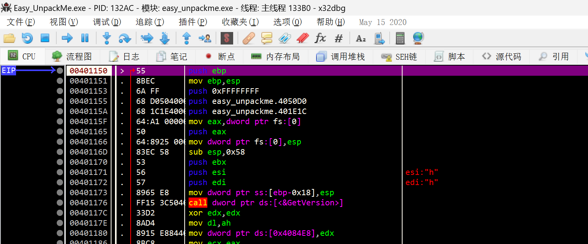
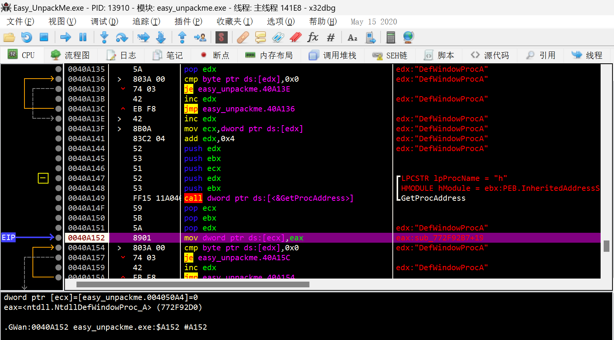
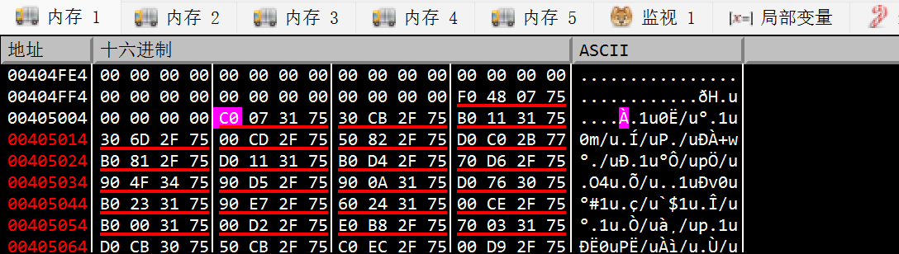
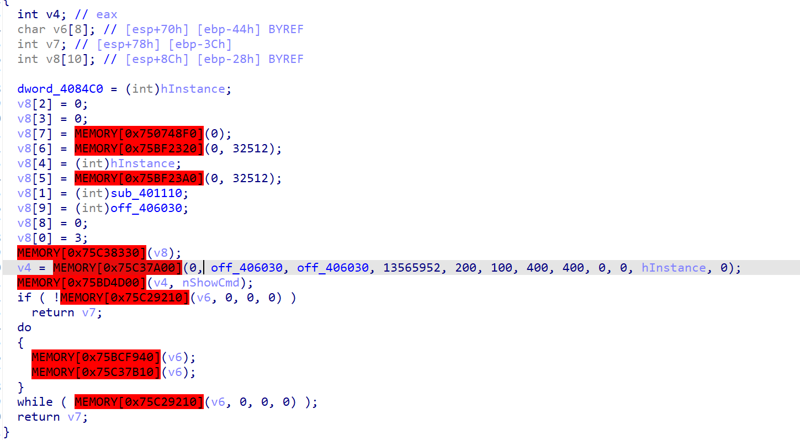

OEP很好找，稍微跟几个xor，就能到恢复IAT的部分，再往下跟就能到OEP了：

关键是正确的DUMP。

直接用Scylla的话，IAT表恢复的不够正确。

回到之前用LoadLibrary + GetProcAdress恢复IAT那儿：

这个 mov [ecx] ,eax的ecx的地址应该就是IAT的地址。

回到OEP后，发现这个地址往上翻也还有IAT。

尝试好多种方法，都无法恢复这种：