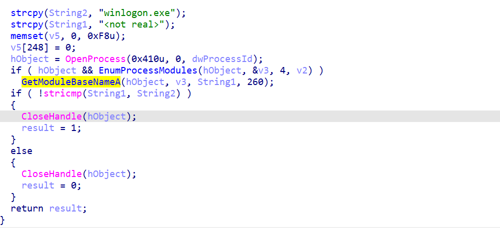

Lab1就没必要动态分析了，静态学学写法。


# `Lab01-01.exe`

前面是内存映射技术，对内存进行修改操作。

将`Kernel32.dll`和`Lab01-01.dll`的内存都Map出来，便于后续更改：


先来看看`Lab01-01.dll`

实现了一个有sleep，exec命令的远控木马：


回到exe，先是将自身进程exe加载的kernel32.dll替换为Lab01-01.dll的内容，

然后将导入表这些的`Kernel32.dll`名字替换为相近的`Kerne132.dll`（L和1的区别）


最后对C盘下的exe进行遍历，将每个exe的导入表的`Kernel32.dll`都换成恶意dll，并同样的修改导入表之类的。


# `Lab01-02.exe`

有个UPX壳：


脱壳后IDA看。

比较简单，这里创建了20个线程：


看`StartAddress`


函数名已经很直白了，连接了“恶意网站“。

实际操作可以改为UrlDownloadFile来下载木马。


# `Lab01-03.exe` （❌）

FSG壳。


尝试网上找个脱壳工具，但好像都不大成功，。等后面来手脱FSG壳再来分析。


2024年9月6日 UPD

其实也蛮容易脱壳的。

x32跟一跟，前面一堆循环很容易知道是在解密代码区。

到这里就能看到在恢复IAT，他这个还有LoadLibrary字段，很容易看出来：


那么细心找一下，在`004050E1`有一个`je 401090`，也就是`[edi]`为0时就跳转。

那就说明是IAT恢复完过后就跳到OEP了，Scylla dump出来：


就能IDA分析了。

只是这里的IAT没有恢复出dll导出函数的名字。。有点小难受。。


理论上可以对着dll导出函数地址挨个找。。。

这里可以x32dbg继续分析。

虽说没搞明白它在干嘛啊。。


这能远程加载？

感觉只是把这个"恶意网站链接"字符串保存了罢？


# `Lab01-04.exe`

信息收集很关键，CFF看，注意到resource处有端倪：


藏了个PE文件。

导出这个BIN。先IDA看主函数，


`winup.exe`：


先看循环里面的`sub_401000`




枚举进程，找`winlogon.exe`

找到后就保存这个PID，

后面`sub_401174`进行了操作：


`sfc_os.dll`：


那个`sub4010FC(xxx)`就是昨天刚好学DLL卸载接触过的Token提权，


这是为了`CreateRemoteThread`的权限，

紧接着：

```c
lpStartAddress = (LPTHREAD_START_ROUTINE)GetProcAddress(v2, (LPCSTR)2);
```

获取`sfc_os.dll`中的一个函数，然后`CreateRemoteThread`注入到`winlogon.exe`中。

然后就是

```
MoveFileA(ExistingFileName, NewFileName);
```

将`\system32\wupdmgr.exe`移动到`\winup.exe`

最后调用`sub_4011FC`


执行了释放的资源文件。

看看资源文件：


执行了`winup.exe`，然后将

恶意的`update.exe`下载覆盖了`\system32\wupdmgrd.exe`。

为什么要这么做？

我的理解：（可能有误）

核心目的是将`\system32\wupdmgrd.exe`覆盖为恶意update.exe，

但为了不影响正常功能（防止察觉），所以将`\system32\wupdmgrd.exe`先移动到`winup.exe`，

因为前面提到过`winup.exe`也能执行更新这些，所以将原本的`\system32\wupdmgrd.exe`作了个备份。

原有的update功能仍然在，只是多了恶意的update.exe。


