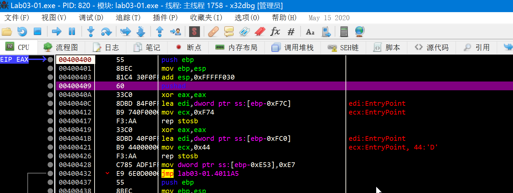
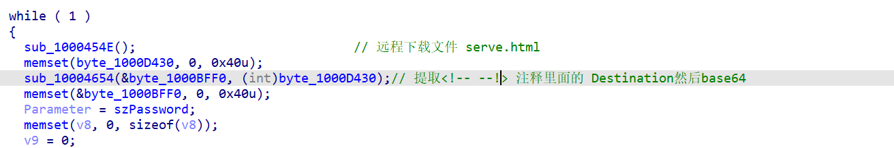
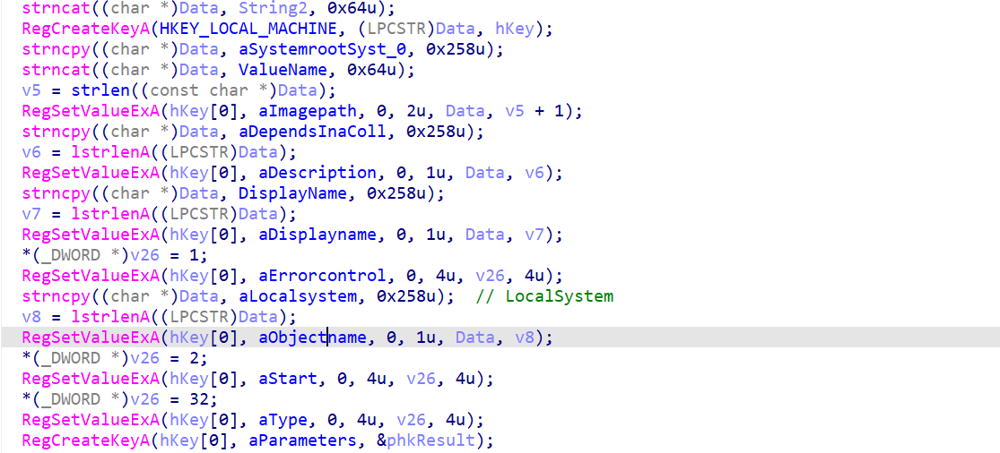

# `Lab03-01.exe`

woc，难！它这个虽然没有壳，但胜似有壳。。。

IDA静态不能F5，x32调试函数调用又太多。。

有点意思。

UPD. 2024年11月22日

这里没有壳是DIE没有识别出来，其实有壳。。。这里可以看到pushad：

但好像这个程序本身跑不起来：？

# `Lab03-02.dll`

一个远控木马。好好分析一下，学一学。

`ServiceMain`里面：

这种下载一个html，然后提取注释里面的C2地址！！！学到了~

就跟访问一个xx主页，从个人说明提取c2一样！！ 牛逼！

C2远控那部分弄明白了，现在就是这个Install的一堆注册表操作的原因？

为什么要操作这些键值还没弄清楚。还有svchost这些的具体作用？

