路漫漫。。。

最好用的那个x32调不了，中间会退出；可以用原版的x32。

那完全可以用原版的x32下条件断点，一样的。


其实感觉有个方法：将不同的key的游戏的引擎bindiff一下。应该能有很多共同点，找时间隔得比较近的。

不然就只能瞎翻函数列表了。。。


可以bindiff rewrite系列的，说不定能有启发。

并没有启发。。。


现在有个思路，猜测 read.sav那儿的解密方法可能是通用的，那么搜索那256的数组，竟然真能找到！

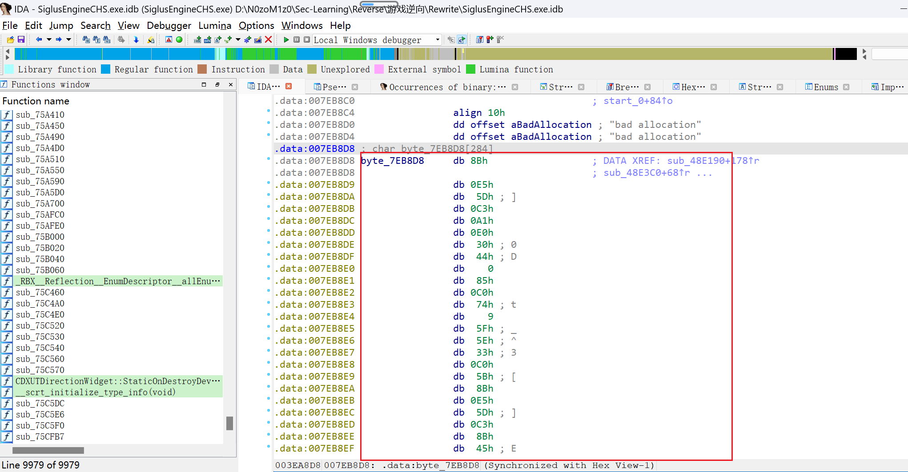


果然，按着开发者的思路来想，能找到可能突破口！


你别说，这么一来总算是能找到点东西了。。


然后惊喜的发现，这个`sub_5BF130`和先前看到的也很类似：

这里的：

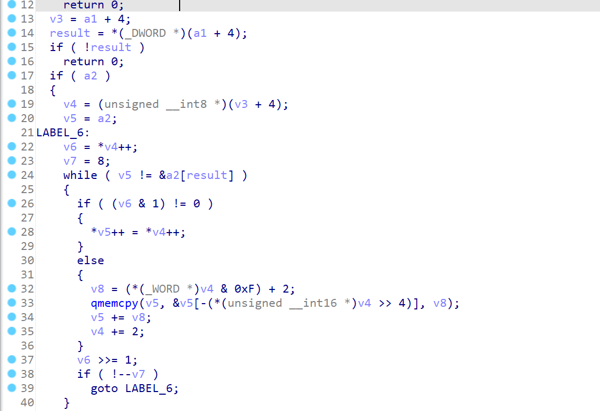


之前：

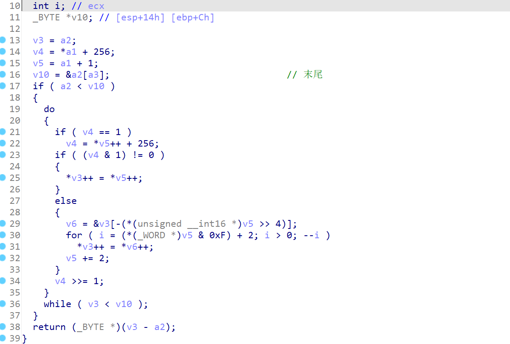


在出现的三个地方都下断点，发现第一次断到这里：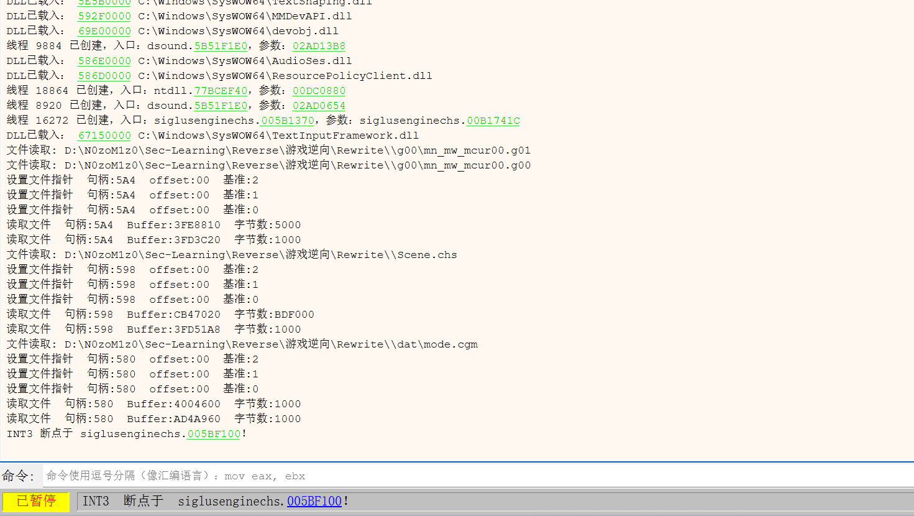


顺着分析 mode.cgm

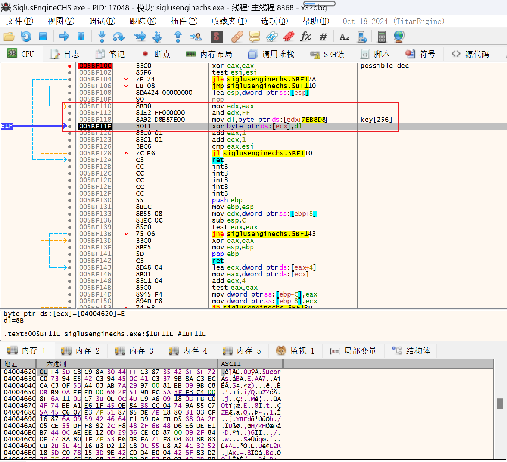

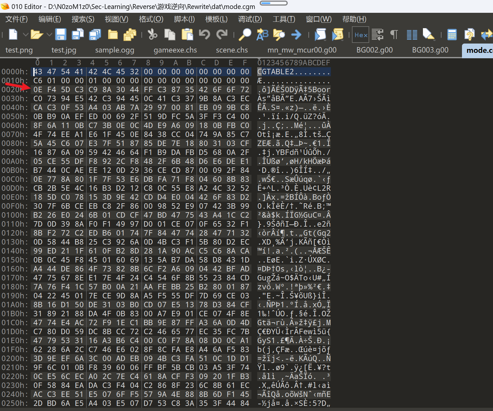


长度是esi字段，0x1185，发现就是除开前面0x20剩下的所有（）

然后经过`sub_5BF130`后：

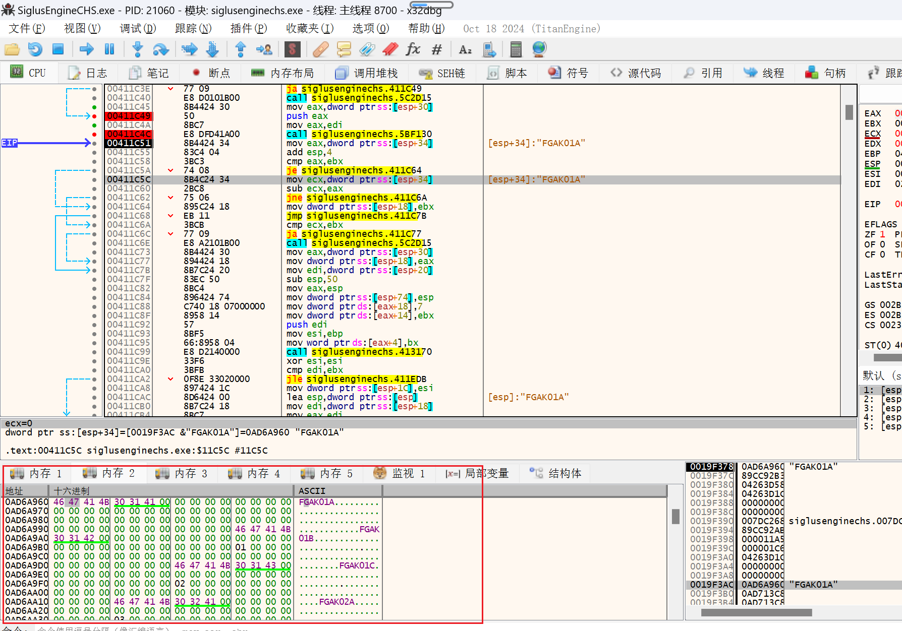


已经初具结构了。

对应的长度是先前调试看到的0x6A68.

这个应该类似一个索引包，下个硬件断点继续跟。

然后IDA 371行的这个：`Source = (char *)Source + 60;  `刚好就是指向下一个字符串。

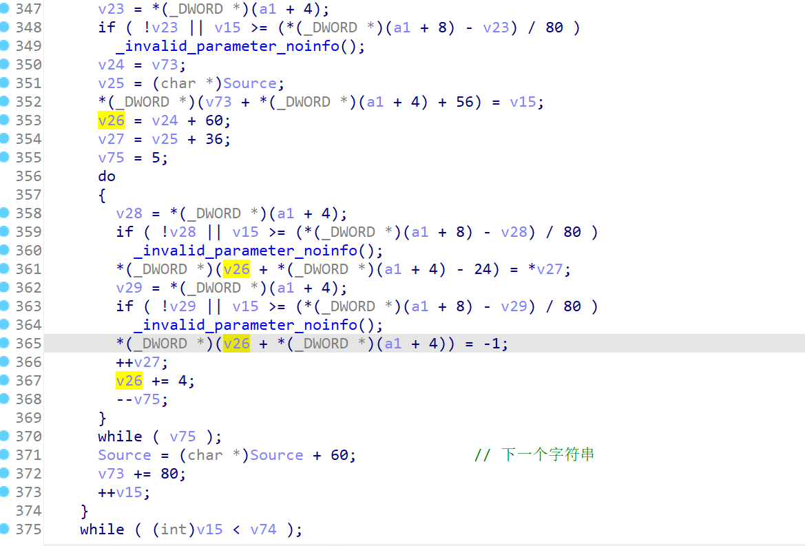


注意这个地方：

```
*(_DWORD *)(v18 + *(_DWORD *)(a1 + 4) + 28) = *((_DWORD *)Source + 8);
```

后面开始就有值了：看着像索引，确实，每次+1的。

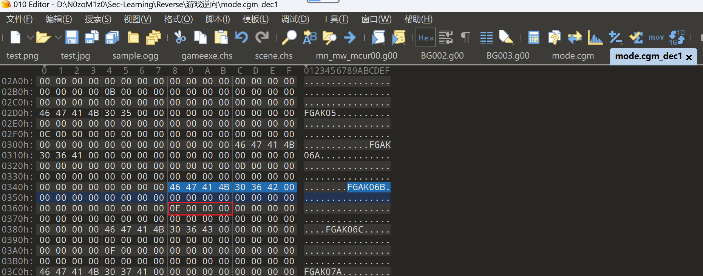


所以这个mode.cgm解出来就是一个索引表。


然后将这个表再做一些处理后弄给`a1+4`那儿。

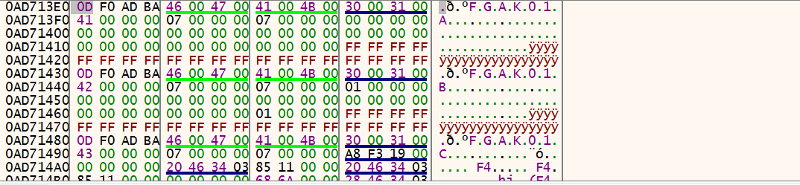


就是转为宽字节，加了两个07（表示字符串长度的），还有存了个索引下标，0,1,2...

最前面还有00 F0 AD BA的固定头部。

一个BLOCK占0x60 Bytes


那么跳到返回后，在这个a1+4下硬件断点。

在触发这个新表的硬件断点之前，进入到了应一个dec的地方：

`sub_48E3C0`


此时发现待处理的文件是global.sav：？

哦对，其实这个地方和之前都read.sav的大差不差：

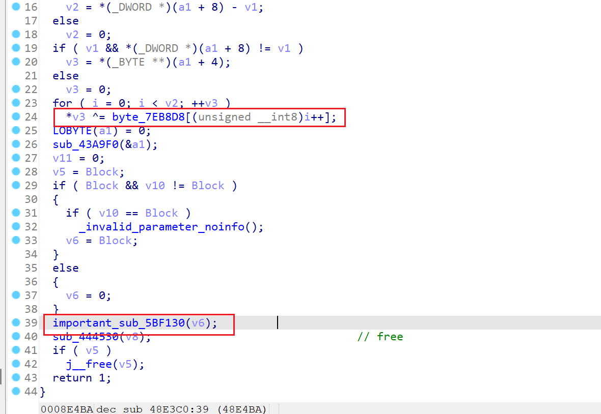

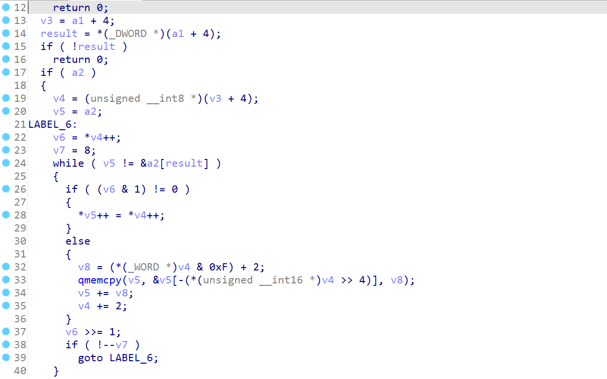

可能细节有些区别，但是没啥影响。

可以直接F9。

毕竟我们现在不关心这个global.sav的解密。

等后面再来处理。


同样的，处理read.sav的时候，也断到了这个地方，那么我们就可以把这里标记为对sav文件的dec了。

同样的，还有config.sav


但为什么先前那个硬件断点一次都没访问过啊。。。：？：？

还有48E190的dec也没断到过；。。。


嘶，当我进入游戏，选择返回Title的时候，就断到这个`48E190`了！


但是，我不知道处理的哪个文件（）

哦，貌似是播放的音频的？

也就是这个是解密音频的？


怎么才能触发先前那个表的啊（）

不应该啊（）

为什么其他的g00这些就没碰过这个表了。。。（）


感觉所有的解密应该都会围绕这个key[256]啊。。

有没有可能用的是另一处还有的这个key？


g。。。没用，。。。


这是真没辙了（）

（）。。。。

。。。


感觉前面那个table是跟g00对应的，关键还是找到g00的处理点在哪儿啊？？？！！！

确实正如我猜想的，这里用于Gallery的图片处。


可以在图片读取的g00这里的内存尝试下断点，看能不能断下来。

麻了。。。真跟不到哪里处理的g00啊！！！！。。。


不是，真的跟我想的对不上啊。


翻函数列表吧。。。（）

接近8000个，慢慢翻。。


2024年11月17日 17点25分 函数翻完了（）

找到几个可能有用的，调试看看。。


## `5BA360`

貌似omv时会断到这个

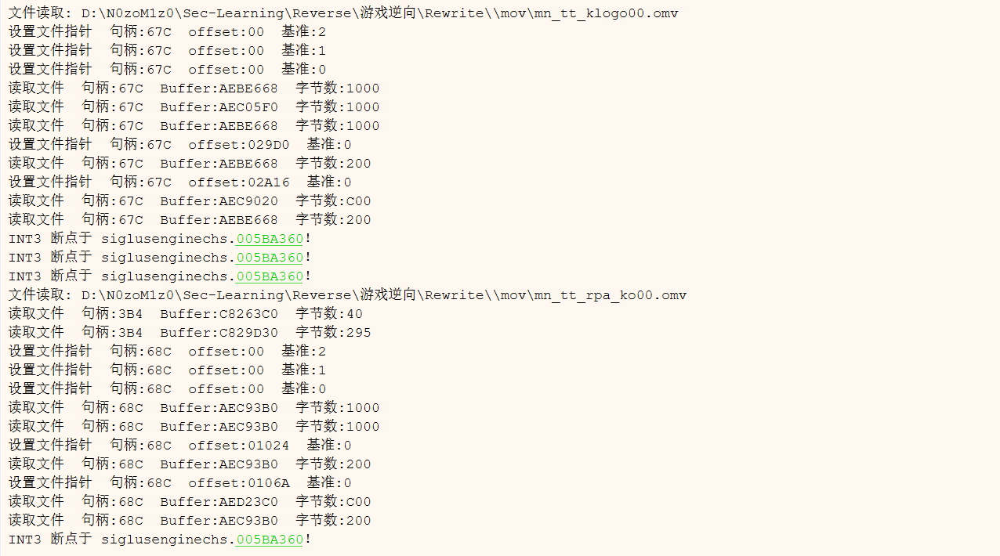

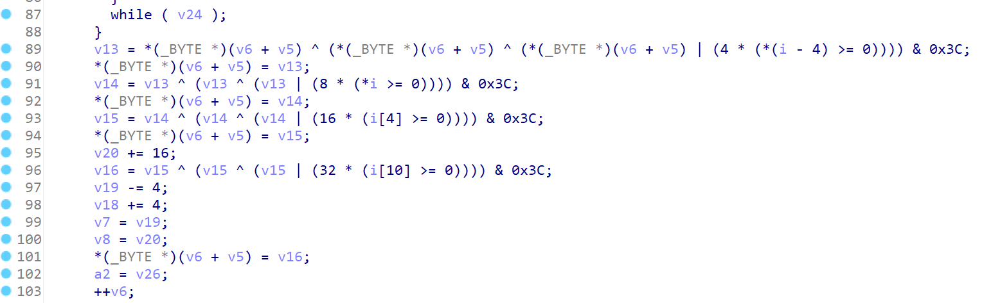


## `5B9BC0`

也是omv会断到这里。


## `5B9850`

omv


## `sub_463730`！

这个是用户态代码，读取了g00，还有scene.chs的处理！


跟着scene.chs的处理时，无意间看到这里！！！

`sub_42BD50`

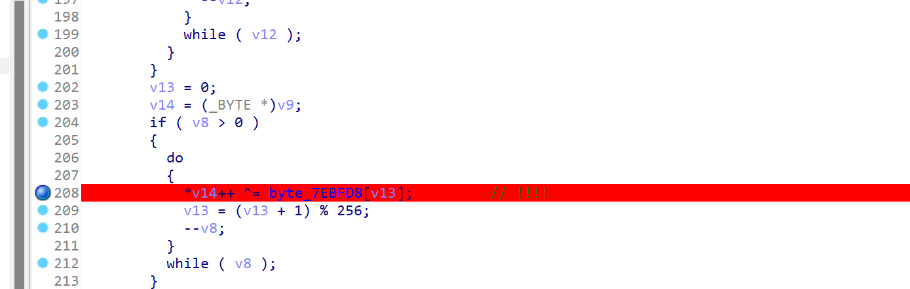


woc。。。


因为我选择运行到返回，所以可以看到EIP的变化：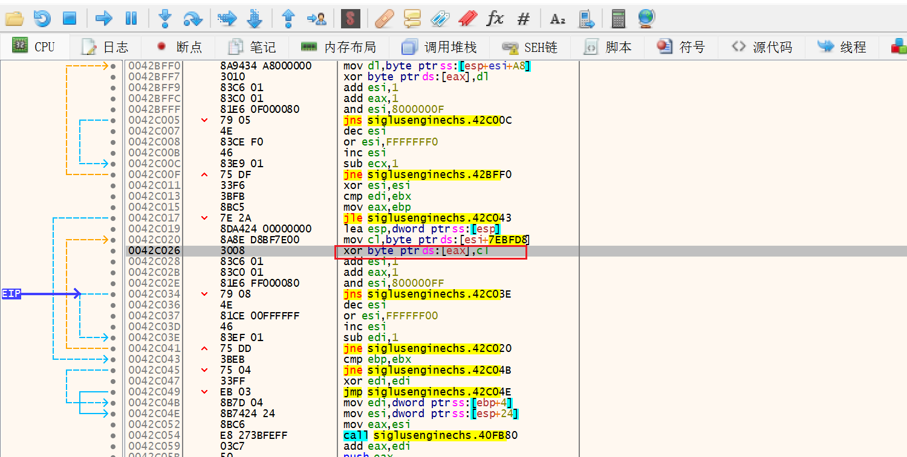


woc，原来换了另一个table。。。藏这儿的。。。

前面点还有一个xor：


这下就又有头绪了（）


但感觉还是挺复杂的。主要是不知道解出来的东西有啥用（）

（）

只是说找到scene.chs相关的地方了，但不知道它解密中间一段有啥用啊：？


## `423440`

这里还有一个xor：

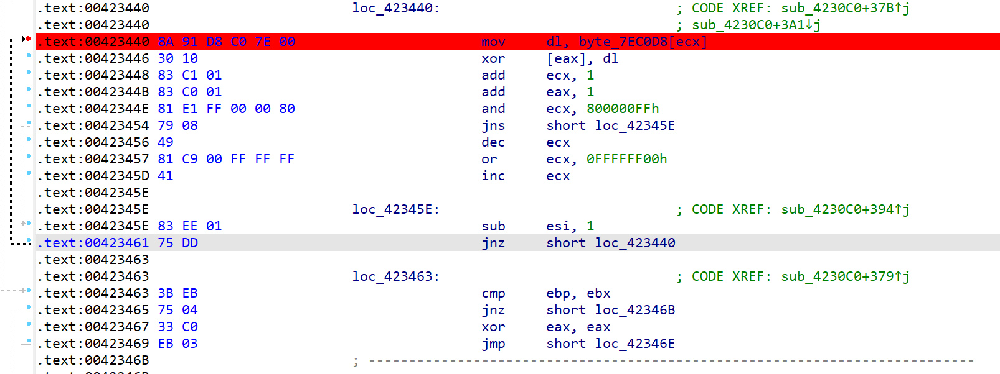


发现是`Gameexe.chs`的解密部分。


现在重点还是关注g00的（）

还是像先前那样，在读取了g00后，回溯往上找。

注意，不断在mn_mw_mcur00，而是后面的g00，第一个mn_mw_mcur00.g00的处理逻辑不大一样。

我们在mn_mw_mw00a00.g00的时候开始回溯。

一直点运行到返回，直到4开头的非引擎代码段。


`sub_4D71E0`貌似是循环读取g00：？

再往上，回溯到`sub_4DB700`

这个也是循环了两次的读取g00，

再往上`sub_4C3160`

再往上`sub_4C0A00`

再往上`sub_4C2860`

再往上`sub_469E40`，正好是g00buf在的地方！！！ woc，有说法（）

而且这些g00文件是分批读取的，要么就是在没跟进去的地方解密的，要么就是后面才处理。

这部分刚好读到 mn_mw_kcur02.g00

前面这些应该都是些配置，窗口之类的资源。


往上 `sub_476E10`

从这里开始，F8一下，缩小下范围。

这个sub_476E10的层面就挺高的了，

`sub_463730`读取了配置文件，直到`movie.ini`

`sub_4993B0`读到`mn_mw_kcur02.g00`

sub_45DD10读到 mn_tt_tr00.g00

sub_45EA80没p用

然后直接跳到 call sub_449320，没有读取

sub_4184A0也没有读取


然后回到前面这个while循环

sub_45DD10读到`mn_ss_se32.nwa`

然后一直循环读取了，看看在哪里跳出这个while

好像这就是游戏资源加载的主循环了，应该就是游戏运行就一直while了。

那资源解密呢？？？

（）


接下来就需要跟到`sub_4993B0`和`sub_45DD10`里面一探究竟了。


先看4993B0，至少要知道哪一步是读取了g00的。

：？

这里跟到一个很诡异的数据：

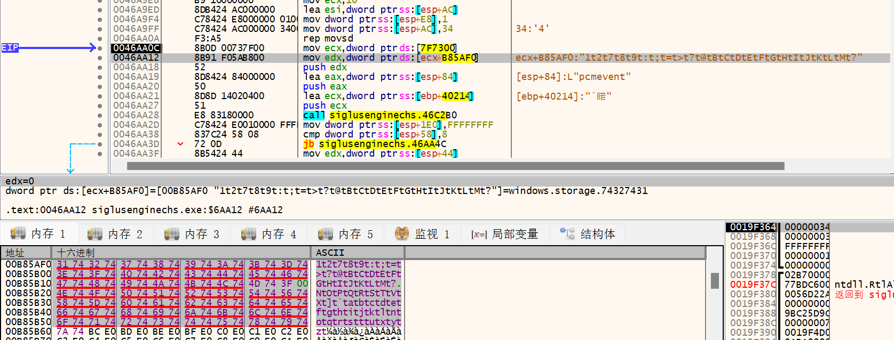

```
31 74 32 74 37 74 38 74 39 74 3A 74 3B 74 3D 74 3E 74 3F 74 40 74 42 74 43 74 44 74 45 74 46 74 47 74 48 74 49 74 4A 74 4B 74 4C 74 4D 74 3F 00 4E 74 4F 74 50 74 51 74 52 74 53 74 54 74 56 74 58 74 5D 74 60 74 61 74 62 74 63 74 64 74 65 74 66 74 67 74 68 74 69 74 6A 74 6B 74 6C 74 6E 74 6F 74 71 74 72 74 73 74 74 74 75 74 78 74 79 74
```


感觉有可能是什么key之类的。不然这么整整齐齐的奇怪还是很奇怪的（）


寄。。。（）还是跟不到。。

那就猜测读取的时候说不定就解密了，跟进这里的call eax：（在弄不出来这个周末就不弄了（））

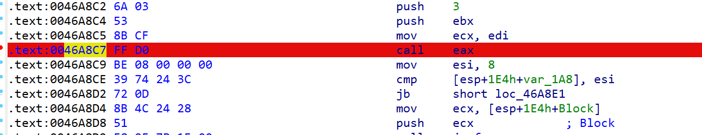


跟进到之前找的`sub_4C3160`里面，排查缩小范围。

是这里的call edx：

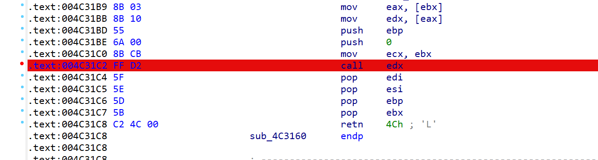


call edx就是 `sub_4DB700`


然后断到`4E2710`


()

现在还有一招，在readfile后，下硬件断点，然后一直回溯来找。

回溯发现在：`4363A8`

：？

主要是不知道对于读取的g00文件做了啥啊。。。？

一个函数调用一个函数调用的看吧（）

。。。

以后再说吧，，，真逆不动了。。。


---

# 0. 原版引擎脱壳

其实是个SMC。。。看着挺简单的，DWORD ^+。

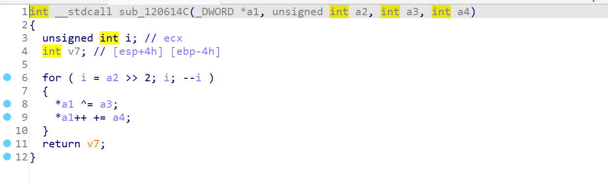

当然，SMC后发现还套着有，得细心跟一下。

跟到入口点在这里：

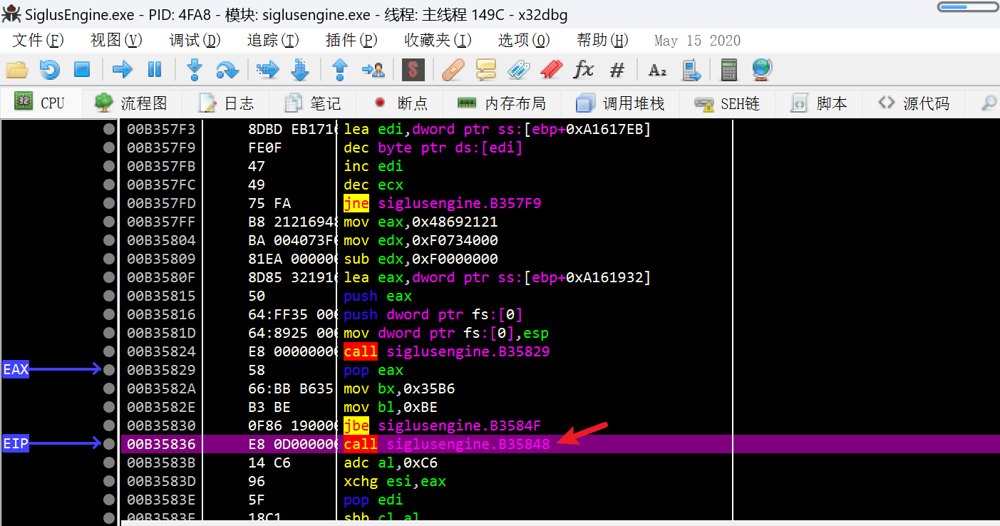


这还不能先下断点，不然解密错误。。。

但完全还原是不大可能。

好像里面还有SMC：？

呃呃，。


# 1. 关于 nwa的解包

网上已经有轮子了，不再自己造了（）

（后面有空可以逆逆看这个nwa格式）

```
https://github.com/mirrorange/NwaConverter
```

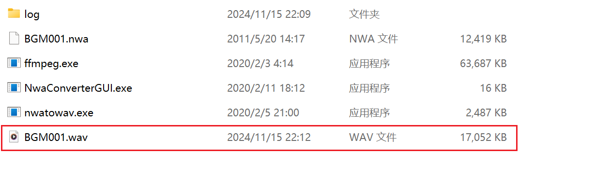


非常不错~


这样一来，我的最初目的已经达成了。。。（）

（）

对应的：


呃，但好像后面的也对不上。😓。。。


嘛，后面慢慢找吧（）主要是想找sakuya的那个BGM~

终于找到sakuya的了😭

BGM017，散花！


# 2. 关于PNG

怎么找游戏加载的PNG呢？

突然翻到这个：

`png_read_info`，被Lumina匹配到的（）

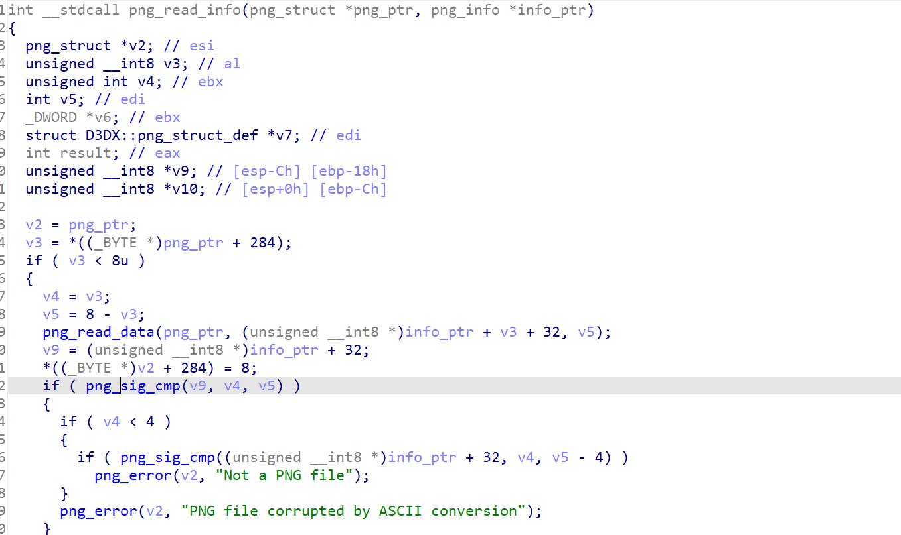


那感觉可以在这里下断点，就有可能能逆向拿到PNG资源了。

但调试实测发现，根本断不到这里。🤣

（）不应该啊。。。

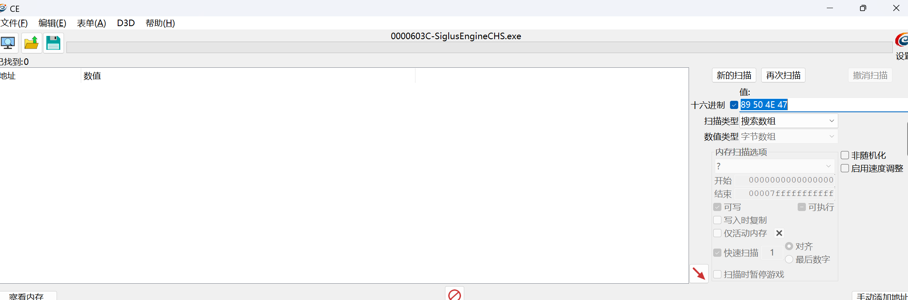


？


根本没有PNG资源？


# 3. 尝试g00文件分析

这些应该是关键资源文件。


在读取到mn_mw_mw00a00.g00的时候（前面的g01没有这个文件），断下逐步分析，发现分别读了

0~E000

E000~

的两部分

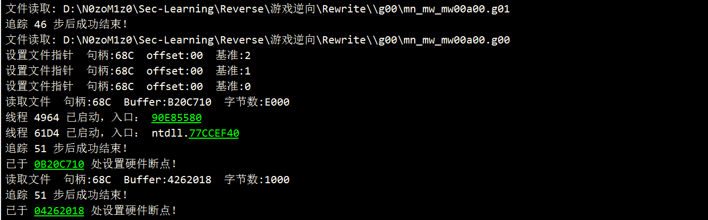


然后在这两个内存地址下硬件断点，断到这里：


可能有说法？

对应IDA的`sub_5759E0`

看B20C710发现并没有被修改，那有可能有赋值操作。

肯定是读取后有解密之类的操作的，感觉不大可能全部读取后，后面再解密吧：？

嘶，真搞不明白了。。。

你别说还真有可能开始只是读取，没有处理。。。

：？有趣🤔


然后关于这个两部分大小的选择：选取的是整个g00文件大小的去除最后3位的。

比如 14BBF0 -> 14B000 , 1000


010分析g00文件：

前5个字节固定，然后紧跟着就是文件大小（除去5Bytes头部）


真找不到在哪儿解析的g00文件啊？

不会是渲染的时候才解析吧：？


呃，看g00文件，找到一个小规律：

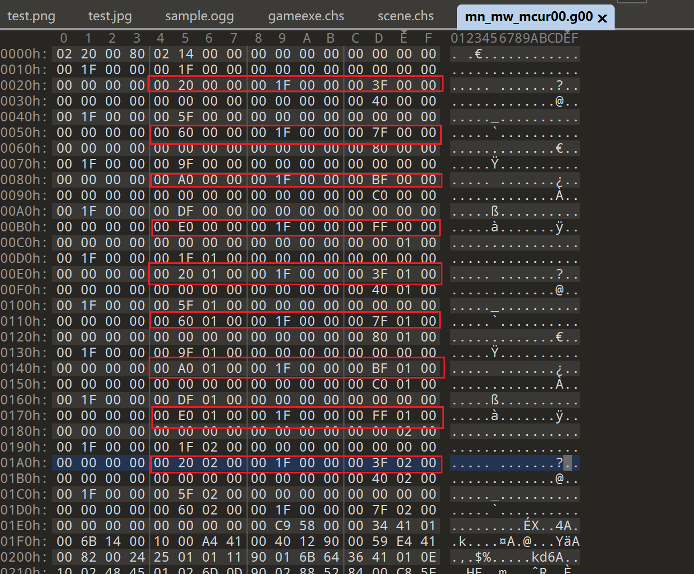


小端序，框起来的第一列是起始地址？第二列是长度？第三列是结束地址？

而且都是1F的长度：？


。。。真不知道这g00咋处理的啊。。。


# 4. omv文件

由于g00始终没弄懂在哪儿解析的，先看有搞头的omv。


```
文件读取: D:\N0zoM1z0\Sec-Learning\Reverse\游戏逆向\Rewrite\\mov\mn_tt_klogo00.omv
设置文件指针  句柄:5A0  offset:00  基准:2
设置文件指针  句柄:5A0  offset:00  基准:1
设置文件指针  句柄:5A0  offset:00  基准:0
读取文件  句柄:5A0  Buffer:AECE668  字节数:1000
读取文件  句柄:5A0  Buffer:AED05F0  字节数:1000
读取文件  句柄:5A0  Buffer:AECE668  字节数:1000
设置文件指针  句柄:5A0  offset:029D0  基准:0
读取文件  句柄:5A0  Buffer:AECE668  字节数:200
设置文件指针  句柄:5A0  offset:02A16  基准:0
读取文件  句柄:5A0  Buffer:AED9020  字节数:C00
读取文件  句柄:5A0  Buffer:AECE668  字节数:200
```


29D0开始正是OggS:

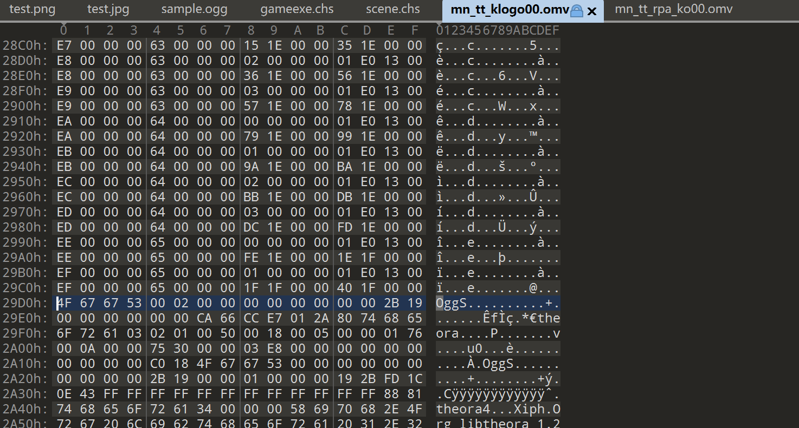


```
文件读取: D:\N0zoM1z0\Sec-Learning\Reverse\游戏逆向\Rewrite\\mov\mn_tt_klogo00.omv
设置文件指针  句柄:69C  offset:00  基准:2
设置文件指针  句柄:69C  offset:00  基准:1
设置文件指针  句柄:69C  offset:00  基准:0
读取文件  句柄:69C  Buffer:AEBE668  字节数:1000
追踪 50 步后成功结束！
已于 0AEBE668 处设置硬件断点！
硬件断点 (byte, 读写) 于 0AEBE668!
读取文件  句柄:69C  Buffer:AEC05F0  字节数:1000
读取文件  句柄:69C  Buffer:AEBE668  字节数:1000
硬件断点 (byte, 读写) 于 0AEBE668!
线程 11240 已创建，入口：ntdll.77CCEF40，参数：00E80880
设置文件指针  句柄:69C  offset:029D0  基准:0
读取文件  句柄:69C  Buffer:AEBE668  字节数:200
硬件断点 (byte, 读写) 于 0AEBE668!
设置文件指针  句柄:69C  offset:02A16  基准:0
读取文件  句柄:69C  Buffer:AEC9020  字节数:C00
追踪 51 步后成功结束！
已于 0AEC9020 处设置硬件断点！
读取文件  句柄:69C  Buffer:AEBE668  字节数:200
追踪 51 步后成功结束！
硬件断点 (byte, 读写) 于 0AEBE668!
```


慢慢下硬件断点调试，终于找到这里：

凭经验，5开头的代码段应该是引擎的代码。

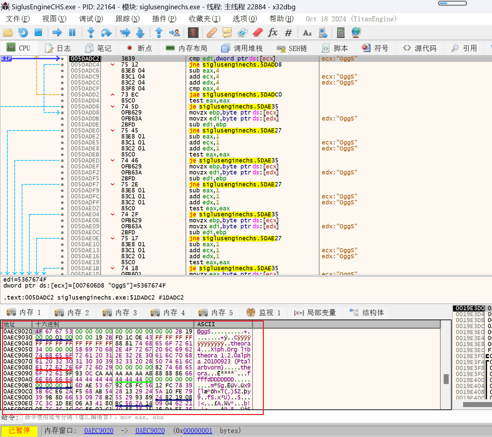


但也只能知道这里用了Ogg，提取出来格式损坏了（

看看binwalk能不能分出来呢。p用没有。。。

（）


# 5. OVK文件


# 6. scene.chs - sub_463730

跟踪发现，在这里会将前面读取到的内容进行一个复制：

`sub_40FC80`

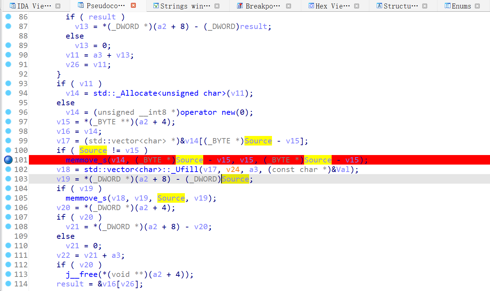


而且发现会有多次复制，每次复制4Bytes?


# 7. read.sav

有个SiglusCounter.exe：

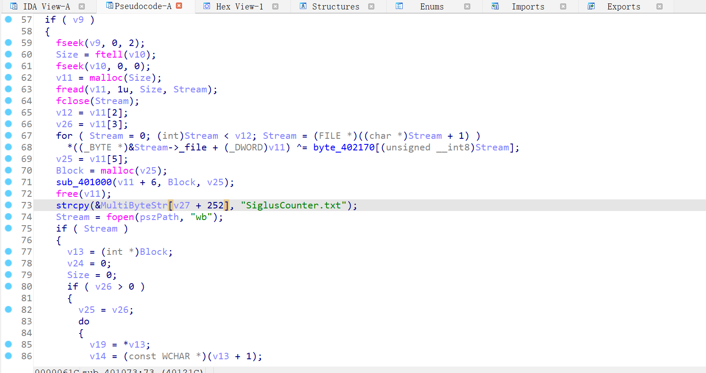


逆一下。

有一个xor，还有一个`sub_401000`，

然后应该就解出明文了，后面的if(Stream)那儿的do-while就是累加统计进度。


主要是这个sub_401000是一个错位乱序的操作：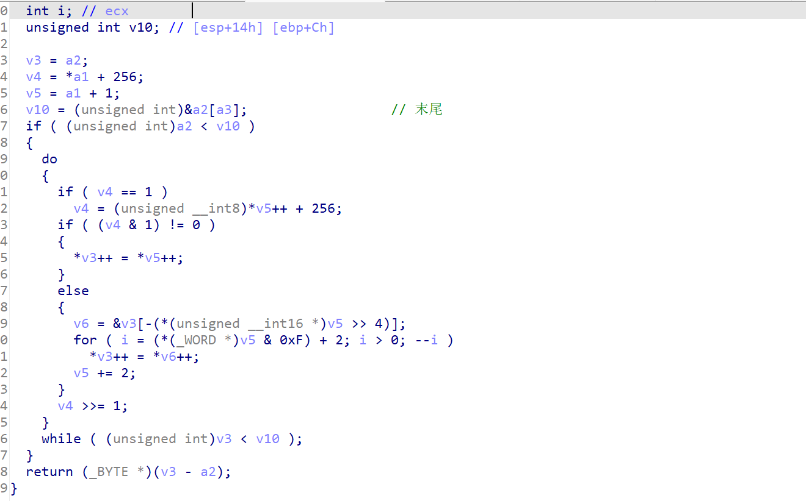

全篇都是带着指针的操作，如果翻译成python，很多细节要注意，太麻烦了。

直接用C，仿照着写一个就行：

```c
# define _CRT_SECURE_NO_WARNINGS
#include<Windows.h>
#include<stdio.h>
#include<stdlib.h>
#include<string.h>
using namespace std;
char data[0x20000];
void sub_401000(BYTE* a1, BYTE* a2, int a3) {
    BYTE* v3; // eax
    unsigned int v4; // edx
    BYTE* v5; // edi
    BYTE* v6; // esi
    int i; // ecx
    unsigned int v10; // [esp+14h] [ebp+Ch]

    v3 = a2;
    v4 = *a1 + 256;
    v5 = a1 + 1;
    v10 = (unsigned int)&a2[a3];                  // 末尾
    if ((unsigned int)a2 < v10)
    {
        do
        {
            if (v4 == 1)
                v4 = (unsigned __int8)*v5++ + 256;
            if ((v4 & 1) != 0)
            {
                *v3++ = *v5++;
            }
            else
            {
                v6 = &v3[-(*(unsigned __int16*)v5 >> 4)];
                for (i = (*(WORD*)v5 & 0xF) + 2; i > 0; --i)
                    *v3++ = *v6++;
                v5 += 2;
            }
            v4 >>= 1;
        } while ((unsigned int)v3 < v10);
    }
}
int main() {
	BYTE key[256] = { 0x8B, 0xE5, 0x5D, 0xC3, 0xA1, 0xE0, 0x30, 0x44, 0x00, 0x85, 0xC0, 0x74, 0x09, 0x5F, 0x5E, 0x33, 0xC0, 0x5B, 0x8B, 0xE5, 0x5D, 0xC3, 0x8B, 0x45, 0x0C, 0x85, 0xC0, 0x75, 0x14, 0x8B, 0x55, 0xEC, 0x83, 0xC2, 0x20, 0x52, 0x6A, 0x00, 0xE8, 0xF5, 0x28, 0x01, 0x00, 0x83, 0xC4, 0x08, 0x89, 0x45, 0x0C, 0x8B, 0x45, 0xE4, 0x6A, 0x00, 0x6A, 0x00, 0x50, 0x53, 0xFF, 0x15, 0x34, 0xB1, 0x43, 0x00, 0x8B, 0x45, 0x10, 0x85, 0xC0, 0x74, 0x05, 0x8B, 0x4D, 0xEC, 0x89, 0x08, 0x8A, 0x45, 0xF0, 0x84, 0xC0, 0x75, 0x78, 0xA1, 0xE0, 0x30, 0x44, 0x00, 0x8B, 0x7D, 0xE8, 0x8B, 0x75, 0x0C, 0x85, 0xC0, 0x75, 0x44, 0x8B, 0x1D, 0xD0, 0xB0, 0x43, 0x00, 0x85, 0xFF, 0x76, 0x37, 0x81, 0xFF, 0x00, 0x00, 0x04, 0x00, 0x6A, 0x00, 0x76, 0x43, 0x8B, 0x45, 0xF8, 0x8D, 0x55, 0xFC, 0x52, 0x68, 0x00, 0x00, 0x04, 0x00, 0x56, 0x50, 0xFF, 0x15, 0x2C, 0xB1, 0x43, 0x00, 0x6A, 0x05, 0xFF, 0xD3, 0xA1, 0xE0, 0x30, 0x44, 0x00, 0x81, 0xEF, 0x00, 0x00, 0x04, 0x00, 0x81, 0xC6, 0x00, 0x00, 0x04, 0x00, 0x85, 0xC0, 0x74, 0xC5, 0x8B, 0x5D, 0xF8, 0x53, 0xE8, 0xF4, 0xFB, 0xFF, 0xFF, 0x8B, 0x45, 0x0C, 0x83, 0xC4, 0x04, 0x5F, 0x5E, 0x5B, 0x8B, 0xE5, 0x5D, 0xC3, 0x8B, 0x55, 0xF8, 0x8D, 0x4D, 0xFC, 0x51, 0x57, 0x56, 0x52, 0xFF, 0x15, 0x2C, 0xB1, 0x43, 0x00, 0xEB, 0xD8, 0x8B, 0x45, 0xE8, 0x83, 0xC0, 0x20, 0x50, 0x6A, 0x00, 0xE8, 0x47, 0x28, 0x01, 0x00, 0x8B, 0x7D, 0xE8, 0x89, 0x45, 0xF4, 0x8B, 0xF0, 0xA1, 0xE0, 0x30, 0x44, 0x00, 0x83, 0xC4, 0x08, 0x85, 0xC0, 0x75, 0x56, 0x8B, 0x1D, 0xD0, 0xB0, 0x43, 0x00, 0x85, 0xFF, 0x76, 0x49, 0x81, 0xFF, 0x00, 0x00, 0x04, 0x00, 0x6A, 0x00, 0x76 };
	FILE* in;
	in = fopen("D:\\N0zoM1z0\\Sec-Learning\\Reverse\\游戏逆向\\read.sav", "rb");
	fread(data, sizeof(char), sizeof(data), in);
	DWORD* dw_data = (DWORD*)data;
	DWORD v12 = dw_data[2];
	DWORD v26 = dw_data[3];
	for (int i = 0x10; i < 0x10 + v12; i++) {
		data[i] ^= key[(i - 0x10) & 0xFF];
	}
    DWORD v25 = dw_data[5];
    void* Block = malloc(v25);
    sub_401000((BYTE*)data + 24, (BYTE*)Block, v25);
    printf("+++++++++++++++++++++++++++++++++++++++++++++++");
    
    for (int i = 0; i < v25; i++) {
        BYTE c = *((BYTE*)Block + i);
    } // checked ✔️
    FILE* Stream = fopen("D:\\N0zoM1z0\\Sec-Learning\\Reverse\\游戏逆向\\SiglusCounter.txt", "wb");
    FILE* v4; // eax
    FILE* v5; // edi
    char* v6; // eax
    const char* v7; // edi
    char* v8; // eax
    FILE* v9; // eax
    FILE* v10; // edi
    void* v11; // esi
    int* v13; // esi
    const WCHAR* v14; // esi
    int* v15; // esi
    int v16; // ecx
    size_t v17; // eax
    int v19; // [esp-14h] [ebp-3A0h]
    char Buffer[304]; // [esp+Ch] [ebp-380h] BYREF
    CHAR MultiByteStr[260]; // [esp+13Ch] [ebp-250h] BYREF
    CHAR pszPath[304]; // [esp+240h] [ebp-14Ch] BYREF
    int v24; // [esp+374h] [ebp-18h]

    size_t v27; // [esp+380h] [ebp-Ch]
    size_t Size; // [esp+384h] [ebp-8h]

    if (Stream)
    {
        v13 = (int*)Block;
        v24 = 0;
        Size = 0;
        if (v26 > 0)
        {
            v25 = v26;
            do
            {
                v19 = *v13;
                v14 = (const WCHAR*)(v13 + 1);
                v26 = v19;
                MultiByteStr[WideCharToMultiByte(0x3A4u, 0, v14, v19, MultiByteStr, 256, 0, 0)] = 0;
                v15 = (int*)&v14[v26];
                v16 = *v15;
                v13 = v15 + 1;
                v26 = v16;
                if (v16)
                {
                    v17 = 0;
                    v27 = 0;
                    if (v16 > 0)
                    {
                        v27 = v16;
                        do
                        {
                            v17 += *(unsigned __int8*)v13;
                            v13 = (int*)((char*)v13 + 1);
                            --v27;
                        } while (v27);
                        v27 = v17;
                    }
                    Size += v17;
                    v24 += v16;
                    fprintf(
                        Stream,
                        "%6d/%6d   %3d.%d%%   %s\r\n",
                        v27,
                        v26,
                        (int)(1000 * v17) / v16 / 10,
                        (int)(1000 * v17) / v16 % 10,
                        MultiByteStr);
                }
                --v25;
            } while (v25);
        }
        free(Block);
        fprintf(
            Stream,
            "----------------------------------------\r\n%6d/%6d   %3d.%d%%   (ALL)\r\n",
            Size,
            v24,
            (int)(1000 * Size) / v24 / 10,
            (int)(1000 * Size) / v24 % 10);
        fclose(Stream);
    }
    ShellExecuteA(0, "open", "D:\\N0zoM1z0\\Sec-Learning\\Reverse\\游戏逆向\\SiglusCounter.txt", NULL,NULL, 1);
}
```

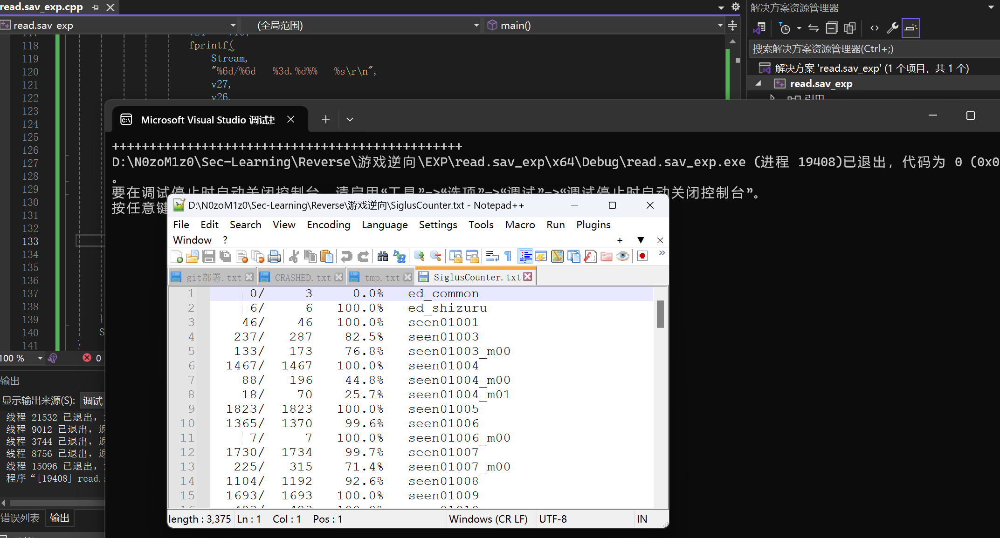


ok~


# 8. Gameexe.chs

`423440`


# New New New

参考这个github工具看看，能不能有啥启发。。。

```
https://github.com/xmoezzz/SiglusExtract
```

看着工作量不小啊（）


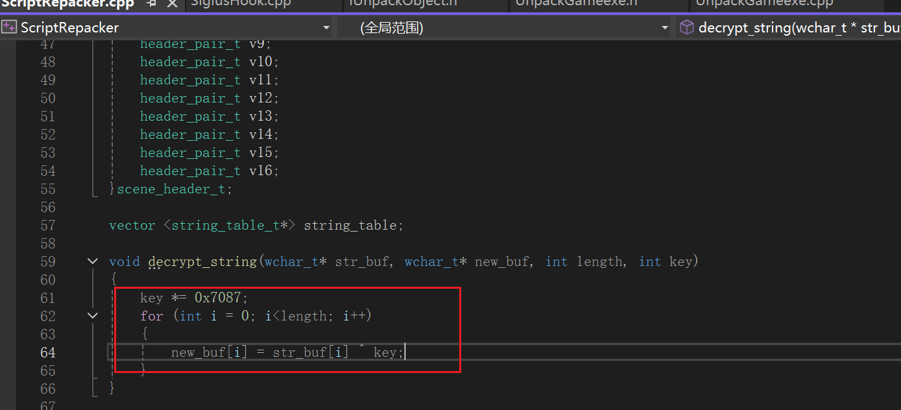

woc？这个我见过……

ooops，tmd，宽字节。。。 md。。。


cao：

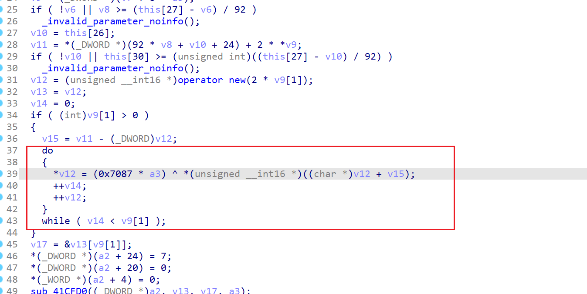


这个是靠前的，tmd忘在这里下断点动调了（）。。。


有两处：

`42D8B0`

`42DA10`


下断点跟一下，在读取mode.cgm后，断在`42D8B0`

但这玩意儿解的啥啊（）


c，有g00 pack official。。。


。。。


感觉还是逆不大动啊（）后面再来看吧，耗费太多时间了（）

2024年11月17日 23点08分


mademade，找到一个超级精简的g00转换工具，逆向看看：

```
http://d4.princess.ne.jp/download/lzhdown.cgi?g00cnv1
```

下载后bandizip解压，exe才10kb！！！

而且能解！！！

发现解出来的图片是bmp。。。


`sub_401D51`
