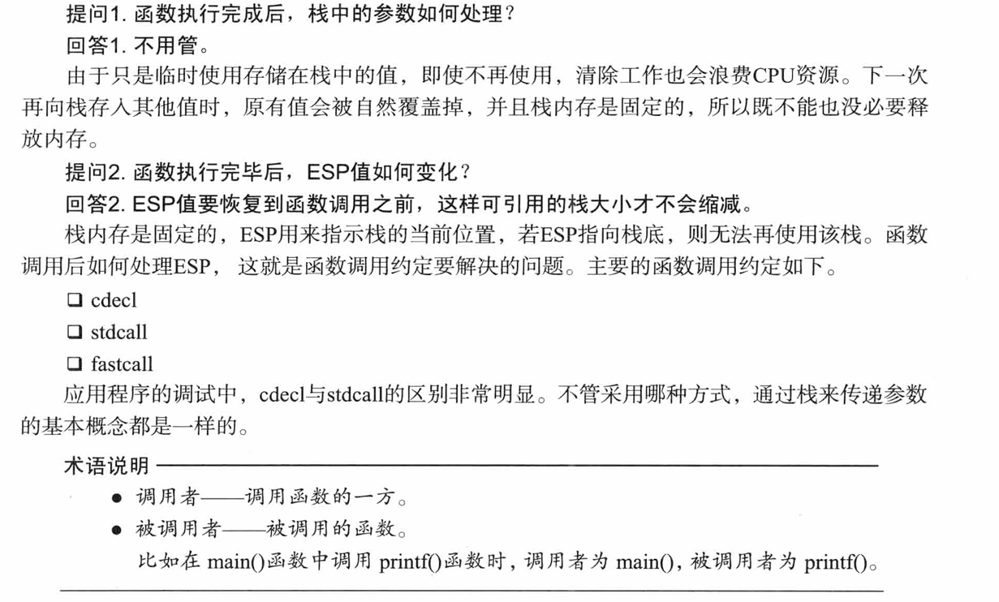
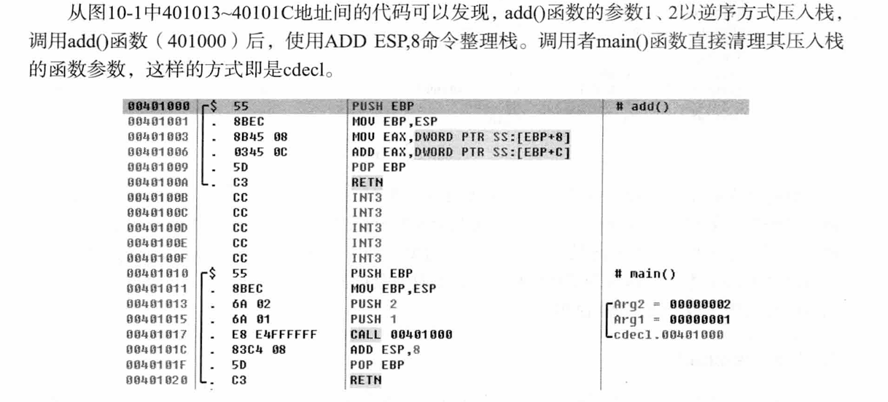
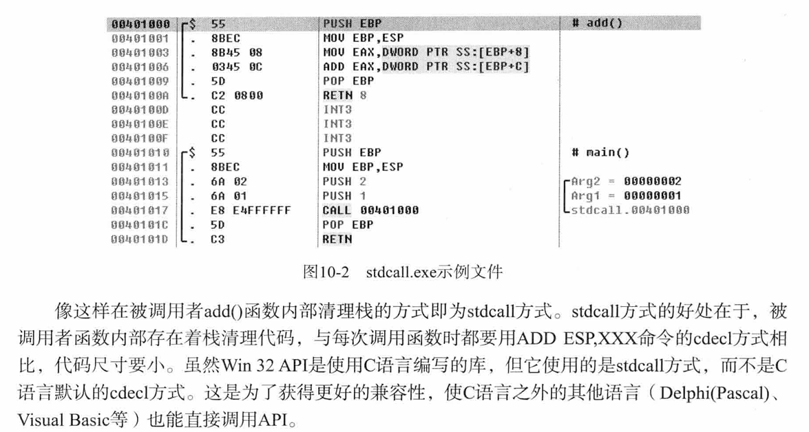
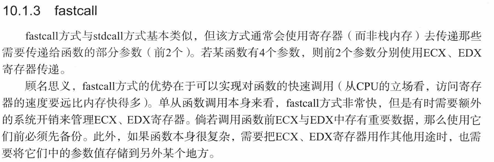

简单学习一下。


作者的Q&A：




# cdecl

`cdecl`是主要在C语言中使用的方式，**caller负责处理栈**。




cdecl方式的好处：

> cdecl方式的好处在于，它可以像C语言的printf()函数一样，向被调用函数传递长度可变的参数。这种长度可变的参数在其它调用约定中很难实现。


# stdcall

常用于**Win32 API**，由**callee清理栈**。

C语言默认的函数调用方式为cdecl，要使用stdcall方式编译源码，使用`_stdcall`关键字即可。

```c
int _stdcall add(int a,int b){
	return a+b;
}
```

栈的清理工作是有add内部的`RETN 8`指令来完成的，而不是call之后`ADD RSP,8`。




# fastcall




这么看来作者是没有考虑64位的情况。。。