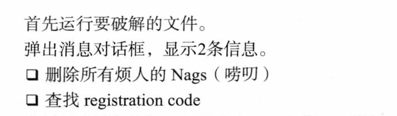
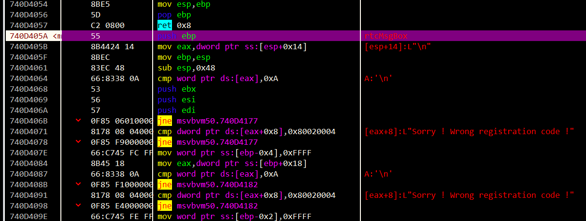
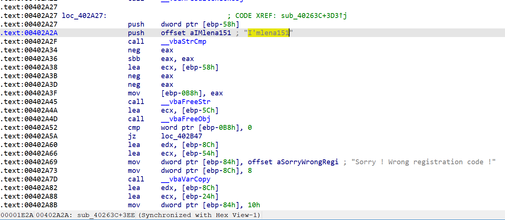
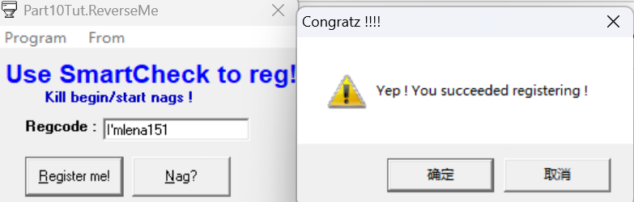
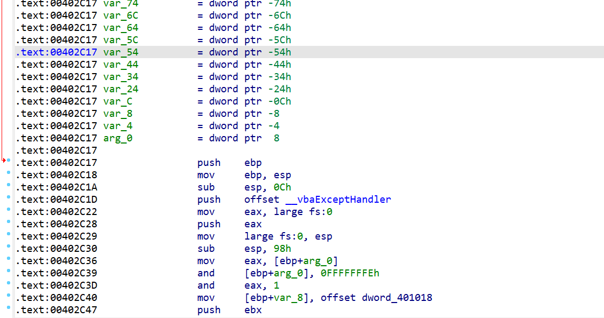
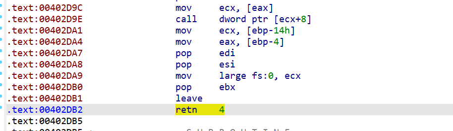
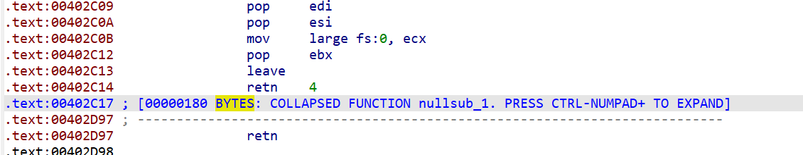
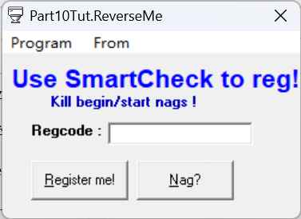

crackme目标：




有点意思。


先弄出reg code。

可以尝试在rtcMsgBox下断点。发现这里加载到了dll的内存？




emmm，好吧，这个regcode纯傻逼

```
I'mlena151
```







接下来看看怎么去nag

怎么去呢？直接patch掉对rtMsg的调用是不行的。。。

教程的方法不错。因为nags对应的只有一个rtMsg处，所以可以patch这个rtMsg的caller函数。




可以直接在开头的`00402C17`处就直接返回。

至于retn后面是多少，直接看原本函数的结尾：




所以retn 4就行了。

这种方式不用像教程那样分析参数个数，stdcall之类的。



patch后再点开就没事了

