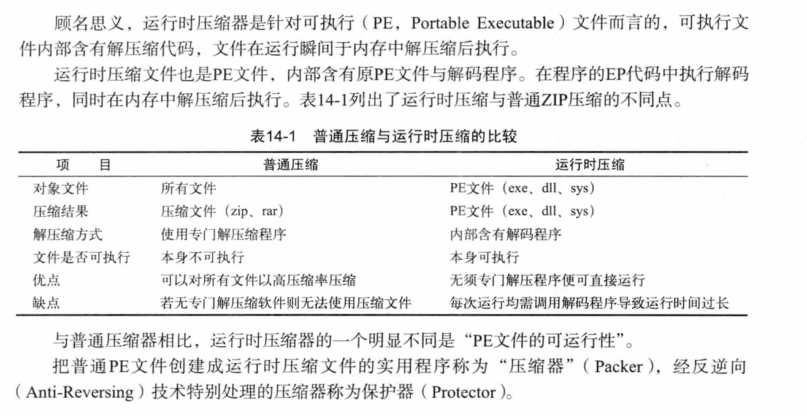
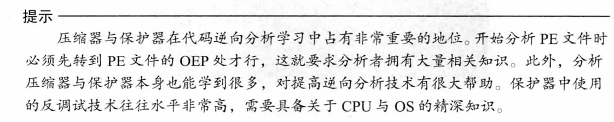
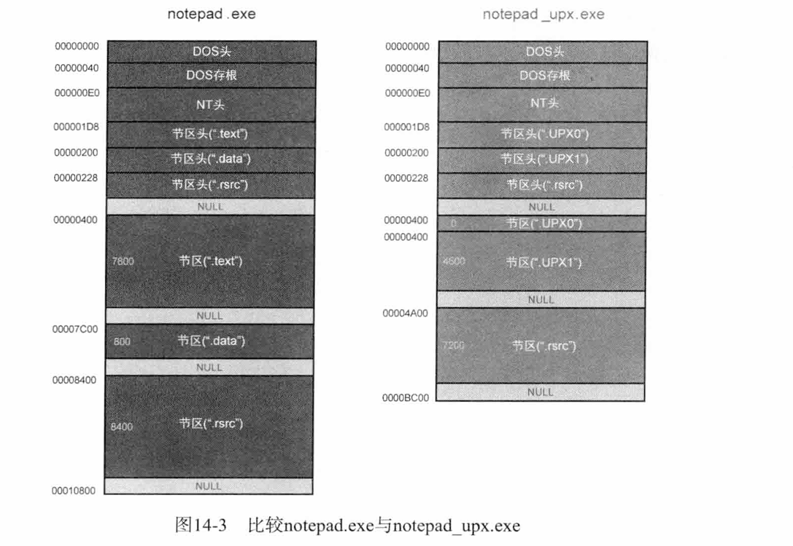
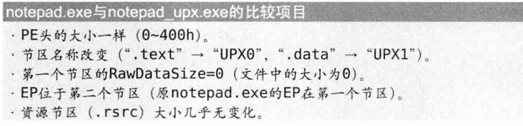
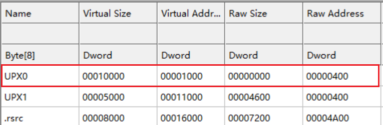

到逆向的壳这一部分了。好好的再学学。。

# 知识点

运行时压缩。

# notepad.exe

这里是简单看看UPX压缩后，**PE文件**的端倪。

比较`notepad.exe`和`notepad_upx.exe`

这里重点关注一下**UPX0**这个节区。

这里看到UPX0节区的`RawSize`是0，也就是说第一个节区在磁盘文件中不存在。是一个空节区。

而`Vitrual Size`是0x10000。

也就是说，UPX压缩的PE文件运行时解压缩到内存的第一个节区，UPX0节区。

相关的解压缩代码和压缩的源代码都在UPX1节区。

PE文件运行时首先执行解压缩代码，把处于压缩状态的源代码解压到第一个节区。

解压结束后再运行源文件的EP代码。

具体的调试分析在下一章~