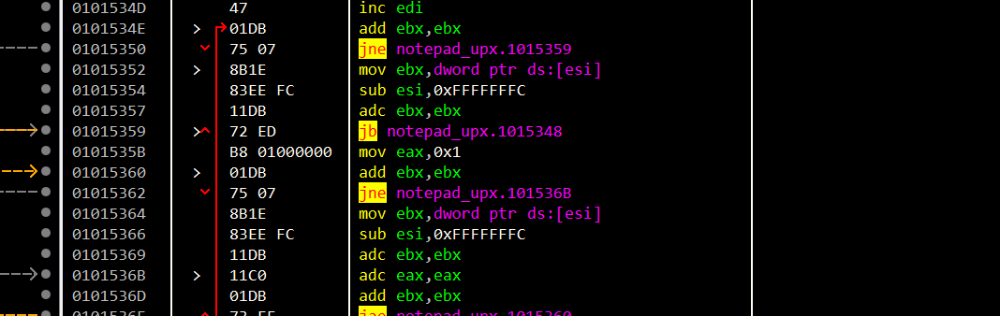

先自己尝试逆一遍，再跟着教程过一遍。

# My Trial

这里IDA打开看segment也能再次清晰注意到：

UPX1是压缩的代码和解压缩的逻辑，UPX0是解压后代码填充的地方。

这种有壳的都用x64来看。

upx后的EP是个很经典的`pushad`。

> `PUSHAD` 是 x86 架构汇编语言中的一个指令，用于一次性将所有通用寄存器（即八个32位寄存器）的当前值压入栈中。它通常在保护当前寄存器内容以便在稍后恢复时使用。

所以这种EP的话，我们只用跟踪到`popad`就能找到OEP。

还可以采用对执行pushad**后**的栈的ESP下硬件断点。

注意这里要先转到内存处，才能设置access(访问)的硬件断点。

F9，

可以看到popad后就触发了硬件断点。

下面的那个jmp就是跳转到OEP了。

当然也可以通过搜索popad的方法来找：

全局搜索命令popad

也不多233。。。

# 完整流程

跟着教程把整个解压缩过程跟一遍。

许多壳，包括UPX，都是特别精妙的写法。所以能逆向过一遍算法、流程还是很有收获的。

---

这次跟完整流程，注意下EP处代码。

`1011000`是第二个节区的起始地址；[esi-0x10000]即`1001000`是第一个节区的起始地址。

而ESI和EDI同时设置，一般是在strcmp这种需要复制的地方。

所以就是从ESI读取内容，解压缩后保存到EDI。即运行时解压缩过程。

下面就开始跟踪。

这里对于loop有一个“法则”：

可以用ctrl+F8来反复执行step over（画面显示），要停下来就F4即可。

## 循环 #1

执行不久就能看到一个小循环：

看看regs：

就是一个简单的读取。没啥用。

跳出循环。

## 循环 #2

再跟一跟会跟到一个大循环：

这也是主要解压缩的循环。

这里结合regs可以知道，

将[esi]的内容解压缩后复制到[edi]中。

在`15402`处F4，我们再看UPX0的节区就已经有解压缩的源码了。

## 循环 #3

这个循环是用来恢复源代码的CALL/JMP指令的destination地址；

对应指令码：E8/E9。

其实完整应该是这段：

代码逻辑：如果是E8（call），就执行`01015418`~`01015432`的代码来恢复call后面的地址。([edi+0x4])

比如一个满足E8后面是1（BYTE）的要求，解密前：

解密后：

emmm，奇奇怪怪。。

## 循环 #4

emm，自己跟的时候中间跟漏了3。

这里这个循环是在重建IAT。

UPX压缩时就会把原来程序的IAT全部提取出来。

弄成一个API的字符串列表：

然后上面循环的`01015467`处就是调用`GetProcAddress`来获取API的起始地址。

把API地址输入到EBX寄存器所指的原notepad.exe的IAT区域。

恢复完过后下面就到了之前找到的jmp处了。

`100739D`也正是原本notepad.exe程序的EP。

# Q&A中学习到的点

也就是说虽然我们的IAT恢复了，但只是这个程序运行的这个时刻的内存中的API地址对应的IAT是存在的；但是dump出来再次运行就不是先前脱壳时dump的环境了。

而INT又是损坏的，所以PE装载器是无法获取对应API的地址，并记录到IAT的。

重点：**运行时解压缩**，所以IAT已经设置过一次，只是是"错"的，UPX解压缩时把正确的API地址填进IAT。

这就是两个字：多练。 😄