对于EXE文件，重定位表以及.reloc节区都是没用的。

VC++生成的重定位节区为.reloc，且是最后一个节区：

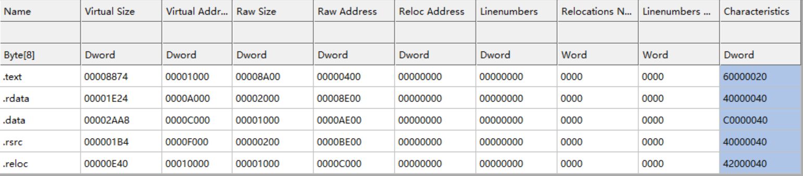

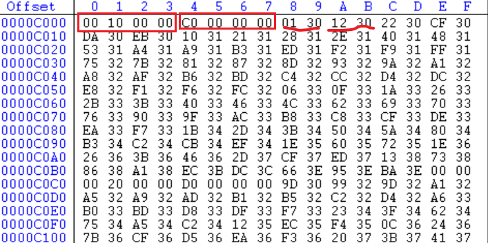

删除.reloc节区需要以下几个步骤：

1. 修改 .reloc **节区头**
2. 删除 .reloc 节区
3. 修改 IMAGE_FILE_HEADER
4. 修改 IMAGE_OPTIONAL_HEADER

## 1. 修改 .reloc节区头

CFF竟然找不着这个项。。 用PE VIEW看：

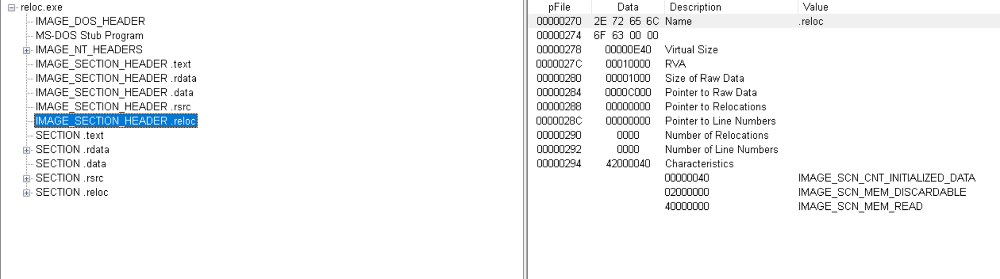

270 ~ 297

将这部分全部填充为00.

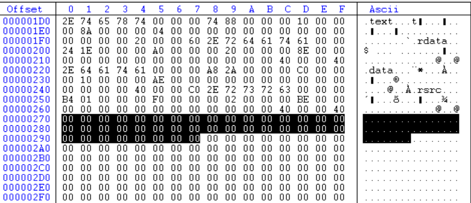

## 2. 删除 .reloc 节区

从 C000开始全部删掉。CFF直接删不掉，用010 editor。

删掉后是无法直接运行的

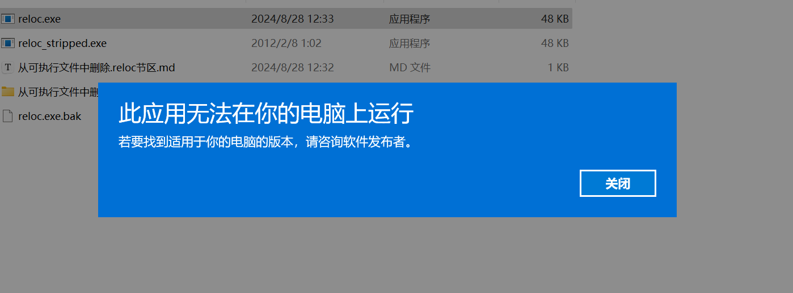

因为我们还需要修改PE头的一些信息。

## 3. 修改 IMAGE_FILE_HEADER

节区数量要改。

5 => 4

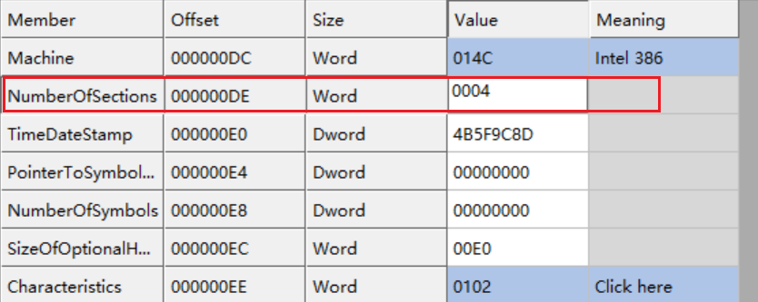

这时改了过后，尝试运行：

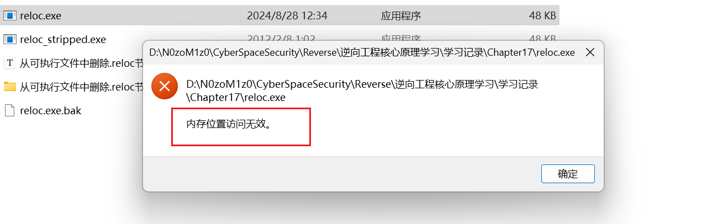

所以说一些address/vitrual address相关的也要改。也就是IMAGE_OPTIONAL_HEADER。

## 4. 修改 IMAGE_OPTIONAL_HEADER

自己尝试改好了~

在这里：（已经改过的）

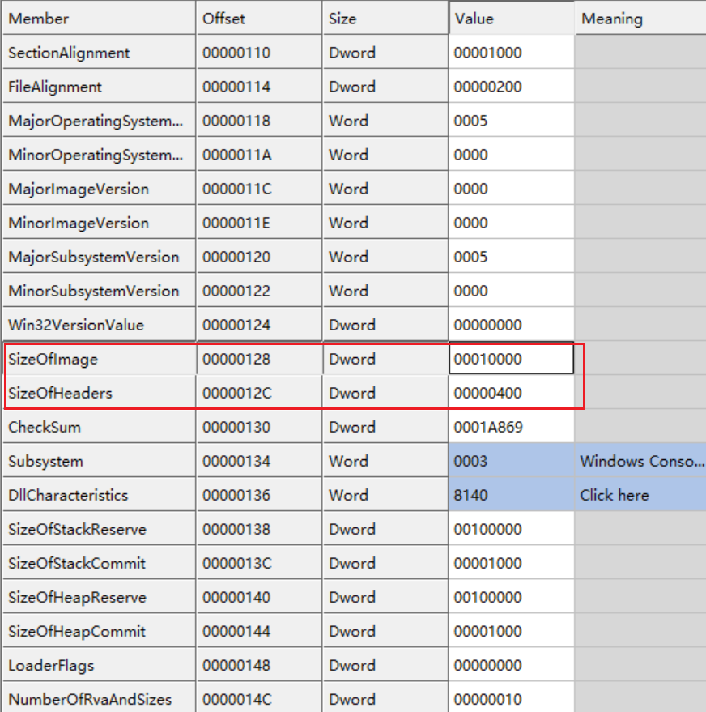

原来这个SizeOfImage是11000，看看删改后的文件大小对比：

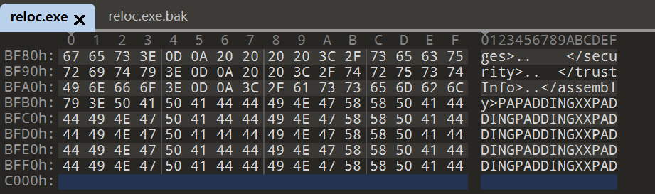

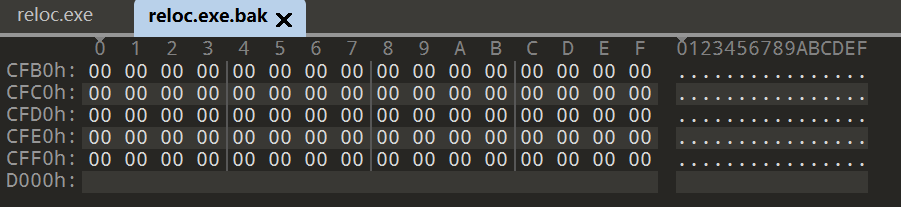

可以发现少了1000，所以SizeOfImage要-1000，修改后就能正常运行了。

emmm，更正一下，其实应该这么算：

原来.reloc节区的虚拟大小为E40：

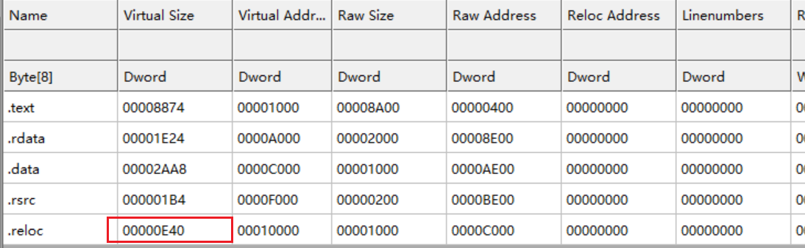

而sectionAlignment是1000，所以对齐后就是1000。

所以删掉.reloc节区后，EXE在进程内存中的ImageSize-1000