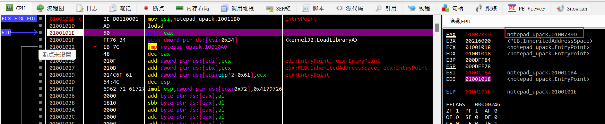
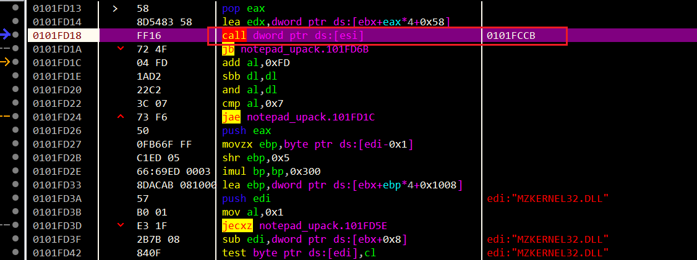
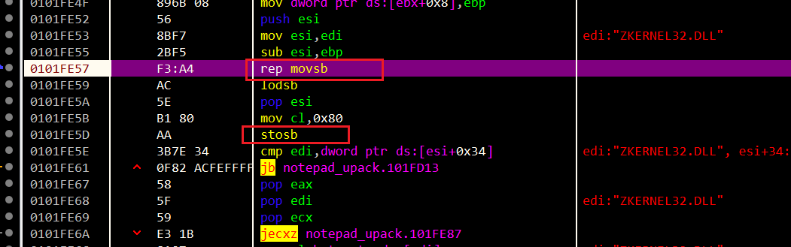
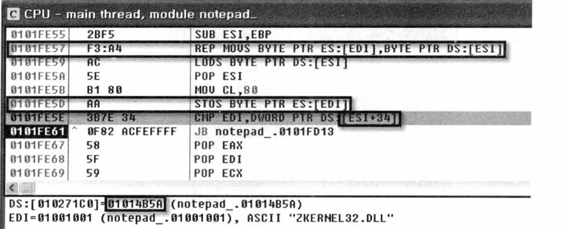
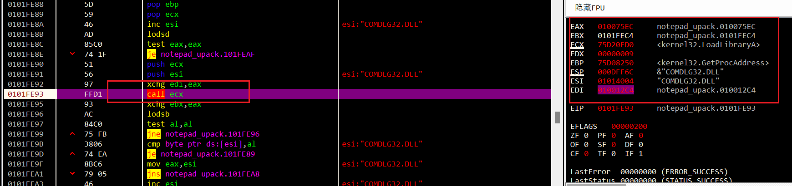
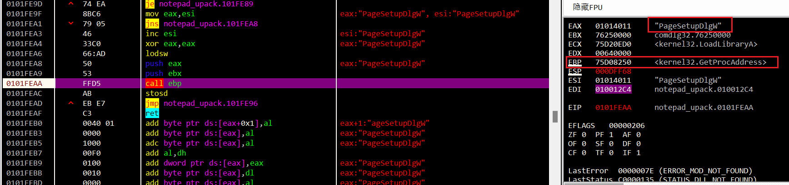
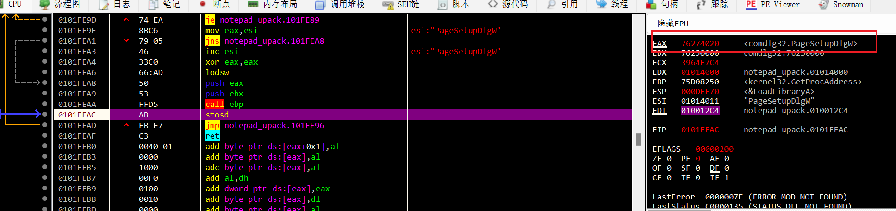
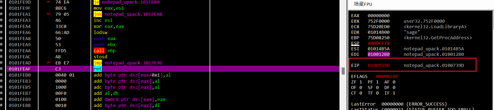
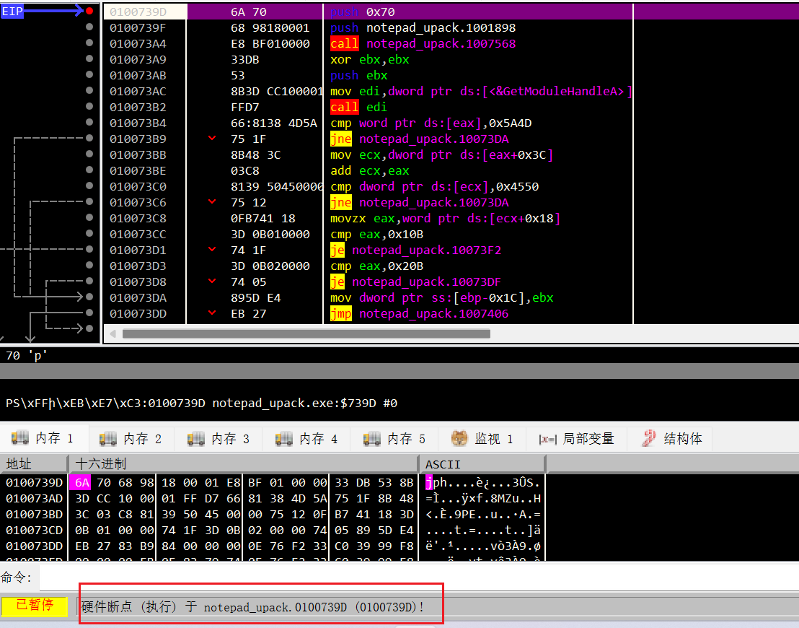

实操调试来看看。

自己调试的话知道有一个大的解码循环，但逻辑完全弄不明白。。。

跟着教程看看，学学思路。

> Upack把压缩后的数据放到第二个节区，再运行解码循环将这些数据解压缩后放到第一个节区。

最开始就出现了原notepad.exe的OEP。

`0100739D`

`loadsd`：`LODS DWORD PTR DS:[ESI]`

所以是从`[ESI]`读取了四字节给EAX。

熟悉流程后就可以在开头这里下一个硬件断点就会在OEP处暂停。

但我们还是跟着分析下整体流程。

随后会到这里：

这个`0101FCCB`就是解密代码。

到这里我也都清楚。。

F7步进会跟踪到这里：

我这个x64的汇编没有教程的直观：

可以看到，上图可以很清楚看到ESI、EDI，就能知道这里是解压后赋值的代码。

这里就是将解压缩的代码写入EDI，直到EDI=[ESI+0x34]=01014B5A才跳出循环。

解压缩的算法就不去深究了。。这也不是一时半会儿能逆出来的。

解压缩完了后，就需要设置IAT了。

设置IAT的话需要用到API，`LoadLibraryA`和`GetProcAddress`

设置完后就ret到OEP了

现在来过一遍开头说的硬件断点。

在push eax后

在eax对应的内存处下一个执行的硬件断点，F9即可到OEP。

---

是我其它逆多了。。这种壳确实不要求能逆出算法。。毕竟写些特别复杂的算法纯汇编不大可能逆出来。🤣。
