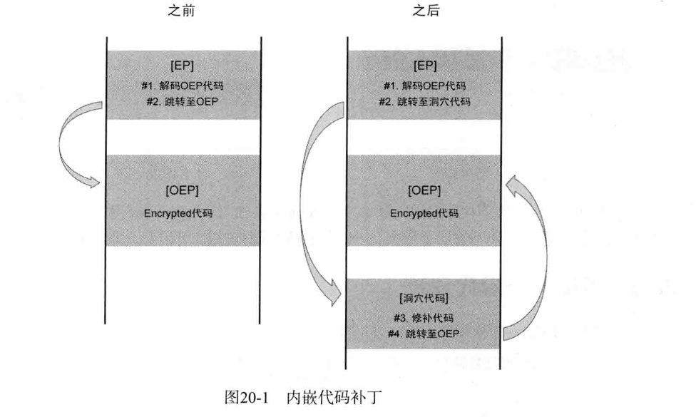
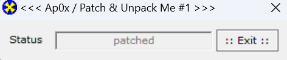

很实用的一个逆向技术。


“壳”的逻辑也是这样的。EP处先解密OEP代码，再跳转到洞穴代码，恢复IAT之类的，然后跳回OEP执行源程序代码。


代码补丁与内嵌补丁的区别：


PatchMe练习

记得上次寒假学过一次，现在再练/学一次。


IDA看可以很清晰的看到解密逻辑。

流程：

0x4010F5~0x401249：xor 0x44

0x401007~0x401086：xor 0x7

0x4010F5~0x401249：xor 0x11


这三个完了后，会`call    loc_401039`

动调看看loc_401039

可以看到一个大循环：


而且ebx++，再累加[ebx]，猜测是在计算checksum。


中间填充了很多垃圾代码，各种奇奇怪怪的跳转。。

会跳到这里来：


用x32来看会好一点。

跟到刚刚那个call，确实是在算CRC


算的是0x4010F5~0x401249的

注意到这里还有一个call，


跟进去看看。

发现又有一层xor 0x17


所以这里是对：

0x40124A~0x401280作了xor 0x17

ret后就跳转到OEP了：


所以整个流程：

0x4010F5~0x401249：xor 0x44

0x401007~0x401086：xor 0x7

0x4010F5~0x401249：xor 0x11

0x40124A~0x401280：xor 0x17

JMP OEP


在OEP的代码貌似有反调试？（INT 3）

但是可以看到字符串


看下这字符串在哪个区域。

`0x4010F5~0x401249`

按照教程的流程图：


那就是[B]区的数据。

由于[B]区有checksum，所以不大可能直接修改，所以要洞穴代码修改。

思路：


补丁代码设置地方：


对应的就是设置在这个部分：


但这里手写汇编还是有一点点难。。。

教程用的简介的REP MOVSB指令

> `REP MOVSB` 是一个在 x86 汇编语言中使用的字符串操作指令。这个指令组合用于在内存中从一个位置复制字节数据到另一个位置。具体来说：
>
> - **`REP`**: 代表 "Repeat"（重复），它会重复执行后面的指令，直到寄存器 `ECX` 或 `RCX` 中的计数值减为零。
> - **`MOVSB`**: 代表 "Move String Byte"（移动字符串字节），它将源操作数所在位置的一个字节（通常由 `DS:SI` 或 `RSI` 指向）复制到目的地位置（通常由 `ES:DI` 或 `RDI` 指向）。

是一个很简洁高效的将ESI复制到EDI的指令。用之前需要设置好ECX(记得+1，'\x00'结尾)，ESI，EDI。

对于我们这个patch，两个字符串的位置：

`00401123`，`0040110A`

```
MOV ECX,0xC
MOV ESI,0x4012A9
MOV EDI,0x401123
REP MOVSB
MOV ECX,0x9
MOV ESI,0x4012B9
MOV EDI,0x40110A
REP MOVSB
```

然后JMP到OEP

```
JMP 0x40121E
```

后面对应填修改后的字符串


把这段洞穴补丁写在00401280开始。（空格即可编辑汇编）


保存补丁很简单，x32有"补丁"选项，点击后“修补文件”即可。


洞穴补丁打好后，还要在前面找一处跳转到洞穴补丁处的代码。

前面分析过这里，CRC校验完后跳转到OEP，


那我们把这个JMP patch为JMP 0x401280即可。

但这里要注意，这个区域属于[A]区域，需要xor 0x7，所以我们把指令xor 0x7后保存。

`E9 F8 01` => `EE FF 06`

Ctrl+P打补丁后保存，尝试运行：





成功。


后面就是DLL注入专题了。