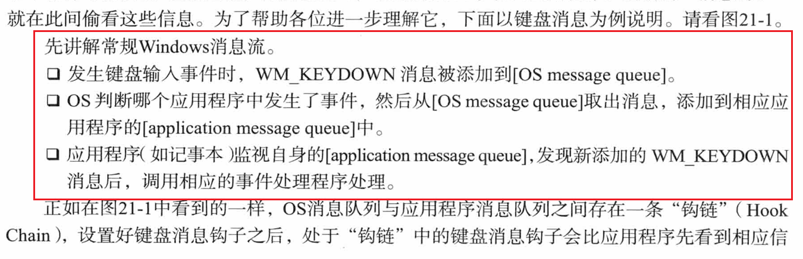
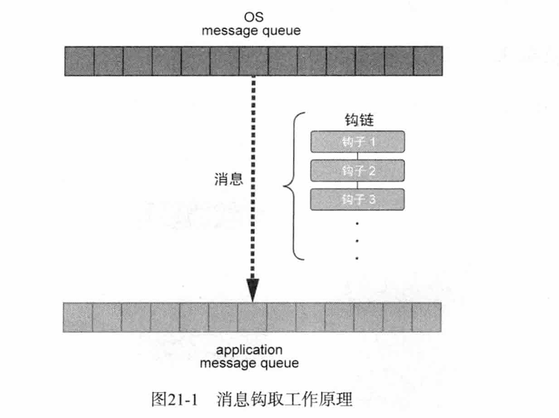
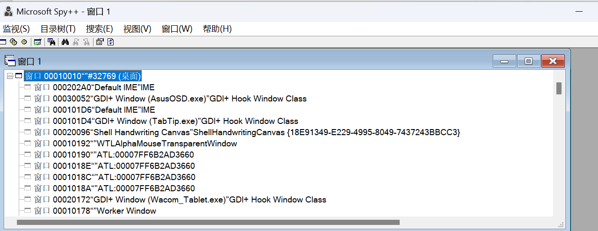
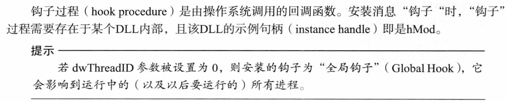
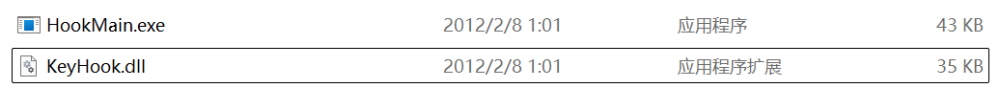
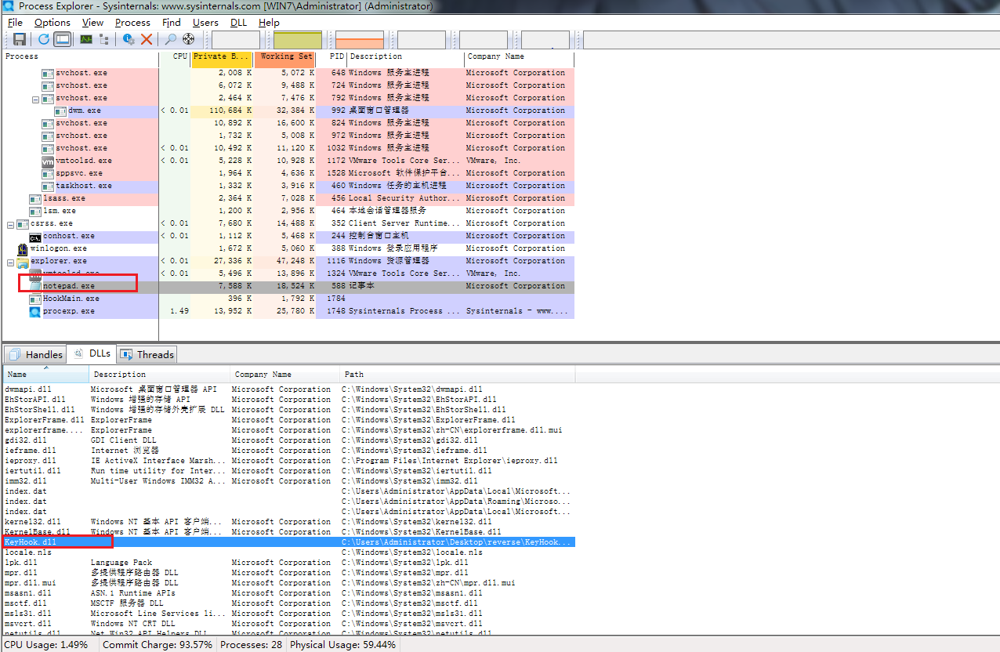
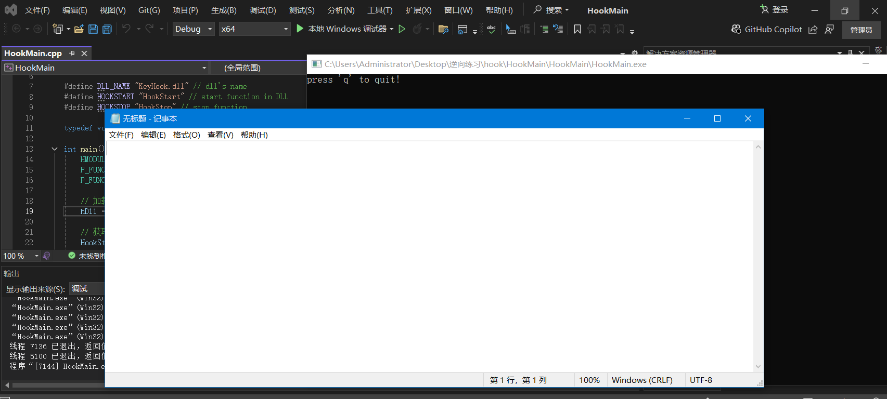
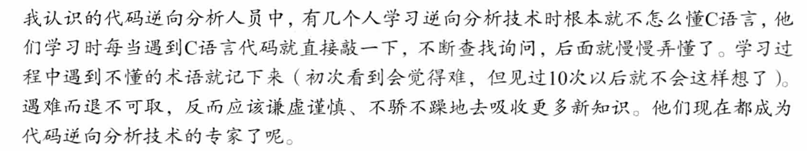

开始DLL注入章节的学习。

# 知识点学习

## 消息钩子

这里主要是要弄明白Windows GUI程序的工作模式/流程。

GUI以**事件驱动**方式工作。核心概念：**message queue**






最具代表性的：MS提供的spy++




## `SetWindowsHookEX()`

[SetWindowsHookExA 函数 (winuser.h) - Win32 apps | Microsoft Learn](https://learn.microsoft.com/zh-cn/windows/win32/api/winuser/nf-winuser-setwindowshookexa)

```c
HHOOK SetWindowsHookExA(
  [in] int       idHook, 	// hook type
  [in] HOOKPROC  lpfn,   	// hook procedure 
  [in] HINSTANCE hmod,   	// hook procedure所属的DLL句柄 (Handle)
  [in] DWORD     dwThreadId // 待hook的线程ID
);
```




> 像这样，使用`SetWindowsHookEX()`设置好钩子后，


# 运行钩取示例 HookMain.exe

附件给的：



经测试，要在win7环境跑。

运行HookMain后打开notepad，再开Process Explorer。

选中notepad.exe CTRL+D




说明KeyHook.dll已经注入notepad.exe进程了。


然后HookMain.exe中输入`q`后就退出，KeyHook.dll也不在notepad.exe中了。


# 源码分析/书写

这一章的逆向都很简单，主要关注的是怎么自己写dll inject。


## `HookMain.cpp`

```c
// HookMain.cpp
#include<stdio.h>
#include<stdlib.h>
#include<conio.h>
#include<Windows.h>

#define DLL_NAME "KeyHook.dll" // dll's name
#define HOOKSTART "HookStart" // start function in DLL
#define HOOKSTOP "HookStop" // stop function

typedef void(*P_FUNC)(); // 函数指针

int main() {
	HMODULE hDll = NULL;
	P_FUNC HookStart = NULL;
	P_FUNC HookStop = NULL;
	
	// 加载KeyHook.dll
	hDll = LoadLibraryA(DLL_NAME);

	// 获取导出函数地址
	HookStart = (P_FUNC)GetProcAddress(hDll, HOOKSTART);
	HookStop = (P_FUNC)GetProcAddress(hDll, HOOKSTOP);

	//
	HookStart();
	printf("press 'q' to quit!\n");
	while (_getch() != 'q');

	//
	HookStop();

	// 卸载KeyHook.dll
	FreeLibrary(hDll);
	return 0;
}
```


## `KeyHook.cpp`


```c
// dllmain.cpp : 定义 DLL 应用程序的入口点。
#include "pch.h"

// KeyHook.cpp
#include<stdio.h>
#include<Windows.h>

constexpr auto PROCESS_NAME = "notepad.exe";
HINSTANCE hInstance = NULL;
HHOOK hHook = NULL;
HWND hWnd = NULL;

BOOL APIENTRY DllMain( HMODULE hinstDLL,
                       DWORD  dwReason,
                       LPVOID lpReserved
                     )
{
    switch (dwReason)
    {
    case DLL_PROCESS_ATTACH:
        hInstance = hinstDLL;
        break;
    case DLL_THREAD_ATTACH:
    case DLL_THREAD_DETACH:
    case DLL_PROCESS_DETACH:
        break;
    }
    return TRUE;
}

LRESULT CALLBACK KeyboardProc(int nCode, WPARAM wParam, LPARAM lParam) {
    char szPath[MAX_PATH] = { 0 };
    char* p = NULL;

    if (nCode == 0) {
        // bit 31 —— 0 = key press   ;   1 = key release
        if ((lParam & 0x80000000) == 0) {
            GetModuleFileNameA(NULL, szPath, MAX_PATH); // 获取当前进程的可执行文件路径
            p = strrchr(szPath, '\\');
            
            // 比较当前进程名称，若为`notepad.exe`，则消息不会传递给下一个钩子。
            if (!_stricmp(p + 1, PROCESS_NAME))
                return 1;
        }
    }

    // 若不是`notepad.exe`，则将消息传递给下一个钩子。
    return CallNextHookEx(hHook, nCode, wParam, lParam);
}

#ifdef __cplusplus
extern "C" {
#endif
    __declspec(dllexport)void HookStart(){
        hHook = SetWindowsHookEx(WH_KEYBOARD, KeyboardProc, hInstance, 0);
}
    __declspec(dllexport)void HookStop() {
        if (hHook) {
            // 注销挂钩
            UnhookWindowsHookEx(hHook);
            hHook = NULL;
        }
    }

#ifdef __cplusplus
}
#endif
```


`KeybroadProc`回调函数的说明：[KeyboardProc 回调函数 - Win32 apps | Microsoft Learn](https://learn.microsoft.com/zh-cn/windows/win32/winmsg/keyboardproc)

```c
LRESULT CALLBACK KeyboardProc(
  _In_ int    code,  // HC_ACTION:0  HC_NOREMOVE:3
  _In_ WPARAM wParam,
  _In_ LPARAM lParam
);
```

`GetModuleFileNameA`

[GetModuleFileNameA 函数 (libloaderapi.h) - Win32 apps | Microsoft Learn](https://learn.microsoft.com/zh-cn/windows/win32/api/libloaderapi/nf-libloaderapi-getmodulefilenamea)

> 检索包含指定模块的文件的完全限定路径。 模块必须已由当前进程加载。

```c
DWORD GetModuleFileNameA(
  [in, optional] HMODULE hModule, // 正在请求其路径的已加载模块的句柄。 如果此参数为 NULL， 则 GetModuleFileName 将检索当前进程的可执行文件的路径。
  [out]          LPSTR   lpFilename, // 指向接收模块的完全限定路径的缓冲区的指针。
  [in]           DWORD   nSize
);
```

`CallNextHookEX`

```c
LRESULT CallNextHookEx(
  [in, optional] HHOOK  hhk, // 忽略此参数。
  [in]           int    nCode,
  [in]           WPARAM wParam,
  [in]           LPARAM lParam
);
```

`SetWindowsHookExA`

[SetWindowsHookExA 函数 (winuser.h) - Win32 apps | Microsoft Learn](https://learn.microsoft.com/zh-cn/windows/win32/api/winuser/nf-winuser-setwindowshookexa)

```c
HHOOK SetWindowsHookExA(
  [in] int       idHook,
  [in] HOOKPROC  lpfn,
  [in] HINSTANCE hmod,
  [in] DWORD     dwThreadId
);
```


两个源码写好后，先生成KeyHook.dll（注意选x86），将生成的dll放在HookMain的文件夹下，生成HookMain.exe。

但尝试运行：本地机直接卡炸。。（可能是写的有Bug）虚拟机的话缺库，跑不了。

看来后续得在win10虚拟机安个visual studio了。。


---

UPD，确实，win10安个visualstudio，**按x64编译**后就行了。




# 调试分析

这部分的dll都很简单，调试直接跟就行，就不展开了。


# 总结

Windows编程还很不熟悉，相应的API写法得多练习。


