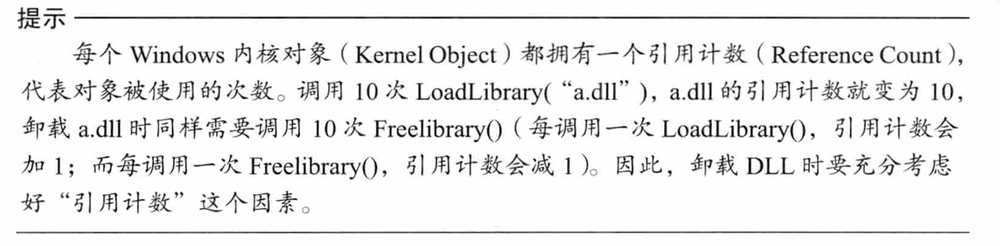
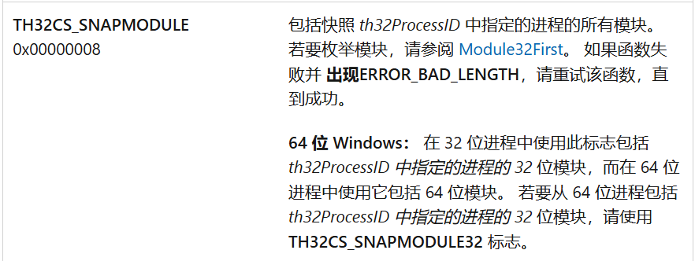
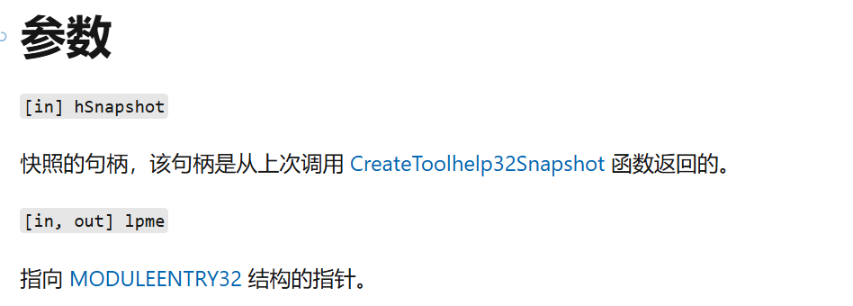
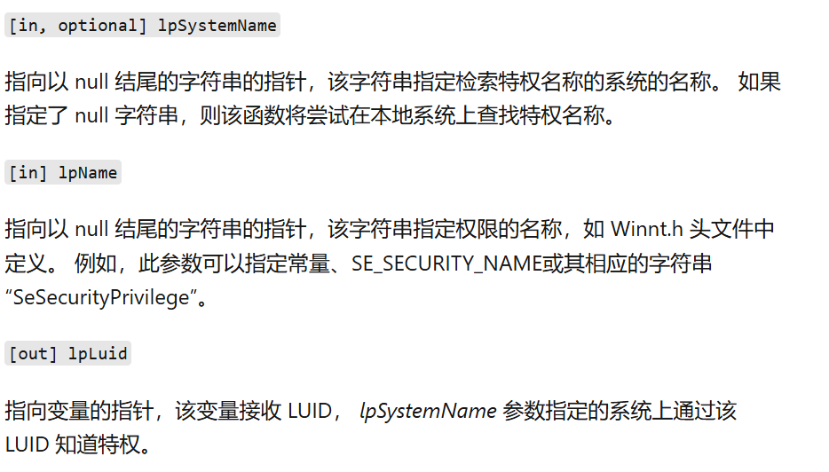
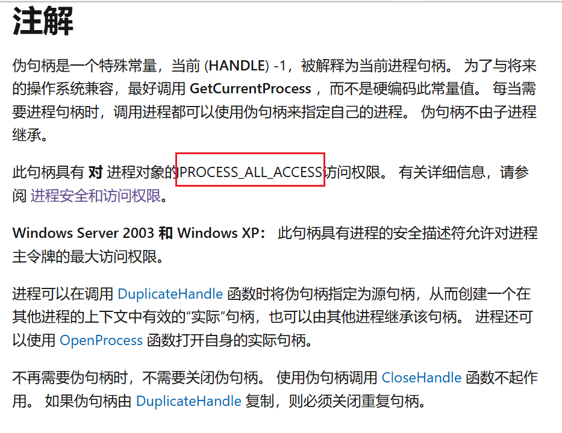
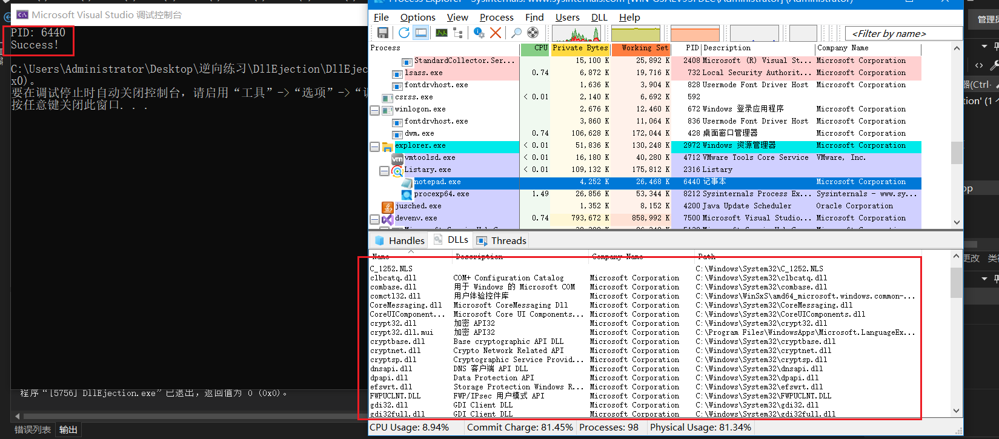
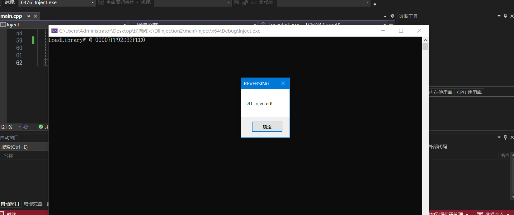
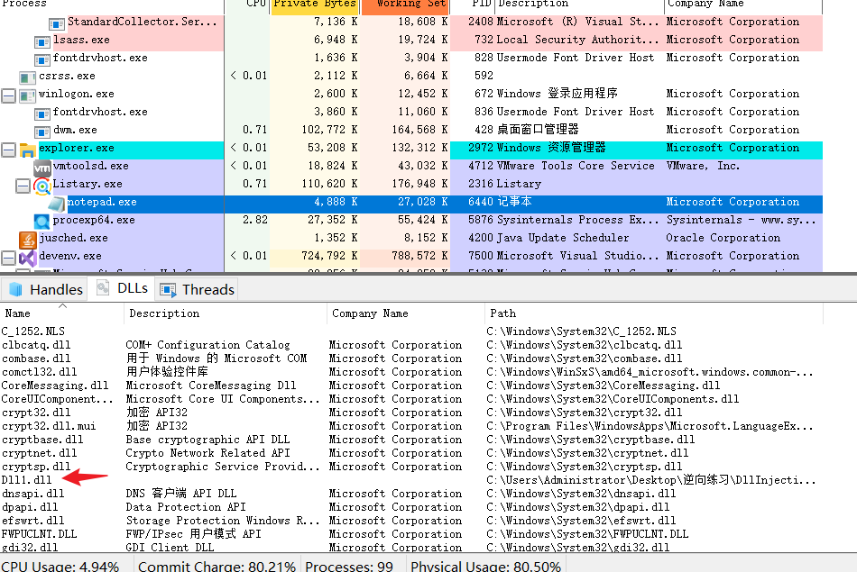
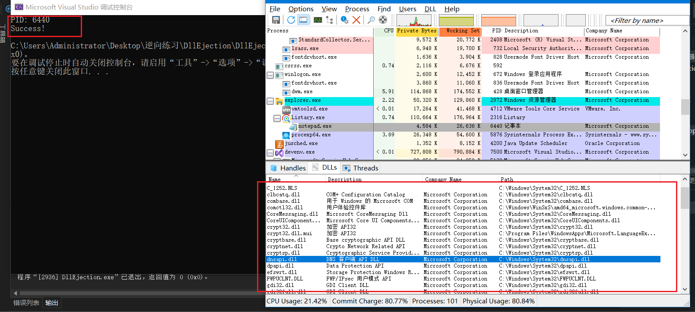

# DLL卸载原理

DLL注入（Injection）是将DLL强制加载进进程的技术。

DLL卸载（Ejection）则是将强制插入进程的DLL弹出的技术。

两者的原理都十分类似，都用`CreateRemoteThread`来实现：

- Injection：驱使目标进程调用`LoadLibrary()` API
- Ejection：驱使目标进程调用`FreeLibrary()`API


具体到传参，

```c
HANDLE CreateRemoteThread(
  [in]  HANDLE                 hProcess,
  [in]  LPSECURITY_ATTRIBUTES  lpThreadAttributes,
  [in]  SIZE_T                 dwStackSize,
  [in]  LPTHREAD_START_ROUTINE lpStartAddress,
  [in]  LPVOID                 lpParameter,
  [in]  DWORD                  dwCreationFlags,
  [out] LPDWORD                lpThreadId
);
```

就是将`FreeLibrary()`的API地址传给`lpStartAddress`参数，将待卸载的DLL字符串地址，传给`lpParameter`。


但卸载相比注入，有个细节点要注意：

> 


# DLL卸载代码实现

照着教程的写一遍。

`EjectDll.cpp`

```c
#include<Windows.h>
#include<iostream>
#include<tchar.h>
#include<TlHelp32.h>
using namespace std;

#define PROC_NAME (L"notepad.exe")
#define DLL_NAME (L"Dll1.dll")

DWORD FindProcessID(LPCTSTR szProcessName) {
	DWORD dwPid = 0xFFFFFFFF;
	HANDLE hSnapshot;
	BOOL bMore;
	PROCESSENTRY32 pe;

	// 获取当前系统快照snapshot
	pe.dwSize = sizeof(PROCESSENTRY32);
	hSnapshot = CreateToolhelp32Snapshot(TH32CS_SNAPALL, NULL);

	// 查找进程
	bMore = Process32First(hSnapshot, &pe);
	// 遍历
	for (; bMore; bMore = Process32Next(hSnapshot, &pe)) {
		if (!_tcsicmp(szProcessName, (LPCTSTR)pe.szExeFile)) {
			dwPid = pe.th32ProcessID;
			break;
		}
	}
	CloseHandle(hSnapshot);
	return dwPid;
}

BOOL SetPrivilege(LPCTSTR lpszPrivilege,BOOL bEnablePrivilege) {
	TOKEN_PRIVILEGES tp;
	HANDLE hToken;
	LUID luid;

	if (!OpenProcessToken(GetCurrentProcess(),
		TOKEN_ADJUST_PRIVILEGES | TOKEN_QUERY, &hToken)) {
		cerr << "OpenProcessToken ERROR: " << GetLastError() << "\n";
		return FALSE;
	}
	if (!LookupPrivilegeValue(
		NULL, // on local system
		lpszPrivilege, // privilege to lookup
		&luid
	)) {
		cerr << "LookupPrivilegeValue ERROR: " << GetLastError() << "\n";
		return FALSE;
	}

	tp.PrivilegeCount = 1;
	tp.Privileges[0].Luid = luid;
	if (bEnablePrivilege) {
		tp.Privileges[0].Attributes = SE_PRIVILEGE_ENABLED;
	}
	else {
		tp.Privileges[0].Attributes = 0;
	}

	if (!AdjustTokenPrivileges(
		hToken,
		FALSE,
		&tp, // new state
		sizeof(TOKEN_PRIVILEGES),
		(PTOKEN_PRIVILEGES)NULL,
		(PDWORD)NULL
	)) {
		cerr << "AdjustTokenPrivileges ERROR: " << GetLastError() << "\n";
		return FALSE;
	}
	if (GetLastError() == ERROR_NOT_ALL_ASSIGNED) {
		cerr << "The token does not have the specified privilege!\n";
		return FALSE;
	}
	
	return TRUE;
}

BOOL EjectDll(DWORD dwPid,LPCTSTR szDllName) {
	BOOL bMore = FALSE, bFound = FALSE;
	HANDLE hSnapshot, hProcess, hThread;
	HMODULE hModule = NULL;
	MODULEENTRY32 me = { sizeof(me) };
	LPTHREAD_START_ROUTINE pThreadProc;

	// dwPid: notepad.exe进程的PID
	// 使用 TH32CS_SNAPMODULE参数，获取加载到notepad.exe进程的DLL名称
	hSnapshot = CreateToolhelp32Snapshot(TH32CS_SNAPMODULE, dwPid);
	bMore = Module32First(hSnapshot, &me);
	// 遍历所有模块
	for (; bMore; bMore = Module32Next(hSnapshot, &me) ){
		if (!_tcsicmp((LPCTSTR)me.szModule, szDllName) ||
			!_tcsicmp((LPCTSTR)me.szExePath, szDllName )){
			bFound = TRUE;
			break;
		}
	}
	if (!bFound) {
		CloseHandle(hSnapshot);
		return FALSE;
	}
	if (!(hProcess = OpenProcess(PROCESS_ALL_ACCESS, FALSE, dwPid))) {
		cerr << "OpenProcess failed!\n";
		return FALSE;
	}

	hModule = GetModuleHandle(L"kernel32.dll");
	pThreadProc = (LPTHREAD_START_ROUTINE)GetProcAddress(hModule, "FreeLibrary");
	hThread = CreateRemoteThread(
		hProcess,
		NULL,
		0,
		pThreadProc,
		me.modBaseAddr,
		0,
		NULL
	);
	WaitForSingleObject(hThread, INFINITE);
	CloseHandle(hThread);
	CloseHandle(hProcess);
	CloseHandle(hSnapshot);
	return TRUE;
}

int _tmain(int argc, TCHAR* argv[]) {
	DWORD dwPid = 0xFFFFFFFF;
	dwPid = FindProcessID(PROC_NAME);
	if (dwPid == 0xFFFFFFFF) {
		cerr << "No process " << PROC_NAME << "!\n";
		return 1;
	}
	cout << "PID: " << dwPid << "\n";

	// 更改privilege
	if (!SetPrivilege(SE_DEBUG_NAME, TRUE)) // 设置DEBUG权限
		return 1;

	// Eject Dll
	if (EjectDll(dwPid, DLL_NAME))
		cout << "Success!\n";
	else
		cout << "Failed!\n";
	
	return 1 ^ 1;
}
```


学到了一大堆WIN32 API

- `CreateToolhelp32Snapshot`

  获取指定进程以及这些进程使用的堆、模块和线程的快照。

  ```c
  HANDLE CreateToolhelp32Snapshot(
    [in] DWORD dwFlags,
    [in] DWORD th32ProcessID
  );
  ```

  > 

- `Module32First`

  检索与进程关联的第一个模块的相关信息。

  ```c
  BOOL Module32First(
    [in]      HANDLE          hSnapshot,
    [in, out] LPMODULEENTRY32 lpme
  );
  ```

  > 

- `OpenProcessToken`

  **OpenProcessToken** 函数打开与进程关联的[访问令牌](https://learn.microsoft.com/zh-cn/windows/desktop/SecGloss/a-gly)。

  ```c
  BOOL OpenProcessToken(
    [in]  HANDLE  ProcessHandle,
    [in]  DWORD   DesiredAccess,
    [out] PHANDLE TokenHandle
  );
  ```

- `LookupPrivilegeValue`

  **LookupPrivilegeValue** 函数检索指定系统上用于[本地](https://learn.microsoft.com/zh-cn/windows/desktop/SecGloss/l-gly)表示指定特权名称 (LUID) 本地唯一标识符。

  ```c
  BOOL LookupPrivilegeValueW(
    [in, optional] LPCWSTR lpSystemName,
    [in]           LPCWSTR lpName,
    [out]          PLUID   lpLuid
  );
  ```

  > 

- `AdjustTokenPrivileges`

  **AdjustTokenPrivileges** 函数启用或禁用指定[访问令牌](https://learn.microsoft.com/zh-cn/windows/desktop/SecGloss/a-gly)中的特权。 启用或禁用访问令牌中的特权需要TOKEN_ADJUST_PRIVILEGES访问权限。

  ```c
  BOOL AdjustTokenPrivileges(
    [in]            HANDLE            TokenHandle,
    [in]            BOOL              DisableAllPrivileges,
    [in, optional]  PTOKEN_PRIVILEGES NewState,
    [in]            DWORD             BufferLength,
    [out, optional] PTOKEN_PRIVILEGES PreviousState,
    [out, optional] PDWORD            ReturnLength
  );
  ```

- `GetCurrentProcess`

  返回值是当前进程的**伪句柄**。

  > 


# 源码分析

## 1. 获取进程中加载的DLL信息

```c
hSnapshot = CreateToolhelp32Snapshot(TH32CS_SNAPMODULE,dwPid)
```

接触进程快照最初是在分析恶意代码的时候，很多都是用这种方式来注入/Kill杀软。

这里用快照获取MODULE信息，后面我们找ProcessPID那儿可以看到这个也可以获得PROCESS信息。

（用`TH32CS_SNAPALL`就行）


获取到MODULE和PROCESS后，就用Module32First/Module32Next进行模块（DLL）遍历。

找到跟szDllName匹配的后，用me的`modBaseAddr`成员获取DLL加载的地址。


## 2. 为什么要SetPrivilege？

教程只字没提这个点，但我觉得这个点挺重要的，感觉有点bypassUAC的影子。（maybe？)

> 


但是我们DLL注入的时候没这么写啊？

我把那段调用`SetPrivilege`的代码注释掉，再运行：




发现还是成功的。~

这也验证了我的想法：

DLL注入和DLL卸载理论上应该是同等权限，DLL注入我们并没有提权，DLL卸载理应也不需要。

（其实应该是notepad.exe进程的权限不高，所以我们不需要高权限，如果是系统进程就不一样了）

但这个函数确实教会了SetPrivilege的WINAPI写法，从token中隐隐能看到bypassUAC这些的影子了。

（突然感觉好像mimikatz的privilege::debug啊，楽。）


好吧，不知道就翻MS的文档：


# 效果

先运行上次写的DllInject，向`notepad.exe`注入Dll1.dll，




process monitor查看：




然后编译运行`EjectDll.cpp`




成功实现DLL卸载。

