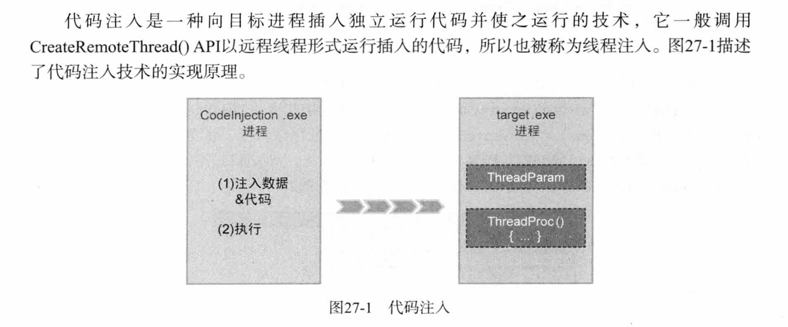
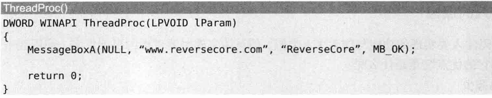
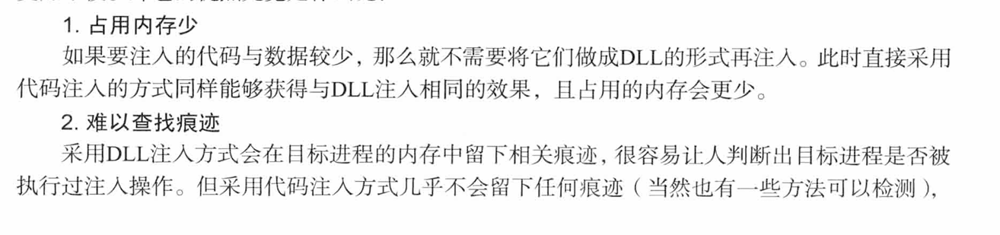
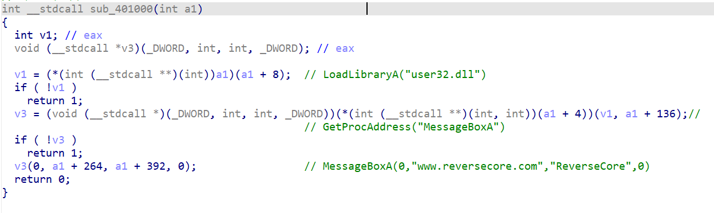
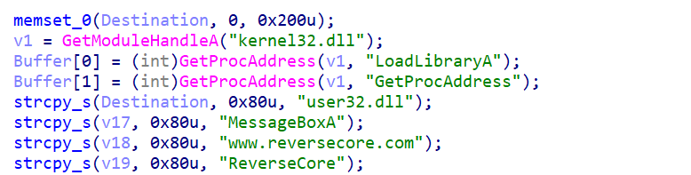
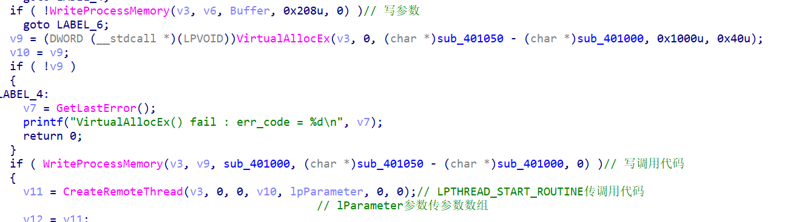
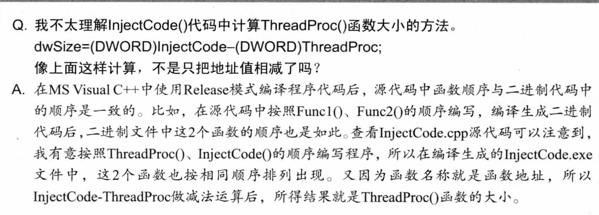
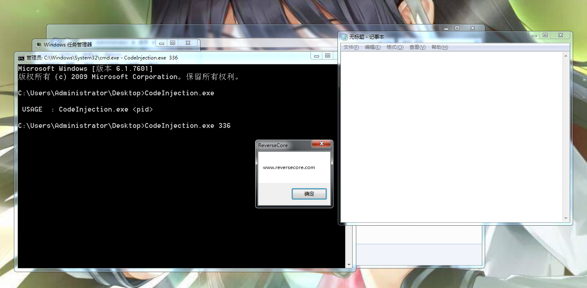
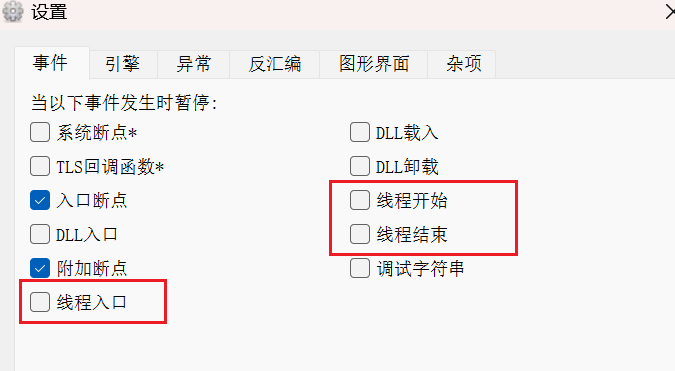

# 代码注入知识点



## 代码注入与DLL注入的区别

代码注入和DLL注入的区别在于：我们必须把参数也注入目标进程。

DLL注入不需要考虑参数地址，只需要考虑LPTHREAD_START_ROUTINE的地址和DLL字符串地址，

是因为参数在DLL里面，目标进程加载DLL后会在内存中加载参数。

而代码注入则不行，如果还是像DLL那样硬编码参数，就会内存访问错误。

具体可以看这个例子：

> 
>
> 采用DLL注入后的代码：
>
> 
>
> 可以看到参数在DLL中是硬编码的。由于DLL可以重定位，所以不会出现内存访问错误。
>
> 但换成代码注入就不行。


DLL注入的`LPTHREAD_START_ROUTINE`传的是`LoadLibrary`，lParameter传的是DLL字符串地址。

代码注入的`LPTHREAD_START_ROUTINE`传的是调用代码的地址，lParameter传的是参数数组的地址。


## 使用代码注入的原因




# 练习示例

这里先逆向看看，后面再手写一遍代码。


代码注入的代码部分：




设置参数部分：


`WriteProcessMemory`和`CreateRemoteThread`部分：




精妙至极！


# 代码编写

不知道为什么一直注入不了，一运行notepad就退出了。。

代码有好几个点要注意：

- `typedef int(WINAPI* PFMessageBoxA)`

- pRemoteBuf[1]那儿分配的是待执行的函数，所以要`PAGE_EXECUTE_READWRITE`

  `pRemoteBuf[1] = VirtualAllocEx(hProcess, NULL, dwSize, MEM_COMMIT, PAGE_EXECUTE_READWRITE);`

- 算`ThreadProc`大小利用的原理是：

  

  这样更简便一点。

```c
#include<tchar.h>
#include<Windows.h>
#include<iostream>
#include<stdlib.h>
#include<stdio.h>

using namespace std;

/*
定义好结构，简化操作
*/
typedef struct _THREAD_PARAMETER {
	FARPROC pFunc[2]; // Func
	char szBuf[4][128]; // Parameter
}THREAD_PARAM, * PTHREAD_PARAM;

// LoadLibraryA
typedef HMODULE(WINAPI* PFLoadLibraryA)(
	LPCSTR lpLibFileName
	);

// GetProcAddress
typedef FARPROC(WINAPI* PFGetProcAddress)(
	HMODULE hModule,
	LPCSTR lpProcName
	);

// MessageBoxA
typedef int(WINAPI* PFMessageBoxA)(
	HWND hWnd,
	LPCSTR lpText,
	LPCSTR lpCaption,
	UINT uType
	);

DWORD WINAPI ThreadProc(LPVOID lParam) {
	PTHREAD_PARAM pParam = (PTHREAD_PARAM)lParam;
	HMODULE hModule = NULL;
	FARPROC pFunc = NULL;

	// LoadLibraryA("user32.dll")
	hModule = ((PFLoadLibraryA)(pParam->pFunc[0]))(pParam->szBuf[0]);

	// GetProcAddress("MessageBoxA")
	pFunc = (FARPROC)((PFGetProcAddress)(pParam->pFunc[1]))(hModule, pParam->szBuf[1]);

	// MessageBoxA(0,text,caption,MB_OK)
	((PFMessageBoxA)pFunc)(NULL, pParam->szBuf[2], pParam->szBuf[3], MB_OK);

	return 0;
}

BOOL InjectCode(DWORD dwPid) {
	HMODULE hModule = NULL;
	THREAD_PARAM param = { 0, };
	HANDLE hProcess = NULL;
	HANDLE hThread = NULL;
	LPVOID pRemoteBuf[2] = { 0, };
	DWORD dwSize = 0;
	
	// 设置参数

	hModule = GetModuleHandleA("kernel32.dll");
	param.pFunc[0] = GetProcAddress(hModule, "LoadLibraryA");
	param.pFunc[1] = GetProcAddress(hModule, "GetProcAddress");
	strcpy_s(param.szBuf[0], "user32.dll");
	strcpy_s(param.szBuf[1], "MessageBoxA");
	strcpy_s(param.szBuf[2], "INJECTED!");
	strcpy_s(param.szBuf[3], "N0zoM1z0");

	// OpenProcess
	hProcess = OpenProcess(PROCESS_ALL_ACCESS, FALSE, dwPid);
	if (hProcess == NULL) {
		cerr << "Error Finding Process!\nCheck PID\n";
		return FALSE;
	}
	// VirtualAllocEx For Param
	dwSize = sizeof(THREAD_PARAM);
	pRemoteBuf[0] = VirtualAllocEx(hProcess, NULL, dwSize, MEM_COMMIT, PAGE_READWRITE);

	// WriteProcessMemory
	BOOL OK = WriteProcessMemory(hProcess, pRemoteBuf[0], (LPVOID)&param, dwSize, NULL);
	if (!OK) {
		cerr << "ERROR WriteProcessMemory!\n";
		return FALSE;
	}
	// VirtualAllocEx For ThreadProc
	dwSize = (DWORD)InjectCode - (DWORD)ThreadProc;
	pRemoteBuf[1] = VirtualAllocEx(hProcess, NULL, dwSize, MEM_COMMIT, PAGE_EXECUTE_READWRITE);

	// WriteProcessMemory
	OK = WriteProcessMemory(hProcess, pRemoteBuf[1], (LPVOID)ThreadProc, dwSize, NULL);
	if (!OK) {
		cerr << "ERROR WriteProcessMemory!\n";
		return FALSE;
	}
	// CreateRemoteThread
	hThread = CreateRemoteThread(hProcess, NULL, 0, (LPTHREAD_START_ROUTINE)pRemoteBuf[1], pRemoteBuf[0], 0, NULL);
	if (hThread == NULL) {
		cerr << "ERROR CreateRemoteThread!\n";
		return FALSE;
	}
	WaitForSingleObject(hThread, INFINITE);
	CloseHandle(hThread);
	CloseHandle(hProcess);
	cout << "DONE!\n";
	return TRUE;
}

int main(int argc, CHAR* argv[]) {
	if (argc < 2) {
		printf("Usage: %s pid\n", argv[0]);
		return 1;
	}

	DWORD dwPid = (DWORD)atol((LPCSTR)argv[1]);
	cout << "argv[1]: " << argv[1] << "\n";
	cout << "PID: " << dwPid << "\n";
	InjectCode(dwPid);

	return 0;
}
```


我用作者的源程序也是notepad直接退出（？）

换win7测试一下作者的exe。

好吧，win7可行。。




然后我自己的在win10的vs上编译，用的vs2022，所以没法兼容win7。。。会报错缺少dll。

高版本Windows和vs的代码注入后面再来看看。

# 调试

x32dbg设置几个选项就行了，

