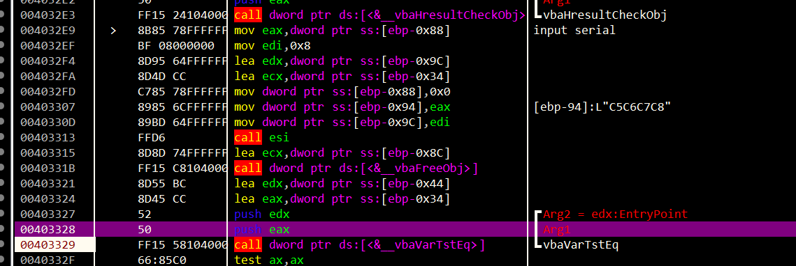
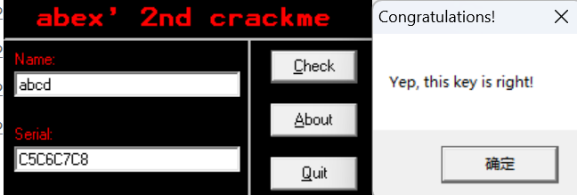
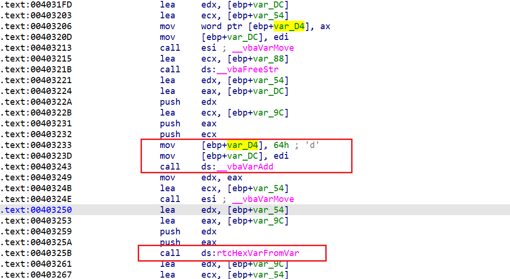
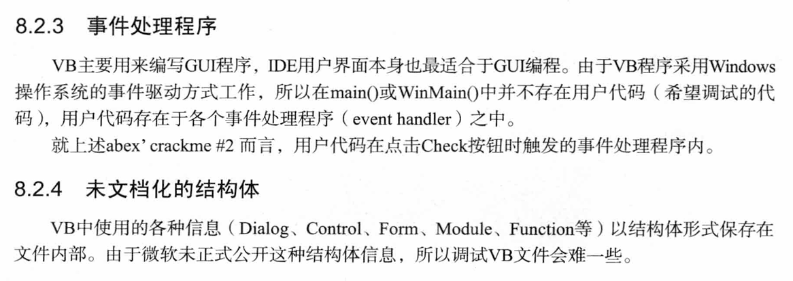
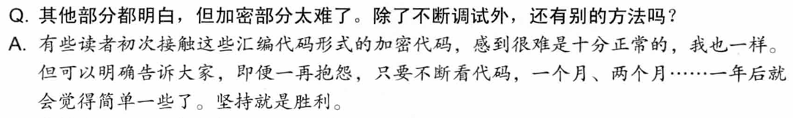

一个经典的CM，要逆向得到Serial序列号。

而且是用Visual Basic语言写的，而不是常规的Visual C++。

而且是混淆过的？

不错，难度上来了。


x32dbg调试看，倒是能对给的的**abcd**调试看到






但还是逆向看看算法。

其实也蛮简单的，就是我们输入name的前四个字符，每个字符的ascii加上'd'的ord，转为HEX，拼接起来即可。




破解代码：

```py
name = "N0zoM1z0"
serial = ''
for n in name[:4]:
    serial += hex(ord(n)+ord('d'))[2:].upper()
print(serial)
```


自己弄完后看看作者的分析，

这个关于**VB程序逆向的特点**值得学习。




然后VB采用的是与C++的string类一样的可变长度的字符串类型。所以有动态的内存分配。


逆向就是要动手多调试，硬怼汇编，习惯就好了。


